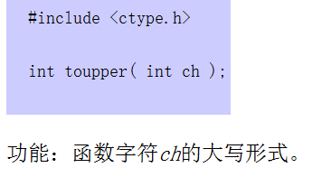
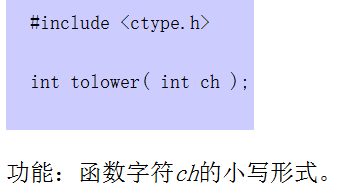
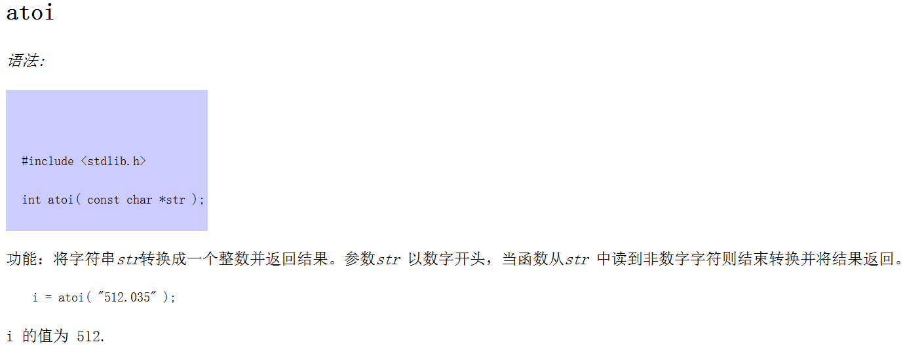
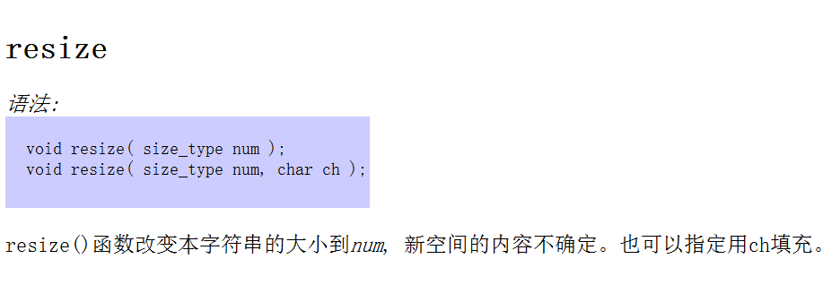
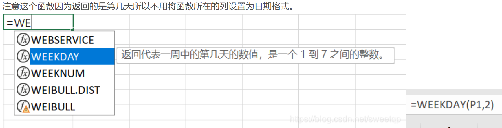
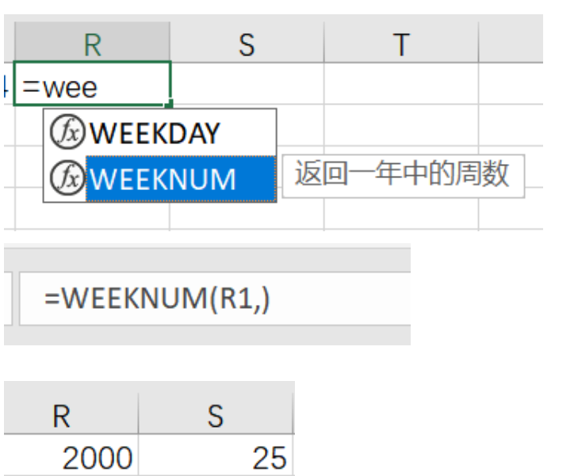

[Github 算法仓库](https://github.com/TheAlgorithms)

# 常用函数速查

## C++

### <ctype.h>

1. toupper() -> *将传入的字符转换为大写*

   

2. tolower() -> *将传入的字符转换为小写*

   

### <stdlib.h>

1. atoi() -> *将字符转换为数字*

   

### <string>

1. resize()

   

## Python

1. .split() -> *字符串分割*

# 大纲

## 知识点归档

### C 组考点

1. 枚举✅
2. 排序
   1. 冒泡
   2. 选择
   3. 插入
3. 搜索✅
4. 贪心
5. 模拟
6. 二分✅
7. DP（普通一维问题）✅
8. 高精度✅
9. 数据结构✅
   1. 栈✅
   2. 队列✅
   3. 链表✅
10. 数学
    1. 初等数论

### B 组考点

11. 排序
    1. 归并
    2. 快排
    3. 桶排
    4. 堆排
    5. 基数排序
12. 搜索
    1. 剪枝✅
    2. 双向 BFS
    3. 记忆化搜索
    4. 迭代➕深搜✅
    5. 启发式搜索
13. DP
    1. 背包 DP
    2. 树形 DP
    3. 状压 DP
    4. 数位 DP
    5. DP 常见优化
14. 字符串
    1. 哈希
    2. kmp
    3. manacher
15. 图论
    1. 欧拉回路
    2. 最小生成树✅
    3. 单源最短路 & 差分约束系统
    4. 拓扑序列
    5. 二分图匹配
    6. 图的连通性问题（割点、桥、强连通分量）
    7. DFS 序
    8. 最近共同祖先
16. 数学
    1. 排列组合
    2. 二项式定理
    3. 容斥原理
    4. 模意义下的逆元
    5. 矩阵运算
    6. 高斯消元
17. 数据结构
    1. ST 表
    2. 堆
    3. 树状数组
    4. 线段树
    5. Trie 树
    6. 并查集✅
    7. 平衡树（利用系统自带的标准库实现简单的平衡树）
18. 计算几何
    1. 基础计算和基本位置关系判定
    2. 概率论
    3. 博弈论

# 常用 Excel 技巧

## 日期类

### 日期直接运算

1. 设置单元格为日期格式
2. 单元格运算

### 计算当前日期是星期几



### 返回一年中的周数



> Excel只能计算1900年之后的，看网上都说1000年闰年平年为一个循环，可以加1000年之后再映射

## 计算类

### 利用 Excel 计算出日期列表后传入程序计算


# 算法模板

## 双指针

### 双指针双对象代码模板

```java
String num1 = "51198";
String num2 = "967895";
int i = num1.length() - 1;
int j = num2.length() - 1;
while (i >= 0 || j >= 0) {
    int n1 = i >= 0 ? num1.charAt(i) - '0' : 0;
    int n2 = j >= 0 ? num2.charAt(j) - '0' : 0;
    i--;j--;
}
```

## 字符串

### 字符串转十进制转换数代码模板

```java
String num = "1234";
int sum = 0;
int index = 0;
while (index < len && Character.isDigit(num.charAt(index))) {
    int ans = num.charAt(index) - '0';
    sum = sum * 10 + ans;
    index++;
}
return sum;
```

## 二分

### 整数二分算法模板

```c++
bool check(int x) {/* ... */} // 检查x是否满足某种性质

// 区间[l, r]被划分成[l, mid]和[mid + 1, r]时使用：
int bsearch_1(int l, int r)
{
    while (l < r)
    {
        int mid = l + r >> 1;
        if (check(mid)) r = mid;    // check()判断mid是否满足性质
        else l = mid + 1;
    }
    return l;
}
// 区间[l, r]被划分成[l, mid - 1]和[mid, r]时使用：
int bsearch_2(int l, int r)
{
    while (l < r)
    {
        int mid = l + r + 1 >> 1;
        if (check(mid)) l = mid;
        else r = mid - 1;
    }
    return l;
}
```

### 浮点数二分算法模板

```c++
bool check(double x) {/* ... */} // 检查x是否满足某种性质

double bsearch_3(double l, double r)
{
    const double eps = 1e-6;   // eps 表示精度，取决于题目对精度的要求
    while (r - l > eps)
    {
        double mid = (l + r) / 2;
        if (check(mid)) r = mid;
        else l = mid;
    }
    return l;
}
```

## 前缀和差分

### 一维前缀和

```c++
// S[i] = a[1] + a[2] + ... a[i]
// a[l] + ... + a[r] = S[r] - S[l - 1]
```

### 二维前缀和

```c++
// S[i, j] = 第i行j列格子左上部分所有元素的和
// 以(x1, y1)为左上角，(x2, y2)为右下角的子矩阵的和为 S[x2, y2] - S[x1 - 1, y2] - S[x2, y1 - 1] + S[x1 - 1, y1 - 1]
```

### 一维差分

```c++
// B[i] = a[i] - a[i - 1]
// 给区间[l, r]中的每个数加上c：B[l] += c, B[r + 1] -= c
```

### 二维差分

```c++
// 给以(x1, y1)为左上角，(x2, y2)为右下角的子矩阵中的所有元素加上c：
// S[x1, y1] += c, S[x2 + 1, y1] -= c, S[x1, y2 + 1] -= c, S[x2 + 1, y2 + 1] += c
```

## 高精度

### 高精度加法

```c++
// C = A + B, A >= 0, B >= 0
vector<int> add(vector<int> &A, vector<int> &B)
{
    if (A.size() < B.size()) return add(B, A);
    
    vector<int> C;
    int t = 0;
    for (int i = 0; i < A.size(); i ++ )
    {
        t += A[i];
        if (i < B.size()) t += B[i];
        C.push_back(t % 10);
        t /= 10;
    }
    
    if (t) C.push_back(t);
    return C;
}
```

### 高精度减法

```c++
// C = A - B, 满足A >= B, A >= 0, B >= 0
vector<int> sub(vector<int> &A, vector<int> &B)
{
    vector<int> C;
    for (int i = 0, t = 0; i < A.size(); i ++ )
    {
        t = A[i] - t;
        if (i < B.size()) t -= B[i];
        C.push_back((t + 10) % 10);
        if (t < 0) t = 1;
        else t = 0;
    }

    while (C.size() > 1 && C.back() == 0) C.pop_back();
    return C;
}
```

### 高精度乘低精度

```c++
// C = A * b, A >= 0, b > 0
vector<int> mul(vector<int> &A, int b)
{
    vector<int> C;
    int t = 0;
    for (int i = 0; i < A.size() || t; i ++ )
    {
        if (i < A.size()) t += A[i] * b;
        C.push_back(t % 10);
        t /= 10;
    }
    
    return C;
}
```

### 高精度除以低精度

```c++
// A / b = C ... r, A >= 0, b > 0
vector<int> div(vector<int> &A, int b, int &r)
{
    vector<int> C;
    r = 0;
    for (int i = A.size() - 1; i >= 0; i -- )
    {
        r = r * 10 + A[i];
        C.push_back(r / b);
        r %= b;
    }
    reverse(C.begin(), C.end());
    while (C.size() > 1 && C.back() == 0) C.pop_back();
    return C;
}
```

## 排序

### 冒泡排序

```c++
#include <iostream>
#include <vector>

bool swap_check = true;
// Bubble Sorting
for (int i = 0; (i < n) && (swap_check); i++) {
    swap_check = false;
    for (int j = 0; j < n - 1 - i; j++) {
        if (numbers[j] > numbers[j + 1]) {
            swap_check = true;
            std::swap(numbers[j],
                      numbers[j + 1]);  // by changing swap location.
                                        // I mean, j. If the number is
                                        // greater than j + 1, then it
                                        // means the location.
        }
    }
}
```

### 插入排序

```c++
#include <algorithm>
#include <cassert>
#include <iostream>
#include <vector>

/** \brief
 * Insertion Sort Function
 *
 * @tparam T type of array
 * @param [in,out] arr Array to be sorted
 * @param n Size of Array
 */
template <typename T>
void insertionSort(T *arr, int n) {
    for (int i = 1; i < n; i++) {
        T temp = arr[i];
        int j = i - 1;
        while (j >= 0 && temp < arr[j]) {
            arr[j + 1] = arr[j];
            j--;
        }
        arr[j + 1] = temp;
    }
}

/** Insertion Sort Function
 *
 * @tparam T type of array
 * @param [in,out] arr pointer to array to be sorted
 */
template <typename T>
void insertionSort(std::vector<T> *arr) {
    size_t n = arr->size();

    for (size_t i = 1; i < n; i++) {
        T temp = arr[0][i];
        int32_t j = i - 1;
        while (j >= 0 && temp < arr[0][j]) {
            arr[0][j + 1] = arr[0][j];
            j--;
        }
        arr[0][j + 1] = temp;
    }
}
```

### 选择排序

```c++

```

### 快速排序

```c++
void quick_sort(int q[], int l, int r)
{
    if (l >= r) return;
    
    int i = l - 1, j = r + 1, x = q[l];
    while (i < j)
    {
        do i ++ ; while (q[i] < x);
        do j -- ; while (q[j] > x);
        if (i < j) swap(q[i], q[j]);
        else break;
    }
    quick_sort(q, l, j), quick_sort(q, j + 1, r);
}
```

### 归并排序

```c++
void merge_sort(int q[], int l, int r)
{
    if (l >= r) return;
    
    int mid = l + r >> 1;
    merge_sort(q, l, mid);
    merge_sort(q, mid + 1, r);
    
    int k = 0, i = l, j = mid + 1;
    while (i <= mid && j <= r)
        if (q[i] < q[j]) tmp[k ++ ] = q[i ++ ];
        else tmp[k ++ ] = q[j ++ ];
    
    while (i <= mid) tmp[k ++ ] = q[i ++ ];
    while (j <= r) tmp[k ++ ] = q[j ++ ];
    
    for (i = l, j = 0; i <= r; i ++, j ++ ) q[i] = tmp[j];
}
```

### 桶排序

```c++
// C++ program to sort an array using bucket sort
#include <algorithm>
#include <iostream>
#include <vector>

// Function to sort arr[] of size n using bucket sort
void bucketSort(float arr[], int n) {
    // 1) Create n empty buckets
    std::vector<float> *b = new std::vector<float>[n];

    // 2) Put array elements in different buckets
    for (int i = 0; i < n; i++) {
        int bi = n * arr[i];  // Index in bucket
        b[bi].push_back(arr[i]);
    }

    // 3) Sort individual buckets
    for (int i = 0; i < n; i++) std::sort(b[i].begin(), b[i].end());

    // 4) Concatenate all buckets into arr[]
    int index = 0;
    for (int i = 0; i < n; i++)
        for (int j = 0; j < b[i].size(); j++) arr[index++] = b[i][j];
    delete[] b;
}
```


## 搜索

### BFS算法框架 - 11.29 - 《labuladong的算法笔记》

```伪代码
// 计算从起点start到终点target的最近距离
int BFS(Node start, Node target) {
	Queue<Node> q; // 核心数据结构
	Set<Node> visited; // 避免走回头路
	
	q.offer(start); // 将起点加入队列
	visited.add(start);
	int step = 0; // 记录扩散的步数
	
	while (q not empty) {
		int sz = q.size();
		/* 将当前队列中的所有节点向四周扩散 */
		for (int i = 0; i < sz; ++i) {
			Node cur = q.poll();
			/* 划重点：这里判断是否到达终点 */
			if (cur is target) return step;
			/* 将cur的相邻节点加入队列 */
			for (Node x : cur.adj()) {
				if (x not in visited) {
					q.offer();
					visited.add(x);
				}
			}
		}
		/* 划重点：更新步数在这里 */
		step++;
	}
	return step;
}
```

# 真题回顾

## ✨枚举与模拟

[蓝桥杯第八讲--枚举与模拟【例题】](https://blog.csdn.net/qq_52156445/article/details/122752259)

### 👊连号区间数

> 第四届蓝桥杯省赛 C++ B 组

### 👊递增三元组

> 第九届蓝桥杯省赛 C++ B 组

1. 思路
   1. 前缀和
   2. 二分
   3. 双指针

### 👊特别数的和

> 第十届蓝桥杯省赛 C++ B 组

### 👊错误票据

> 第四届蓝桥杯省赛 C++ A / B 组

### 👊回文日期

