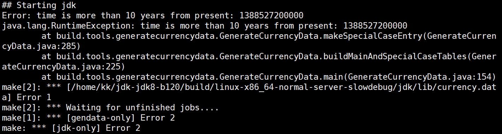
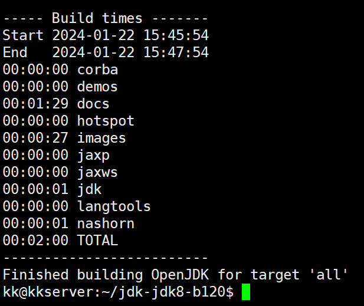

# 课程链接

[Java JVM 虚拟机 已完结（IDEA 2021版本）4K蓝光画质 全程劝退 - by 青空の霞光](https://www.bilibili.com/video/BV1Er4y1r7as)

# 笔记

[柏码 - 让每一行代码都闪耀智慧的光芒！ (itbaima.cn)](https://www.itbaima.cn/document)

## 报错记录

1. time is more than 10 years from present

   

   > 解决办法：
   >
   > 1. （亲测无效）（[博客地址](https://yddmax.github.io/2017/06/12/openjdk%E4%B9%8B%E7%BC%96%E8%AF%91%E7%BB%8F%E5%B8%B8%E5%87%BA%E7%8E%B0%E7%9A%84%E9%97%AE%E9%A2%98/)）：
   >
   >    修改 jdk/src/share/classes/java/util/CurrencyData.properties 文件
   >
   >    修改108行
   >    `AZ=AZM;2009-12-31-20-00-00;AZN`
   >    修改381行
   >    `MZ=MZM;2009-06-30-22-00-00;MZN`
   >    修改443行
   >    `RO=ROL;2009-06-30-21-00-00;RON`
   >    修改535行
   >    `TR=TRL;2009-12-31-22-00-00;TRY`
   >    修改561行
   >    `VE=VEB;2009-01-01-04-00-00;VEF`
   >
   > 2. （亲测有效）（[Github 地址](https://github.com/NixOS/nixpkgs/commit/9b81769950b6d0221643c7b0758d894f7742a62a)）
   >
   >    修改相关时间计算函数中的计算代码

2. 还有几个 Not found 报错原因：只将更改前的（nashorn/make/BuildNashorn.gmk 文件中的）代码注释而未删掉

## 成功瞬间

1. JDK8 编译成功

   

   截止 2024.1.23 00:00
