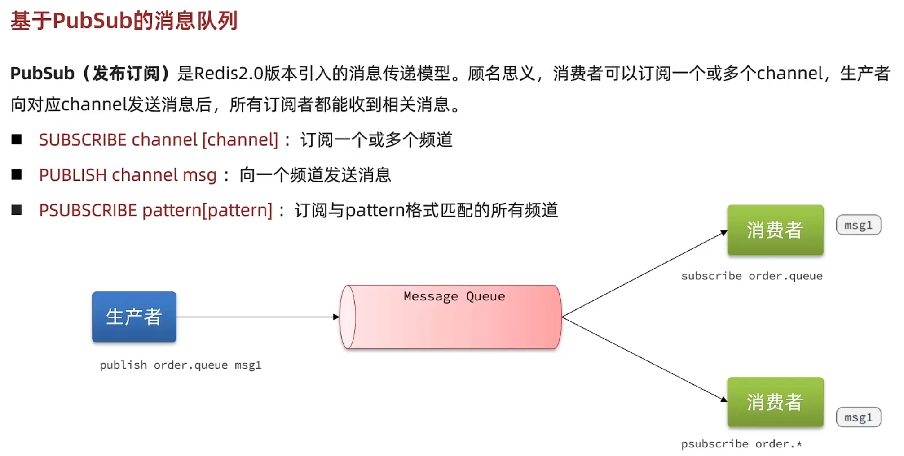

# 1. 坦克大战 (停止维护)

1. Repo:
   1. [TanksBattle (Github)](https://github.com/kkyesyes/TanksBattle/tree/master)

# 2. 多用户通信系统 (暂停维护)

1. Repos:
   1. [Client (Github)](https://github.com/kkyesyes/Multi-userCommunicationSystem-Client)
   2. [Server (Github)](https://github.com/kkyesyes/Multi-userCommunicationSystem-Server)

# 3. 从 0 实现 Tomcat (暂停维护)

1. Repo:
   1. [KKTomcat (Github)](https://github.com/kkyesyes/KKTomcat)

2. Notes:

   1. 已完结

      （详情见 JavaWeb 相关部分）

# 4. 家居网购 (暂停维护)

1. Assets:
   1. [Java正则表达式大全(参考).zip](./Java正则表达式大全(参考).zip)

2. Repo:
   1. [JavaWebQuiz (Github)](https://github.com/kkyesyes/JavaWebQuiz)

3. Notes:

## 技术栈：

- 原生 Servlet / 过滤器，WEB-Service-DAO-Entity

## 软件项目开发流程

   1. 需求分析阶段

      
             

   2. 设计阶段

   

   3. 开发阶段

   

   4. 测试阶段

   

   5. 实施阶段

   

   6. 维护阶段

   

   7. 项目设计

      1. 后端三层架构

         

      2. 项目分包方案

         

      3. MVC

         

         1. MVC 全称：Model、View、Controller
         2. 最早出现在 JavaEE 三层中的 Web 层，可有效指导 Web 层的代码分离，单独工作（解耦）
         3. View 视图：负责数据和界面显示，不接受任何与数据无关的代码
         4. Controller 控制器：负责接收请求，调用业务层的代码处理请求，然后派发页面（调度者）
         5. Model 模型：将与业务逻辑相关的数据封装为具体的 JavaBean 类，其中不掺杂与数据处理相关的代码

## 代码归档（Version of Git's message）

  1. 开发环境搭建（1.x）
  2. 会员注册前端校验与后端表设计（2.x）
  3. 会员注册后端服务（3.x）
  4. 会员登录（4.x）
  5. 登录错误提示，表单回显用户名（5.x）
  6. Servlet 瘦身优化（6.x）
  7. 后台管理 - 家居显示（7.x）
  8. 后台管理 - 家居添加（8.x）
     1. 中文乱码问题解决：要在 BasicServlet（父类）中设置 req 编码
     2. 表单重复提交问题解决：设置重定向（重定向本质为两次请求）
     3. 后端数据校验：捕获异常并返回信息
  9. 后台管理 - 家居删除（9.x）
  10. 后台管理 - 家居修改（10.x）
  11. 后台分页 - 家居分页显示（11.x）
      1. 数据模型：高频变化的数据封装为 Bean（如导航条数据）
  12. 首页分页（12.x）
  13. 首页搜索（13.x）
  14. 会员显示登录名（14.x）
  15. 注销登录（15.x）
  16. 注册验证码（16.x）
  17. 添加家居到购物车（17.x）
  18. 购物车的显示、修改、清空等界面前后端交互（18.x）
  19. 添加购物车操作库存校验（19.x）
  20. 过滤器权限验证（20.x）
  21. 事务管理（21.x）
      1. ThreadLocal 统一管理数据库连接
  22. 统一错误页面（22.x）
  23. AJAX 重构（23.x）
  24. 家居图片更新功能（24.x）

   4. 项目完结

# 5. 人人点评网（Redis）

## 短信登录（Session to Redis）

1. Session 不方便进行多台 Tomcat 横向部署
2. 拦截器内取 token 不能使排除页面获取 token

## 缓存（Cache）

1. 缓存更新

   1. 更新策略

      1. 内存回收，自动更新（**低一致** 性需求）
      2. 设置超时，定时更新（**低一致性** 需求）
      3. 编码，主动更新（**高一致性** 需求）

   2. 缓存一致性问题

      1. 先删缓存，再更新数据库
      1. 先更新数据库，再写缓存（✅缓存更新速度快，相对影响小）

2. 缓存穿透

   指客户端请求的数据在缓存中和数据库中都不存在，这样缓存永远不会生效，这些请求都会打到数据库

   1. 缓存空对象
      1. 优：实现简单，维护方便

      2. 缺：
         1. 额外内存消耗
         2. 可能造成短期数据不一致

   2. 布隆过滤（用数据索引布尔值来做存在判断）
      1. 优：内存占用少，无多余 key
      2. 缺：
         1. 实现复杂
         2. 存在误判可能

3. 缓存雪崩

   指同一时段大量缓存 key 同时失效或 Redis 服务宕机，导致大量请求到达数据库，带来巨大压力

   1. 给不同的 key 的 TTL 添加随机值
   2. 利用 Redis 集群提高服务可用性
   3. 给缓存业务添加降级限流策略（如提前返回、拒绝服务）
   4. 给业务添加多级缓存（如 Nginx 缓存、JVM 本地缓存）

4. 缓存击穿

   查询过程较慢导致大量请求打到数据库

   1. 互斥锁

      

      1. 优：
         1. 无额外内存消耗
         2. 保证一致性
         3. 实现简单
      2. 缺：
         1. 线程需要等待，性能受影响
         2. 可能有死锁风险

   2. 逻辑过期

      

      1. 优：
         1. 线程无需等待，性能较好
      2. 缺：
         1. 不保证一致性
         2. 有额外内存消耗
         3. 实现复杂

5. 缓存工具封装

## 优惠券秒杀（Redisson）

1. 全局唯一 ID

   

2. 实现优惠券下单

3. 超卖问题（JMeter 实测）

   1. 加锁

      

      1. 乐观锁

         不加锁，在更新时判断是否有其它线程在修改

         1. 版本号法

            在表中加一个版本号字段，用于判断

         2. CAS 法（比较和替换）

            库存与版本号同时变化，那么库存同时具有与版本号相同的功能

            1. 优：性能好

            2. 缺：存在成功率低的问题

               > 可分批加锁 或 低要求加锁

      2. 悲观锁

         添加同步锁，让线程串行执行

         1. 优：简单粗暴
         2. 缺：性能一般

4. 一人一单

   判断同人同单的订单是否存在

   因为是插入操作而不是更新，所以采用悲观锁

   > 快捷键：Ctrl + Alt + M -> *封装所选代码段为私有方法*

   1. 加锁位置

      1. 对用户加锁而不是操作

         
         
         要对同一用户加锁，故将锁加在 userId 字段上，注意以值判断是否等价（getId() 返回的是新对象，toString() 方法返回的也是新对象）

   2. 释放锁后事务可能未提交

      1. 要对封装方法加锁

         

   3. 非代理对象事务失效

      return 处调用的函数的对象为 this，还未被 Spring 代理，会造成事务失效

      1. 取得代理对象后用代理调用方法

         
         
         > 使用代理对象需要的配置
         >
         > 1. 引入依赖 org.aspectj
         >
         >    
         >
         > 2. 暴露代理对象
         >
         >    

   4. 集群并发安全（⬇️分布式锁⬇️）

5. 分布式锁

   满足分布式系统或集群模式下 **多进程可见** 并且 **互斥** 的锁

   

   1. 实现方案

      

   2. 两个基本方法

      

      > 自动拆箱注意空指针问题

   3. 锁误删

      

      问题剖析：释放锁时应确认锁是否属于自己（线程锁标识可用 UUID 表示）

   4. 判断与释放的原子性问题（Lua 脚本）

      Redis 提供了 Lua 脚本功能，在一个脚本中编写多条 Redis 命令，确保多条命令执行时的原子性

      

      ```java
      private static final DefaultRedisScript<Long> UNLOCK_SCRIPT;
      
      static {
              UNLOCK_SCRIPT = new DefaultRedisScript<>();
              UNLOCK_SCRIPT.setLocation(new ClassPathResource("unlock.lua"));
              UNLOCK_SCRIPT.setResultType(Long.class);
      }
      
      @Override
      public void unlock() {
          stringRedisTemplate.execute(
                  UNLOCK_SCRIPT,
                  Collections.singletonList(KEY_PREFIX + lockName),
                  ID_PREFIX + Thread.currentThread().getId()
          );
      }
      ```

   5. Redisson

      基于 setnx 实现的分布式锁存在问题

      

      Redisson：在 Redis 基础上实现的 Java 驻内存数据网络（In-Memory Data Grid）。它不仅提供了一系列的分布式 Java 常用对象，还提供了许多分布式服务，其中就包含了各种分布式锁的实现

      1. 分布式锁原理

         

      2. 总结

         

         

6. Redis 优化秒杀

   

   

7. Redis 消息队列实现异步秒杀

   1. 基于 List 实现

      

      

   2. 基于 PubSub 实现

      

      

   3. 基于 Stream 实现

      

      1. XREAD

         

         

         特点
   
         
   
      2. 消费者组
   
         
   
         
   
         
   
         
   
   4. 总结
   
      

## 达人探店

1. 查看探店笔记
2. 点赞实现
3. 点赞排行

## 好友关注


# 6. 爱乐之城（PileUp） - （乐手匹配系统）

1. Repos:
   1. [PileUp-Frontend (Github)](https://github.com/kkyesyes/PileUp-Frontend)
2. Notes:

## 需求分析

1. 用户添加标签，标签分类
2. 搜索、标签搜索
   1. Redis 缓存
3. 组队
4. 允许用户修改标签
5. 推荐
   1. 相似度计算算法 + 本地分布式计算

## 技术栈

### 前端

1. Vue3（提高页面开发效率）
2. Vant UI （基于 Vue 的移动端组件库）（React 版 Zent）
3. Vite（打包工具）
4. Nginx 单机部署

### 后端

1. Java + SpringBoot
2. SpringMVC + MyBatis + MyBatis Plus
3. MySQL 数据库
4. Redis 缓存
5. Swagger + Knife4j 接口文档

## 代码归档

1. 前端项目初始化（1.x）

2. 前端主页 + 组件概览（2.x）

   1. 设计
      1. tabbar
         1. 首页（推荐 + 广告）
            1. 推荐信息流（含广告）
         2. 发现页（搜索/热搜）
         3. 消息（邮件）
         4. 用户页（我）
   2. 开发

3. 数据库表设计

   1. 标签表

      1. 性别：男、女
      2. 方向：Java、C++、Go、前端、网安
      3. 正在学：Spring
      4. 目标：考研、春招
      5. 段位：初级、中级、高级、王者
      6. 身份：大一、大二、大三、大四、学生、待业、已就业、研一、研二、研三
      7. 状态：乐观、有点丧、单身、已婚、有对象
      8. **用户自定义标签**
      9. 字段
         1. id int 主键
         2. 标签名 varchar 非空（必须唯一，唯一索引）
         3. 上传标签的用户 userId int（根据 userId 查已上传标签，普通索引）
         4. 父标签 id parentId int（分类）
         5. 是否为父标签 isParent tinyint （0 -> 不是父标签 / 1 -> 是父标签）
         6. 创建时间 createTime datetime
         7. 更新时间 updateTime datetime
         8. 是否删除 isDelete tinyint （0/1）

   2. 修改用户表（**根据需求**）

      1. 补充 tags 字段，存 json 字符串 :white_check_mark:

         1. 优：查询方便、不用新建关联表，标签是 **用户的固有属性** （除该系统之外还可能用到）

            > 性能低可用 Redis

         2. 缺：用户表多一列

      2. 加一个关联表，记录用户和标签的关系

         1. 优：（应用场景：）查询灵活、可正查反查

         2. 缺：要多建一个表、多维护一个表

            > 企业大项目开发中尽量减少关联查询，很影响扩展性，而且影响查询性能

4. 后端接口开发（3.x）

   > 用户中心集中提供用户的检索、操作、注册、登录、鉴权

   1. 根据标签搜索用户

5. 根据标签搜索用户 - 前端（）

# x. 硅谷课程（SpringBoot 后）

含公众号开发、文件上传、点播、直播...

# x. 智能 BI（React + SpringBoot + MQ + AIGC）


# x. 尚医通（微服务一血）

