# 课程链接

[【零基础 快速学Java】韩顺平 零基础30天学会Java_哔哩哔哩_bilibili](https://www.bilibili.com/video/BV1fh411y7R8/?spm_id_from=333.999.0.0&vd_source=760264507c20c8ac38634e47af1aa1fa)

[JavaSE 9-17 新特性 已完结（IDEA 2022.1最新版）4K蓝光画质 - by 青空の霞光](https://www.bilibili.com/video/BV1tU4y1y7Fg)

# 笔记引用

[柏码 - 让每一行代码都闪耀智慧的光芒！ (itbaima.cn)](https://www.itbaima.cn/document)

# 环境

# 基本类型 & 引用类型

# 运算

# 进制 & 数的存储 & 位运算

# 分支  循环

## if else if else

## switch case

## for

## while

## do while

## break

## continue

# 数组

# 面向对象

## 属性

## 方法

## 递归

## 重载

## 可变参数

## 作用域

## 构造器

## this

## super

# 包

## 访问修饰符

## 封装

## 继承

## 方法重写

## 多态

## ==运算符

## 子类重写equals

## hashCode

## toString

## finalize

## 断点调试

## [项目1]零钱通

(未做)

|----------

# 类基础

## 类变量

## 类方法

## main

## 代码块

## final

## 单例模式


# 抽象类 & 接口


# 内部类

- 基本介绍：
  1. 一个类的内部又完整的嵌套了另一个类结构
  2. 其最大特点就是 **可以直接访问私有属性** ，并且可以体现类与类之间的包含关系
  3. 是类的第五大成员（属性、方法、构造器、代码块、内部类）

## 局部内部类（有类名）

1. 可以直接访问外部类的所有成员，包含私有的

2. 不能添加访问修饰符。因为它的地位就是一个局部变量。局部变量是不能使用修饰符的。但是可以使用final修饰（则不能被继承），因为局部变量也可以使用final

3. 作用域：仅仅在定义它的方法或代码块中

4. 局部内部类  --直接访问-->  外部类的成员

5. 外部类  --创建对象后访问(作用域内)-->  局部内部类成员

   > 谨记：
   >
   > 1. 局部内部类定义在 （通常）方法 /代码块 中
   > 2. 作用域在 方法体 或者 代码块 中
   > 3. 本质仍然是一个类

6. 外部其它类  --不能访问--> 局部内部类（因为局部内部类地位是局部变量）

7. 如果外部类和局部内部类的成员重名时，默认遵循就近原则。如果想访问外部类的成员，则可以使用（外部类名.this.成员）访问

## 匿名内部类（没有类名）

1. 基本语法

   ```java
   new Class() {
       @Override
       public void cry() {
           System.out.println("Cring...");
       }
   }.cry();
   ```

   > 注：
   >
   > - 本质是类
   > - 内部类
   > - 匿名
   > - 同时也是一个对象

2. 应用实践
   1. 当做实参直接传递

## 成员内部类（无static修饰）

- 成员内部类是定义在外部类的成员位置，并且 无static修饰

1. 可以直接访问外部类的所有成员，包含私有的
2. 可以添加任意访问修饰符（public、protected、默认、private），因为它的地位就是一个成员
3. 作用域：同外部类的其他成员一样，为整个类体

## 静态内部类（static修饰）

- 静态内部类是定义在外部类的成员位置，并且有static修饰

1. 可以直接访问外部类的所有**静态成员**，包含私有的，但不能直接访问非静态成员
2. 可以添加任意修饰符（成员地位）
3. 作用域：同其它成员，为整个类体

# 枚举类(Enumeration)

1. 基本定义：枚举是一组常量的集合，特殊的类，里面只包含一组有限的特定的对象，**类中成员默认为private修饰**

2. 实现方式：

   1. 自定义类实现枚举
      1. 不需要提供setXxx方法，因为枚举对象值通常为只读
      2. 对枚举对象/属性使用 final + static 共同修饰，实现底层优化
      3. 枚举对象名通常要使用全部大写（常量命名规范）
      4. 枚举对象根据需要，也可以有多个属性
   2. 使用enum关键字实现枚举
      1. 当使用enum关键字开发一个枚举类时，默认会继承Enum类
      2. 传统的`public static final Season2 SPRING = new Season2("春天", "温暖");` 简化成 `SPRING("春天", "温暖")`，这里必须知道它调用的哪个构造器
      3. 若使用无参构造器 创建 枚举对象，则 **实参列表** 和 **小括号** 都可以省略
      4. 当有多个枚举对象时，使用 **逗号** 间隔，最后以一个分号结尾
      5. 枚举对象必须放在枚举类的行首

3. Enum常用方法：

   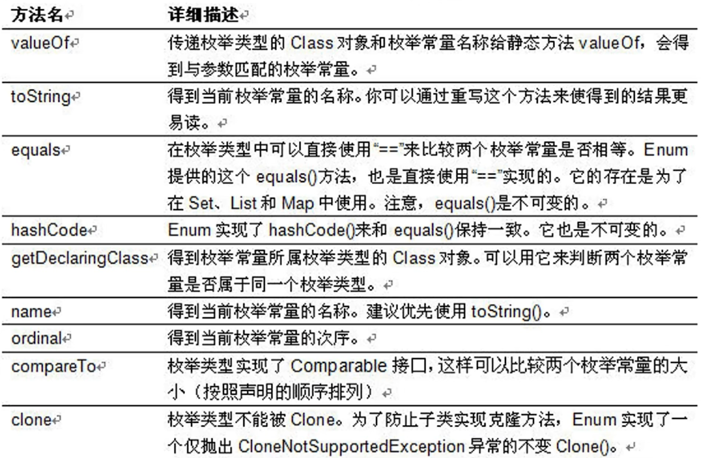

4. enum实现接口：

   1. 不能继承其它类（因为已经隐式继承Enum类）
   2. 可以实现接口（同其它类一样）

# 注解

- 理解：
  1. 注解(Annotation)也被称为 元数据(Metadata)，用于修饰 包、类、方法、属性、构造器、局部变量 等数据信息
  2. 和注释一样，注解不影响程序逻辑，但注解可以被编译或运行，相当于嵌入在代码中的补充信息
  3. 在JavaSE中，注解的使用目的比较简单，例如标记过时的功能，忽略警告等。在JavaEE中注解占据了更重要的角色，例如用来配置应用程序的任何切面，代替JavaEE旧版本中所遗留的繁冗代码和XML配置等

## @Override

1. 限定某个方法，是重写父类方法，该注解只能用于方法

   > @interface
   >
   > - @interface 不是 interface，是注解类（jdk5.0后加入）

2. 只能修饰方法，不能修饰其它类、包、属性等

3. 未加该注解的重写 仍构成重写

4. 查看@Override注解源码为 @Target(ElementType.METHOD)，说明只能修饰方法

5. @Target是修饰注解的注解，称为元注解

## @Deprecated

1. 用于表示某个程序元素（类、方法等）已过时
2. 可以修饰方法、类、字段、包、参数 等等
3. @Target(value={CONSTRUCTOR, FIELD, LOCAL_VARIABLE, METHOD, PACKAGE, PARAMETER, TYPE})
4. @Deprecated的作用可以做到新旧版本的兼容和过渡

## @SuppressWarnings({"xxx", "xxx"})

1. 抑制编译器警告

## 元注解

1. 基本介绍

   JDK的元Annotation用于修饰其它Annotation

   > 元注解：本身作用不大，看懂即可

2. 种类

   1. @Retention -> *指定注解的作用范围，三种 SOURCE, CLASS, RUNTIME*

      1. RetentionPolicy.SOURCE -> *编译器使用后，直接丢弃这种策略的注解*
      2. RetentionPolicy.CLASS -> *编译器将把注解记录在class文件中，当运行Java程序时，JVM不会保留注解（默认）*
      3. RetentionPolicy.RUNTIME -> *编译器将把注解记录在class文件中，当运行Java程序时，JVM会保留注解，程序可以通过反射获取该注解*

   2. @Target -> *指定被修饰的注解可以用于修饰哪些程序元素（包含一个名为value的成员变量）*

   3. @Documented -> *指定该注解是否会在javadoc体现（即生成文档时可以看到该注解）*

      > 注：定义为Documented的注解必须设置Retention值为RUNTIME

   4. @Inherited -> *子类会继承父类注解*

      被它修饰的Annotation将具有继承性。若某个类使用了被它修饰的Annotation，则其子类将自动具有该注解（实际应用较少）

# 异常

## 异常体系

## 五大运行时异常

## try catch

## throws

## 自定义异常


> Throw VS Throws

# 常用类

## 八大Wrapper类

## 装箱 & 拆箱

## 包装类

1. Integer创建机制

   若初始值大小在cache范围内(-128~127)则不new，否则会new一个Integer对象.

   ```java
   public static Integer valueOf(int i) {
       if (i >= IntegerCache.low && i <= IntegerCache.high)
           return IntegerCache.cache[i + (-IntegerCache.low)];
       return new Integer(i);
   }
   ```
   
   注：Integer对象在与基本类型如int进行==比较时比的是值

## String 类 ->*不可变字符序列 效率低 复用率高*

1. Serializable(串行化) -> 代表可以在网络中传输

2. Comparable -> 说明String对象可以比较

3. 是**final类**，不能被继承

4. 底层是用private **final**(指地址不可更改) char value[];来存放字符串内容

5. 对象创建

   1. **直接赋值**`String s = "xxx";`

      先从**常量池**查看是否有"xxx"数据空间，如有则指向，否则重新创建后指向。s最终指向**常量池的空间地址**。

   2. 调用构造器`String s2 = new String("xxx");`

      在堆中创建空间，维护value属性，指向常量池的xxx空间。常量池中有"xxx"则通过value指向，无则创建后指向。s2最终指向堆中的空间地址。

6. intern()方法 -> 返回常量池地址

7. charAt()方法 -> 获取某索引处的字符，注意**不能使用 Str [ index ] 这种写法**

8. 对象特性

   ```java
   String a = "hello";
   String b = "abc";
   
   String c = a + b;
   // 先创建一个StringBuilder sb = StringBuilder()
   // 执行 sb.append("hello");
   //     sb.append("abc");
   // String c = sb.toString();
   // 最后c指向堆中的对象(底层new出)指向池中的"helloabc"
   ```

   **常量相加看池，变量相加看堆**

   

   例题：

   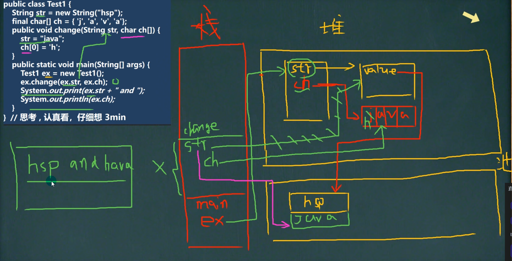

## StringBuffer 类 ->*可变字符序列 效率高(增删) 线程安全*

1. java.lang.StringBuffer代表可变字符序列(**可变长度**)，可对字符串内容进行增删

2. 直接父类为AbstractStringBuilder

3. 实现 Serializable， 可串行化

4. 是 **final 类**

5. 父类 AbstractStringBuilder 有**非final**属性 char[] value。

   value 数组存放字符串内容， 因此是**存放在堆中的**

6. 常用方法：

   1. append(String s)
   2. delete(int start, int end) -> *删除子串 | 左闭右开*
   3. replace(int start, int end, String s) -> *将索引 [start, end)内的字符替换为 s*
   4. indexOf(String s) -> *查找指定字串s在字符串中第一次出现的索引，找不到返回-1*
   5. insert(int index, String s) -> *在索引为 index 处插入 s*
   6. length()

## String与StringBuffer互转

1. **-->**:

   1. 构造器：

      ```java
      String s = "xxx";
      StringBuffer sb = new StringBuffer(s);
      ```

   2. StringBuffer.append():

      ```java
      StringBuffer sb = new StringBuffer();
      sb = sb.append(s);
      ```

2. **<--**:

   1. 构造器：

      ```java
      StringBuffer sb = new StringBuffer("yyy");
      String s = new String(sb);
      ```
   
   2. StringBuffer.toString():
   
      ```java
      String s = sb.toString();
      ```
   

## StringBuilder 类 ->*可变字符序列 效率最高 线程不安全*

1. 可变字符序列。提供与StringBuffer兼容的API，但其方法没有做互斥处理(无synchronized)，不保证同步(非线程安全)

   该类被设计用作StringBuffer的一个简易替换，用在**字符串缓冲区被单个线程使用**的时候。

   建议优先使用(大多数实现中比StringBuffer快)

2. StringBuilder上的主要操作是append和insert方法(可重载以接受任意类型的数据)

3. 是**final类**，不能被继承

4. 实现Serializable， 可串行化

5. 对象字符序列存放在其父类的char[] value(堆)中

## Math 类


## Arrays 类 -> *包含一系列静态方法，用于管理&操作数组 (如排序 and搜索)*

1. toString() -> *返回数组的字符串形式*

2. sort() -> *自然排序和定制排序*

   定制排序 -> *Arrays.sort(待排数组, 匿名内部类)*

3. binarySearch() -> *通过二分搜索法进行**查找**(对升序序列),不存在返回-1*

4. copyOf -> *数组元素的复制*

   拷贝长度 > arr.length 则填充null

   拷贝长度 < 0 则throw Exceptions

   底层使用System.arraycopy()

5. fill -> *数组元素的填充*

   填充后数组中**所有元素的值**均为传入参数

6. equals -> *比较两个数组元素内容是否完全一致*

   返回 传入arr1 与 arr2的元素内容是否相同的bool值

7. asList -> *将一组值转换成 list*

   返回的编译类型为List(接口)，其运行类型为java.util.Arrays#ArrayList(Arrays类的静态内部类)

## System 类

1. exit() -> *退出当前程序*
2. arraycopy() -> *复制数组元素，一般用于底层调用*
3. currentTimeMillens() -> *返回当前时间距离1970-1-1的毫秒数*
4. gc() -> *运行垃圾回收机制*

## BigInteger & BigDecimal 类 -> *将大数的字符串形式传入构造*

1. BigInteger/BigDecimal常用方法

   1. add()

   2. subtract()

   3. multiply()

   4. divide()

      BigDecimal使用时注意可能throw无限循环小数异常，通过指定精度`b1.divide(b2, BigDecimal.ROUND_CEILING)`来使结果**保留分子精度**

      推荐使用`b1.divide(b2, RoundingMode.CEILING)`-(2023-9-2)

      

2. 总结：

   BigInteger   处理大整型

   BigDecimal 处理高精度浮点

## 日期类

1. 第一代日期类

   1. Date类 -> (java.util.Date)精确到毫秒，代表特定瞬间

   2. SimpleDateFormat类 -> 格式化和解析日期(即用即查)

      

      1. 日期 -> 日期: 格式化

         new一个模板对象，传入格式字符串(格式控制字符是规定好的)，后调用模板对象的format()函数传入raw data返回格式化后的string

         

      2. 日期 -> 文本: 解析

         

      3. 文本 -> 日期: 规范化

         调用模板对象的parse()方法传入raw string返回对应Date规范的数据

         

2. 第二代日期类

   1. Calendar类 -> 抽象类，为 **特定瞬间与日历字段的转换& 操作日历字段** 提供方法

      1. 构造器为private，**不能使用new**

      2. 可通过getInstance()获取实例

      3. 提供大量方法和字段

      4. 调用方式：(无专门格式化方法，需自行组合)

         c.get( Calendar.字段 )  *注：调用月份字段时返回要+1(默认从0开始)*

3. 第三代日期类 -> *jdk8加入*

   1. LocalDate -> *日期：年月晶*

   2. LocalTime -> *时间：时分秒*

   3. LocalDateTime -> *日期+时间：年月日时分秒*

   4. 常用方法：

      `LocalDateTime ldt = LocalDateTime.now()`

      now()方法返回表示当前日期时间的对象

      后可调用ldt的诸多方法获取细节内容

   5. DateTimeFormatter 格式日期类 -> *类似SimpleDateFormat*

   6. Instant 时间戳 -> *类似于Date，提供与Date类的转换方法*

      1. Instant -> Date:

         `Date date = Date.from(instant);`

      2. Date -> Instant:

         `Instant instant = date.toInstant();`

# 集合

**集合：**主分为**单列集合**和**双列集合**可以动态保存任意多个对象，提供操作对象的方法，代码简洁

## Collection -> 单列集合接口 -> 存放单个元素

*下图重点：*

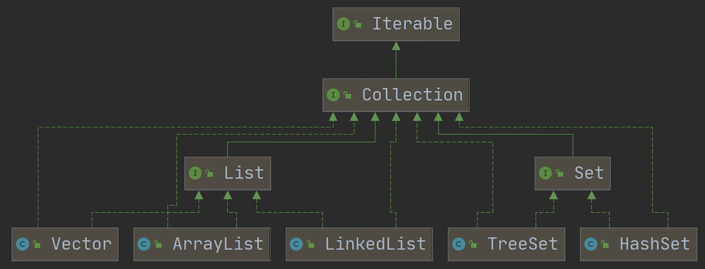

1. 常用方法：
   1. add()
   2. remove()
   3. contains() -> *查找元素是否存在*
   4. size()
   5. isEmpty()
   6. clear()
   7. addAll()

2. 遍历方式

   1. Iterator -> *(itit + tab)*

      所有实现了Collection接口的集合类都有一个Iterator方法(继承自Iterable)，用以返回一个实现了Iterator接口的对象(迭代器)

      Iterator仅用于遍历，本身不存放对象

      

      **常用方法**：

      1. hasNext()
      2. next()
      3. remove()

   2. for -> *只能用于遍历集合和数组，底层仍是迭代器 (I + tab)*

      `for (Object obj : collection) { }`

3. **List**子接口

   1. 特性：
      1. 元素有序，可重复
      2. 支持索引(**.get(index)**) -> *可索引遍历*

   2. 实现类：

      1. **ArrayList**

         1. 可以加入null

         2. 底层由数组实现

         3. 基本等同于Vector，但**线程不安全(执行效率高)**，多线程不建议使用

            

         4. **底层机制源码分析**

            1. ArrayList中维护了一个Object数组elementData

               `transient Object[] elementData;`

               **transient**：瞬间/短暂 -> 表示属性不会被序列化?

            2. 创建对象时 若用无参构造则初始elementData == 0 (10 in jdk7)

            3. 添加元素时 判断若需扩容则调grow()，否则直接添加

            4. 使用无参构造 且 第一次添加，若需扩容则扩容elementData为10，如需再次扩容则扩容elementData为1.5倍

            5. 如使用指定容量capacity的构造器，则初始elementData == capacity，如需扩容则扩为1.5倍

      2. **LinkedList**

         1. 实现了**双向链表**和**双端队列**的特点

         2. 可以添加任意元素包括null

         3. **线程不安全**(无同步)

            

         4. **底层机制源码分析**

            1. 底层维护了一个双向链表
            2. 维护了两个属性：first(首节点)和last(尾节点)
            3. 每个节点(Node对象)里又维护了prev(前一个)、next(后一个)、item()三个属性，实现双向链表
            4. 元素添加删除效率高

      3. **Stack**

      4. **Vector**

         1. 底层为对象数组

            `protected Object[] elementData;`

         2. **线程安全**(操作方法带有synchronized)

         3. 需要线程安全同步时使用

            

         4. **底层机制源码分析**

            1. 无参构造默认size == 10，之后按2倍扩容
            2. 若指定大小构造，之后直接2倍扩容

      5. ......

   3. 方法 -> *操作元素*

      1. void **add**(int *index*, Object *ele*)

         在index位位置插入ele

      2. boolean **addAll**(int *index*, Collection *eles*)

         从index处开始将eles中的所有元素加入

      3. Object **get**(int *index*)

         获取index处的元素

      4. int **indexOf**(Object *obj*)

         返回obj在集合中**首**次出现的位置

      5. int **lastIndexOf**(Object *obj*)

         返回obj在集合中**末**次出现的位置

      6. Object **remove**(int *index*)

         移除index位置的元素，返回此元素

      7. Object **set**(int *index*, Object *ele*)

         设置指定index位置的元素为ele(替换)

      8. List **subList**(int *fromIndex*, int *toIndex*)

         返回从fromIndex到toIndex位置(左闭右开)的字集合

   

4. **Set**子接口

   1. 特性：
   
      1. 无序，无索引
      2. 无重复
   
   2. 实现类：
   
      1. **HashSet**
   
         1. **底层机制源码分析**
   
            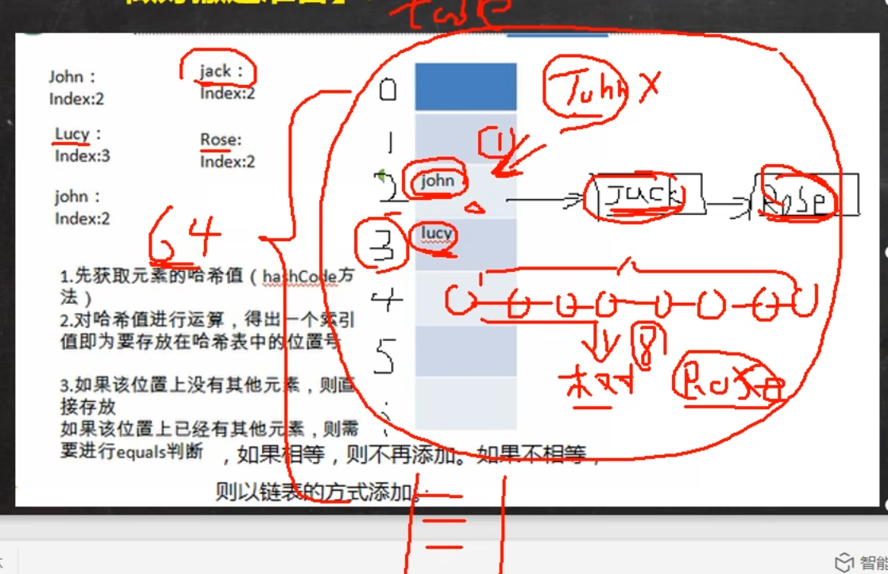
   
            1. HashSet  底层是 HashMap
   
               HashMap底层是 **数组 + 链表 + 红黑树**
   
               `new HashMap<>();`
   
            2. 添加一个元素时，先通过**hash**得到hash值，后转化为索引值
   
               1. `add();`
   
               2. `put();`
   
                  该方法会调用
   
                  ```java
                  static final int hash(Object key) {
                      int h;
                      return (key == null) ? 0 : 
                      ( h = key.hashCode() ) ^ (h >>> 16);
                  }
                  ```
   
            3. 找到存储数据表table，看这个索引位置是否已经存放有元素
   
            4. 若无，直接加入
   
            5. 若有，调用**equals**比较
   
               1. 同则放弃添加
               2. 异则添加
   
            6. jdk8中，若一链表元素个数达TREEIFY_THRESHOLD( == 8)，且table >= MIN_TREEIFY_CAPACITY( == 64)，就会进行树化(红黑树)
   
         2. **LinkedHashSet** -> *HashSet的子类*
   
            1. LinkedHashSet 底层是LinkedHashMap，底层维护了一个  **数组 + 双向链表**
            2. LinkedHashSet根据hashCode来决定存储位置，用链表维护元素的次序(图)，**使元素看起来是以插入顺序保存的**
            3. 不能添加重复元素
      
      2. **TreeSet** -> *可排序*
      
         1. 提供一个构造器，可以传入比较器
      
      3. ......

*< ctrl+j -> 列出目前所有缩略指令 >*

## Map -> 双列集合接口 -> 存放 K(key)-V(value) 映射关系数据

*下图重点：*

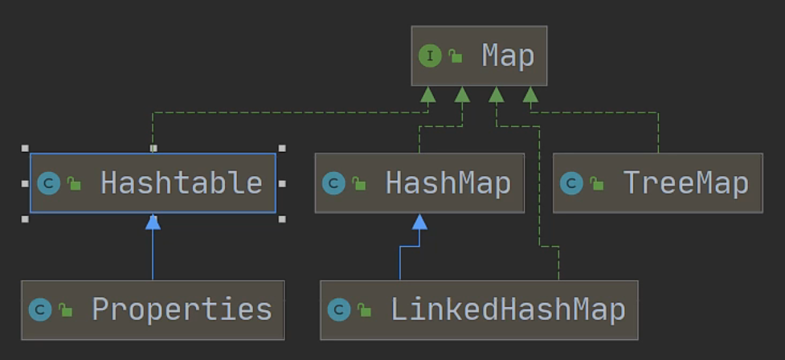

1. 实现类的特点：
   1. Map中的key和value可以是任何引用类型的数据，会封装到HashMap$Node对象中，同时还有一个entry集合指向Node，一对k-v对应一个entry元素，entry中也可以通过getKey()和getValue()单独取出只含key的集合set或只含value的集合collection
   2. **key** **不**允许重复(原因同HashSet，若为相同的key赋不同的value，则会使对应key的value值更新)
   3. **value** 可以重复
   4. 常用String类作为Map的key
   5. key与value之间存在单向一对一关系(通过指定key总能找到对应的value)

2. 实现类：

   1. **HashMap**

   2. **HashTable**

      1. 存放键值对
      2. 键值皆**不**能为null
      3. HashTable 使用方法基本上和HashMap一样
      4. HashTable 是**线程安全**的，HashMap 是线程不安全的

   3. **TreeMap** -> *可排序*

      

   4. **Properties**

      1. Properties继承自HashTable且实现了Map接口，也是一种键值对的形式来保存数据
      2. 使用特点和HashTable类似
      3. Properties还可以用于从xxx.properties文件中 加载数据到Properties类对象，并进行读取和修改
      4. 说明：工作后 xxx.properties 文件通常作为配置文件

3. 常用方法：
   1. put() -> *向表中添加 k-v对*
   2. remove() -> *根据键删除映射关系*
   3. get() -> *根据key获取value*
   4. size()
   5. isEmpty()
   6. clear() -> *键值对全部清空*
   7. containsKey() -> *查找键是否存在*

4. 遍历方法：

   1. 增强for

      ```java
      Set keyset = map.keySet();
      for (Object key : keyset) {
          System.out.println(key + "-" + map.get(key));
      }
      ```

      ```java
      Collection values = map.values();
      for (Object value : values) {
          System.out.println(value);
      }
      ```

      

   2. 迭代器

      1. entrySet的迭代器返回的是HashMap$Node -实现-> Map.Entry，转成此后调用其中的getKey()和getValue

         ```java
         Iterator iterator = entrySet.iterator();
         while (iterator.hasNext()) {
             Object entry = iterator.next();
             Map.Entry m = (Map.Entry) entry;
             System.out.println(m.getKey() + "-" + m.getValue());
         }
         ```

         

   3. EntrySet来获取k-v

      ```java
      Set entrySet = map.entrySet();
      for (Object entry : entrySet) {
          Map.Entry m = (Map.Entry) entry;
          System.out.println(m.getKey() + "-" + m.getValue());
      }
      ```

## 集合选型 -> *取决于业务操作特点*

1. 先判断存储类型(一组对象 或 一组键值对)
2. 一组对象：   **Collection**
   1. 允许重复：    **List**
      1. 增删多：**LinkedList** (底层维护了一个双向链表)
      2. 改查多：**ArrayList** (底层维护了一个Object类型的可变数组)
   2. 不允许重复：**Set**
      1. 无序：    **HashSet** (底层是HashMap，维护了一个哈希表，即 数组+链表+红黑树)
      2. 排序：    **TreeSet**
      3. 插入取出顺序一致：**LinkedHashSet** (维护了数组+双向链表)
3. 一组键值对：**Map**
   1. 键无序： **HashMap** (底层是哈希表：jdk7 = 数组+链表，jdk8 = 数组+链表+红黑树)
   2. 键排序： **TreeMap**
   3. 键插入取出顺序一致：**LinkedHashMap**
   4. 读取文件： **Properties**

## Collections 工具类

1. 介绍：
   1. Collections 是一个**操作 Set, List 和 Map** 等集合的工具类
   2. Collections 中提供了一系列**静态的方法**对集合元素进行排序、查询和修改等操作
2. 排序操作：(均为static方法)
   1. reverse(List)：反转List中元素的顺序
   2. shuffle(List)：根据元素的自然顺序对指定的List集合元素按升序排序
   3. sort(List)：根据 元素的自然顺序对指定List集合元素按升序排序
   4. sort(List, Comparator)：根据指定的Comparator产生的顺序对List集合元素进行排序
   5. swap(List, int, int)：将指定List集合中的i元素与j元素进行交换
   6. max(List)
   7. max(List, Comparator)
   8. min(List)
   9. min(List, Comparator)
   10. frequency(Collection, Object) -> *返回指定集合中指定元素的出现次数*
   11. copy(List dest, List src) -> *将src中的内容复制到dest中*
   12. replaceAll(List list, Object oldVal, Object newVal) -> *使用新值替换List对象的所有旧值*

# 泛型

1. 好处：

   1. 编译时检查添加元素类型，提高了安全性
   2. 减少了类型转换次数，提高了效率

2. 介绍：

   1. 泛型又称参数化类型，是jdk5.0出现的新特性，解决数据类型的安全性问题

   2. 在类声明或实例化时只要指定好需要的具体类型即可

   3. Java泛型可以保证如果程序在编译时没有发出警告，运行时就不会产生ClassCastException异常。同时代码更简洁，健壮

   4. 可以在类声明时通过一个标识表示类中 某个**属性**的类型 或 某个**方法**的返回值类型 或 **参数**类型

      

3. 注意事项&细节：
   1. 给泛型指定数据类型时，要求是引用类型，不能是基本数据类型
   2. 在指定泛型具体类型后，可以传入该类型或者其子类类型
   3. 若不明确指定则默认为<E>，即Object

## 自定义泛型类

1. 注意细节：
   1. 普通成员可以使用泛型(属性，方法)
   2. 使用泛型的 数组，不能初始化
   3. 静态方法中不能使用类的泛型
   4. 泛型类的类型，是在创建对象时确定的，如未确定则默认为Object

## 自定义泛型接口

1. 注意细节：
   1. 静态成员不能使用泛型
   2. 泛型接口的类型，在 继承接口 或 实现接口 时确定，如未确定则默认为Object

## 自定义泛型方法

1. 注意细节：
   1. 泛型方法，可以定义在普通类中，也可以定义在泛型类中
   2. 当泛型方法被调用时，类型会确定
   3. public void eat(E e) {}，修饰符后没有<T, R...>，该方法不是泛型方法，而是使用了泛型

## 泛型的继承和通配符

1. 泛型不具备继承性
2. <?> -> *支持任意泛型类型*
3. <? extends A> -> *支持A类以及A类的子类，规定了泛型的上限*
4. <? super A> -> *支持A类以及A类的父类，不限于直接父类，规定了泛型的下限*

## JUnit -> *Java语言单元测试框架*

用@Test

# 多线程

## 线程的基本使用

(ctrl+alt+t -> *提示快捷键*)

1. 创建线程的两种方式
   1. 继承Thread类，重写run方法，调用start()启动线程
   2. 实现Runnable接口，重写run方法，通过new一个Thread(对象)后调用该对象的start()启动线程(使用了**代理模式**)

## 常用方法

1. setName() -> *设置线程名称，使之与参数name相同*

2. getName() -> *返回该线程的名称*

3. start() -> *使该线程开始执行，Java虚拟机底层调用该线程的start0方法*

4. run() -> *调用线程对象run方法*

5. setPriority() -> *更改线程的优先级*

6. getPriority() -> *获取线程的优先级*

7. sleep() -> *在指定毫秒数内让当前正在执行的线程休眠(暂停执行)*

8. interrupt() -> *中断线程*

   

9. yield() -> *(调自身的静态方法)线程的礼让。让出cpu，让其它线程执行，但礼让的时间不确定，所以也不一定礼让成功*

10. join() -> *(调对方的方法)线程的插队。一旦插队成功，则肯定先执行完插入的线程所有的任务*

    

    **注意细节&细节**：

    1. start底层会创建新的线程，调用run，run就是一个简单的方法调用，不会启动新线程
    2. 线程优先级的范围
    3. interrupt，中断线程，但并没有真正地结束线程。所以一般用于中断正在休眠的线程
    4. sleep，线程的静态方法，使当前线程休眠

## 用户线程 和 守护线程

1. 用户线程：也叫工作线程，当线程的任务执行完或通知方式结束

2. 守护线程：一般是为工作线程服务的，当所有的用户线程结束，守护线程自动结束

   设置方法：`线程对象.setDaemon(true);`

3. 常见的守护线程：垃圾回收机制

## 线程的生命周期

线程状态：

1. NEW -> *尚未启动的线程处于此状态*
2. RUNNABLE -> ***在Java虚拟机中执行**的线程处于此状态*
3. BLOCKED -> ***被阻塞等待监视器锁定**的线程处于此状态*
4. WAITING -> ***正在等待另一个线程执行特定动作**的线程处于此状态*
5. TIMED_WAITING -> ***正在等待另一个线程执行动作 达到指定等待时间**的线程处于此状态*
6. TERMINATED -> ***已退出**的线程处于此状态*

## 线程同步

*保证数据在任何同一时刻 最多有一个线程访问，以保证数据的完整性*

同步方法：Synchronized

1. 同步代码块

   ```java
   synchronized (对象) { // 得到对象的锁，才能操作同步代码
       // code block
   }
   ```

   

2. 修饰方法

   ```java
   public synchronized void method(String name) {
       // code block
   }
   ```

## 互斥锁

1. 基本介绍

   1. Java语言中，引入对象互斥锁的概念，来保证共享数据操作的完整性
   2. 每个对象都对应于一个可称为“互斥锁”的标记，这个标记用来保证在任一时刻，只能有一个线程访问该对象
   3. 关键字synchronized来与对象的互斥锁联系。当某个对象用synchronized修饰时，表明该对象在任一时刻只能由一个线程访问
   4. 同步的局限性：导致程序的执行效率降低
   5. 同步方法(非静态)的锁可以是this，也可以是其他对象(要求是同一个对象)
   6. 同步方法(静态)的锁为当前类本身

2. 注意事项&细节：

   1. 同步方法如果没有使用static修饰，默认锁对象为this

   2. 如果方法使用static修饰，默认锁对象为当前类.class

      

   3. 实现的落地步骤：

      1. 需先分析上锁的代码
      2. 选择同步代码块(尽量)或同步方法
      3. 要求多个线程的锁对象为同一个即可

## 线程死锁

*多个线程都占用了对方的锁资源，但不肯相让，导致了死锁，在编程中是一定要避免死锁的发生*

## 释放锁

1. 常见情况：
   1. 当前线程的 同步方法、同步代码块 执行结束
   2. 当前线程 在同步代码块、同步方法 中遇到break、return
   3. 当前线程 在同步代码块、同步方法 中出现了未处理的Error或Exception，导致异常结束
   4. 当前线程 在同步代码块、同步方法 中执行了线程对象的wait()方法，当前线程暂停，并释放锁


# 文件 IO

## 文件流

​		文件在程序中是以 **流** 的形式来操作的

## 常用文件操作

### 创建文件对象相关 构造器 和 方法

1. 构造器（在**内存**中创建）

   1. `new File(String pathname) //根据路径构建一个File对象`

      串

   2. `new File(File parent, String child) //根据父目录文件 + 子路径构建`

      文件对象 + 串

   3. `new File(String parent, String child) //根据父目录+子路径构建`

      串 + 串

2. 相关方法

   createNewFile() -> *将new至内存中的文件对象加载到**硬盘**中*

### 获取文件的相关信息

1. getName() -> *得到文件名*
2. getAbsolutePath() -> *绝对路径*
3. getParent() -> *父级目录*
4. length() -> *文件大小(字节)*
5. exists() -> *是否存 *
6. isFile()
7. isDirectory()

### 目录的操作和文件删除

1. mkdir() -> *创建一级目录*
2. mkdirs() -> *创建多级目录*
3. delete() -> *删除空目录或文件*

## 流的原理及流的分类
### 流的分类
1. 按操作数据**单位不同**分为：字节流(8 bit)二进制文件，字符流(按字符)文本文件
2. 按数据流的**流向不同**分为：输入流，输出流
3. 按数据流的**角色不同**分为：节点流，处理流/包装流

|（**抽象**基类）|字节流|字符流|
|:-:|:-:|:-:|
|输入流|InputStream|Reader|
|输出流|OutputStream|Writer|
>1. Java的IO流共涉及40多个类，实际上非常规则，都是从如上4个抽象基类派生的
>2. 由这4个类派生出来的子类名称都是以其父类名作为子类名后缀

## 输入流

### InputStream(abstract class)

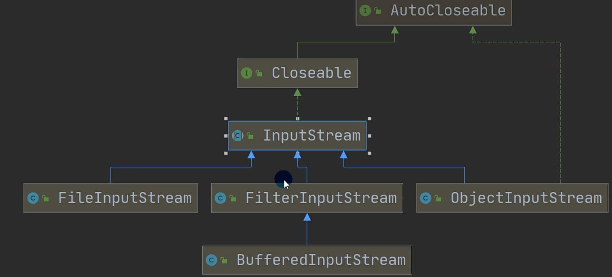

1. FileInputStream -> *文件输入流*

   > 文件完成读取后要关闭以释放资源

   ```java
   // 目标路径
   String inputFilePath = "D:/hello.txt";
   
   // 流对象
   FileInputStream fileInputStream = null;
   
   // 计数器
   int readData = 0;
   int readLen = 0;
   byte[] buff = new byte[8];
   
   // 执行
   try {
       fileInputStream = new FileInputStream(inputFilePath);
       while ((readLen = fileInputStream.read(buff)) != -1) {
           System.out.print(new String(buff, 0, readLen));
       }
   } catch (IOException e) {
       throw new RuntimeException(e);
   } finally {
       // 关闭文件
       try {
           fileInputStream.close();
       } catch (IOException e) {
           throw new RuntimeException(e);
       }
   }
   ```

   

2. BufferedInputStream -> *缓冲字节输入流*

3. ObjectInputStream -> *对象字节输入流*

### Reader(abstract class)

1. (InputStreamReader->)FileReader
   1. 相关方法
2. BufferedReader
3. InputStreamReader

## 输出流

### OutputStream(abstract class)

1. FileOutputStream -> *文件输出流*

   > 在写入时若目标文件不存在则会创建文件(前提是目录已存在)

2. BufferedOutputStream

3. ObjectOutputStream

### Writer(abstract class)

1. (OutputStreamWriter->)FileWriter

   > FileWriter使用后，必须要关闭(close)或刷新(flush)，否则写入不到指定的文件

2. BufferedWriter

3. OutputStreamWriter

## 节点流 & 处理流

### 节点流

节点流可以 从一个特定的数据源 读写数据，如FileReader, FileWriter

### 处理流

处理流（也叫包装流）是**连接**在已存在的流（节点流或处理流之上）为程序提供更为强大的读写功能，如BufferedReader, BufferedWriter。关闭时**只需关闭外层流即可**（底层会自动关闭所包装的节点流）。

1. BufferedReader(字符流) & BufferedWriter(字符流)
2. BufferedInputStream(字节流) & BufferedOutputStream(字节流)


> 节点流与处理流的区别与联系
>
> 1. 节点流是底层流/低级流，直接与数据源相接
> 2. 处理流包装节点流，既可以消除不同节点流的实现差异，也可以提供更方便的方法来完成输入输出
> 3. 处理流对节点流进行包装，使用了修饰器设计模式，不会直接与数据源相连

> 处理流的功能主要体现在以下两个方面
>
> 1. 性能的提高：主要以增加缓冲的方式来提高输入输出的效率
> 2. 操作的便捷：处理流可能提供了一系列便捷的方法来一次输入输出大批量的数据，使用更加灵活方便

## 对象处理流

## 标准输入输出流

### System.in -> *标准输入*（默认键盘）

1. 编译类型 -> InputStream
2. 运行类型 -> BufferedInputStream

### System.out -> *标准输出*（默认显示器）

1. 编译类型 -> PrintStream
2. 运行类型 -> PrintStream

## 转换流

1. OutputStreamReader(将文件流按格式读取)

   ```java
   // 转换流转换
   InputStreamReader isr = new InputStreamReader(new FileInputStream(filePath), "gbk");
   // 包装流包装
   BufferedReader br = new BufferedReader(isr);
   ```

2.  OutputStreamWriter(将文件流按格式保存)

   ```java
   OutputStreamWriter osw = new OutputStreamWriter(new FileOutputStream(filePath), "gbk");
   osw.write("xxx");
   osw.close();
   ```

## 打印流

### PrintStream

### PrintWriter

## Properties 类

# 网络编程

## 网络基础

### 网络通信

1. 概念：两台设备之间通过网络实现数据传输
2. 网络通信：将数据通过网络从一台设备传输到另一台设备
3. java.net 包下提供了一系列 类&接口

### 网络

1. 概念
2. 分类
   1. 局域网
   2. 城域网
   3. 广域网

### IP

### 域名 & 端口

### 网络协议

### TCP & UDP

1. TCP协议：
   1. 使用TCP协议前，须先建立TCP连接，形成传输数据通道
   2. 传输前，采用“三次握手”方式，是**可靠的**
   3. TCP协议进行通信的两个应用进程：客户端、服务端
   4. 在连接中可进行大数据量的传输
   5. 传输完毕，需释放已建立的连接，**效率低**
2. UDP协议：
   1. 将数据、源、目的封装成数据包，不需要建立连接
   2. 每个数据报的大小限制在64K内
   3. 因无需连接，故是**不可靠的**
   4. 发送数据结束时无需释放资源（因为不是面向连接的），速度快

## InetAddress 类

1. 相关方法：
   1. getLocalHost() -> *获取本机的InetAddress对象*
   2. getByName() -> *根据指定主机名/域名获取ip地址对象*
   3. getHostName() -> *获取InetAddress对象的主机名*
   4. getHostAddress() -> *获取InetAddress对象的地址*

## Socket

1. 套接字（Socket）开发应用程序被广泛使用，以至于成为事实上的标准
2. 通信的两端都要有Socket，是两台机器间通信的端点
3. 网络通信其实就是Socket间的通信
4. Socket允许程序把网络连接当成一个流，数据在两个Socket间通过IO传输
5. 一般主动发起通信的应用程序属客户端，等待通信请求的为服务端

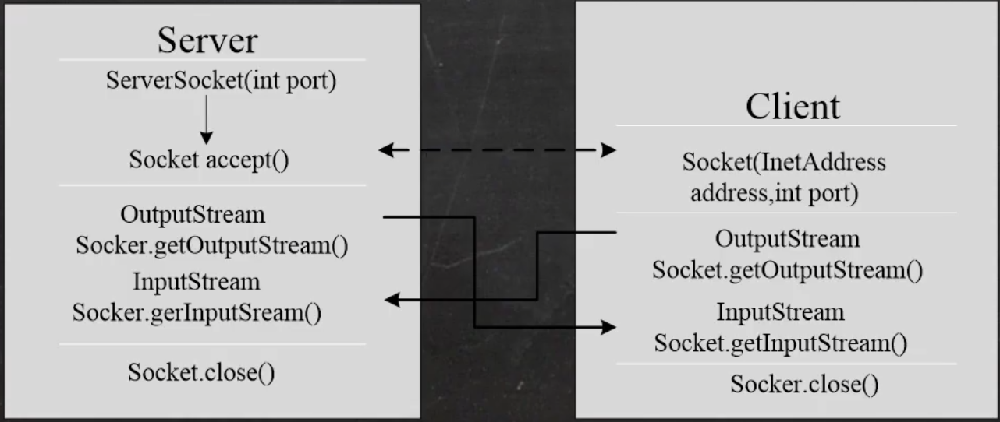

## TCP编程

### netstat

1. netstat -an -> *可以查看当前主机的网络情况，包括**端口监听**情况和**网络连接**情况*
2. netstat -an | more -> *可以分页显示*

## UDP编程（了解）

1. 核心的两个类/对象 DatagramSocket & DatagramPack

## [项目2]多用户通信系统

[客户端代码Repo](https://github.com/kkyesyes/Multi-userCommunicationSystem-Client)

[服务端代码Repo](https://github.com/kkyesyes/Multi-userCommunicationSystem-Server)

### 需求分析

1. 用户登录
2. 拉取在线用户列表
3. 无异常退出（客户端、服务端）
4. 私聊
5. 群聊
6. 发文件
7. 服务器推送新闻

### 功能实现（细节盘点）

1. 用户登录

   1. 传输User对象和Message对象进行通信

   2. Message类型采用接口

   3. 为每一个客户端登录请求建立一个socket线程，加入至线程管理集合

   4. ConcurrentHashMap（支持多线程）代替数据库，静态代码块初始化

   5. 单点登录：同一个ID只允许建立一个socket
2. 拉取在线用户列表
   1. 每当用户登录就启动一个线程，并且加入至**管理线程类**中
   2. 当用户想要拉取时，遍历管理线程类中的用户并返回
3. 无异常退出
   1. 客户端发送退出消息至服务端后，客户端结束通信线程
   2. 服务端收到客户端退出消息后，将线程结束并从线程管理集合中移除
4. 私聊
   1. 服务端收到私聊消息后选择对应用户，将线程取出后执行消息转发
5. 群发
   1. 服务端收到群发消息后遍历在线用户后，逐个取出线程执行消息转发
6. 发送文件
   1. NPE异常(解决中) //todo

### 项目总结

1. 涉及技术点
   1. 项目框架设计
   2. Java面向对象
   3. 网络编程
   4. 多线程
   5. IO流
   6. 内存数据库(HashSet)
2. 项目开发流程
   1. 需求分析
   2. 设计
   3. 实现
   4. 测试
   5. 实施
   6. 维护

# 反射

## Java Reflection

1. 反射机制允许程序在执行期借助于Reflection API取得任何类的内部信息（如成员变量，构造器，成员方法等），并能操作对象的属性及方法。反射在设计模式和框架底层都会用到
2. 加载完类之后，在堆中就产生了一个Class类型的对象（一个类只有一个Class对象），这个对象包含了类的完整结构信息。通过这个对象得到类的结构。这个对象就像一面镜子，透过这个镜子看到类的结构，故谓之“反射”

## Java 反射机制原理示意图

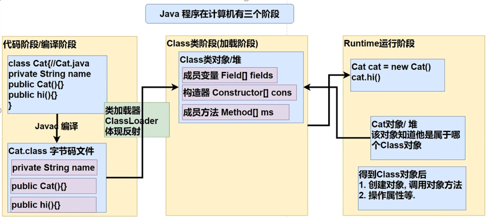

## Java 反射机制可以完成

1. 在运行时判断任意一个对象所属的类
2. 在运行时构造任意一个类的对象
3. 在运行时得到任意一个类所具有的成员变量和方法
4. 在运行时调用任意一个对象的成员变量和方法
5. 生成动态代理

## 反射相关的主要类

1. java.lang.Class：代表一个类，Class对象表示某个类加载后在堆中的对象
2. java.lang.reflect.Method：代表类的方法，Method对象表示某个类的方法
3. java.lang.reflect.Field：代表类的成员变量，Field对象表示某个类的成员变量
4. java.lang.reflect.Constructor：代表类的构造方法，Constructor表示构造器

## 反射的优点和缺点

1. 优点：可以动态地创建和使用对象（框架底层核心），使用灵活，没有反射机制，框架技术就失去底层支撑
2. 缺点：使用反射基本是解释执行，对执行速度有影响

## 反射调用优化（关闭访问检查）

1. Method和Field、Constructor对象都有setAccessible()方法
2. setAccessible()方法作用是 启动 和 禁止 访问安全检查
3. setAccessible()参数为 true，取消反射检查，提高访问效率；false，执行反射检查

## Class 类

### 基本介绍

1. Class也是类，因此也是继承Object类

   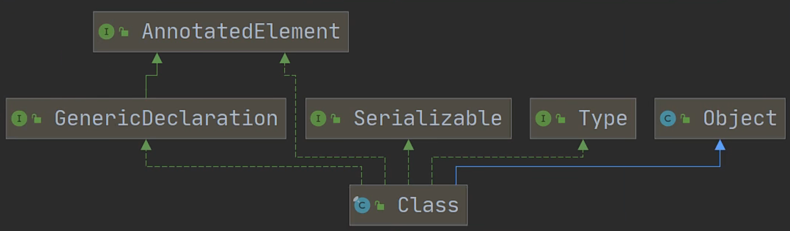

2. Class类对象不是new出来的，而是系统创建的

3. 对于某个类的Class类对象，在内存中只有一份，因为类只加载一次

4. 每个类的实例都会记得自己是由哪个Class类实例所生成

5. 通过Class可以完整地得到一个在的完整结构，通过一系列API

6. Class对象是存放在堆的

7. 类的字节码二进制数据，是放在方法区的，有的地方称为类的元数据（包括 方法代码，变量名，方法名，访问权限等等）

### Class 类常用方法

### 得到类的多种方式

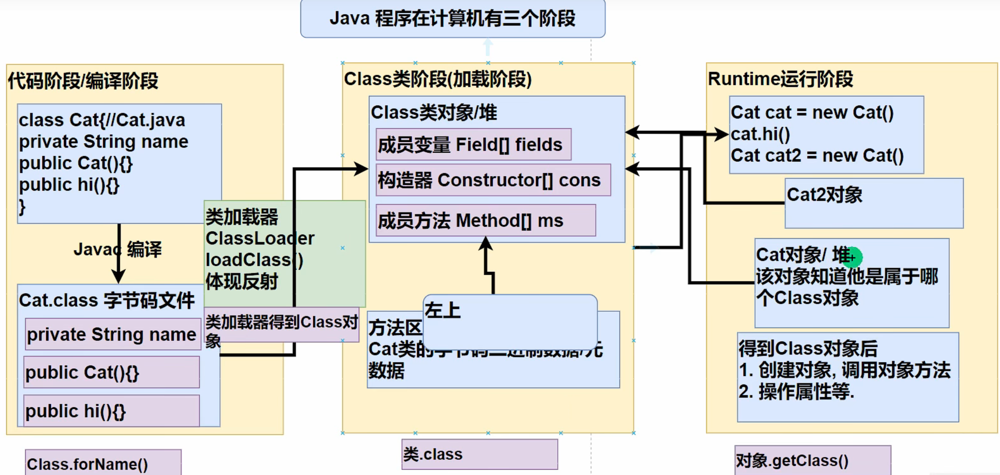

1. Class.forName() -> *常用于配置文件的读取*

2. 类名.class -> *应用于参数传递*

3. 对象.getClass() -> *应用于有对象实例*

4. 通过类加载器(4种) 来获取类的Class对象

   ```java
   // 先得到类加载器
   ClassLoader classLoader = car.getClass().getClassLoader();
   // 通过类加载器得到Class对象
   Class cls = classLoader.loadClass(classAllPath);
   ```

   

5. 基本数据类型(int, char, ...) 获取方式

   ```java
   Class cls = 基本数据类型.class
   ```

6. 基本数据类型对应的包装类 获取方式

   ```java
   Class cls = 包装类.TYPE
   ```

## 含有Class对象的类

1. 外部类，成员内部类，静态内部类，局部内部类，匿名内部类
2. interface接口
3. 数组
4. enum枚举
5. annotation注解
6. 基本数据类型
7. void

## 类加载

### 基本说明

反射机制是Java实现动态语言的关键，也就是通过反射实现类的动态加载

1. 静态加载：编译时加载相关的类，如果没有则报错，依赖性太强
2. 动态加载：运行时加载需要的类，如果运行时不用该类，则不报错，降低了依赖性

### 类加载时机

1. 当创建对象时（new）（静态加载）
2. 当子类被加载时 （静态加载）
3. 调用类中的静态成员时 （静态加载）
4. 通过反射（动态加载）

### 过程图示

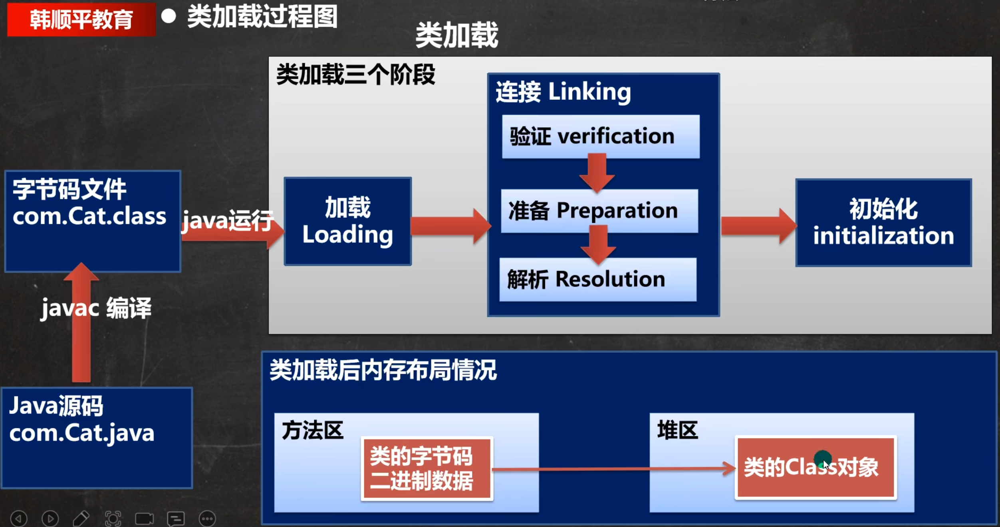

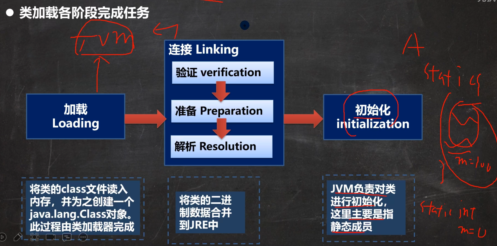

### 加载各阶段

1. 加载阶段

   JVM在该阶段的主要目的是将字节码从不同的数据源（可能是class文件、也可能是jar包，甚至网络）转化为二进制字节流加载到内存中（方法区），并生成一个代表该类的java.lang.Class对象

2. 连接阶段

   1. 验证：
      1. 目的是为了确保class文件的字节流中包含的信息符合当前虚拟机的要求，并且不会危害虚拟机自身的安全
      2. 包括：文件格式验证（是否以魔数 oxcafebabe开头）、元数据验证、字节码验证和符号引用验证
      3. 可以考虑使用 -Xverify:none 参数来关闭大部分的类验证措施，缩短虚拟机类加载的时间
   2. 准备：
      1. JVM会在该阶段对 **静态变量** 分配内存并 **默认初始化（对应数据类型的默认初始值，如0、0L、null、false等）**。这些变量所使用的内存都将在方法区中进行分配
   3. 解析：
      1. 虚拟机将常量池内的符号引用替换为直接引用的过程

3. 初始化

   1. 到初始化阶段，才真正开始执行类中定义的Java程序代码，此阶段是执行<clinit>()方法的过程
   2. <clinit>()方法是由编译器按语句在源文件中出现的顺序，依次自动收集类中的所有**静态变量**的赋值动作和静态代码块中的语句，并进行合并
   3. 虚拟机会保证一个类的<clinit>()方法在多线程的环境中被正确地加锁、同步，如果多个线程同时去初始化一个类，那么只有一个线程去执行这个类<clinit>()方法，其它线程都需要阻塞等待，直到活动线程执行<clinit>()方法完毕

## 通过反射创建对象

### 类调用

1. 调用类中的public修饰的无参构造器
2. 调用类中的指定构造器

### Class类相关方法

1. newInstance() -> *调用类中的无参构造器，获取对应类的对象*
2. getConstructor(Class...class对象) -> *根据参数列表，获取对应的**public**构造器对象*
3. getDeclaredConstructor(Class...class对象) -> *根据参数列表，获取对应的**所有**构造器对象*

### Constructor类相关方法

1. setAccessible() -> *暴破*
2. newInstance(Object...obj) -> *调用构造器*

## 通过反射访问类中的成员

### 访问属性

1. 根据属性名获取Field对象

   ```java
   Field f = class对象.getDeclaredField(属性名);
   ```

2. 暴破

   ```java
   f.setAccessible(true);
   ```

3. 访问

   ```java
   f.set(o, 值); // o 表示对象
   System.out.println(f.get(o));
   ```

4. 如果是 静态属性，则set和get中的参数o，可以写成null

### 访问方法

1. 根据方法名和参数列表获取Method方法对象

   ```java
   Method m = class对象.getDeclaredMethod(方法名, XX.class); // 得到本类的所有方法
   ```

2. 获取对象

   ```java
   Object o = class对象.newInstance();
   ```

3. 暴破

   ```java
   m.setAccessible(true);
   ```

4. 访问

   ```java
   Object returnValue = m.invoke(o, 实参列表);
   ```

5. 注意：如果是静态方法，则invoke的参数o，可以写成null

# MySQL 基础

## 安装 & 配置（MySQL5.7）

### 命令行窗口连接

1. mysql -h [hostname] -P [port] -u [username] -p [passwd]

2. 登录前，保证服务启动

   ```bash
   net stop mysql服务名
   net start mysql服务名
   ```

## MySQL 三层结构

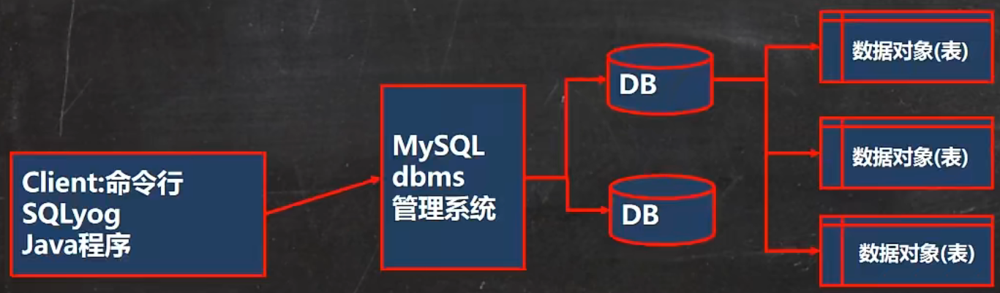

> 表的本质是文件

## SQL语句的分类

1. DDL：数据定义语句 [create 表，库...]
2. DML：数据操作语句 [增加 insert，修改 update，删除 delete]
3. DQL：数据查询语句 [select]
4. DCL：数据控制语句 [管理数据库：比如用户权限 grant revoke]

## 数据库操作

### 创建数据库

> 注：数据库可以指定 字符集 和 校对规则，**表也可以**
>
> 创建 数据库、表 时为规避关键字，可以用反引号解决

### 查看、删除数据库

1. 显示数据库：SHOW DATABASES
2. 删除数据库：DROP DATABASE *db_name*

### 备份、恢复数据库

1. 备份命令(DOS中执行)：mysqldump -u [username] -p -B [db0 db1 ...] > [filename].sql
2. 恢复命令(在MySQL命令行中执行)：Source [filename].sql

> 备份库的表：mysqldump -u [username] -p [passwd] [db_name] [table_name0 table_name1 ...] > [filename].sql

## 表操作

### 创建表

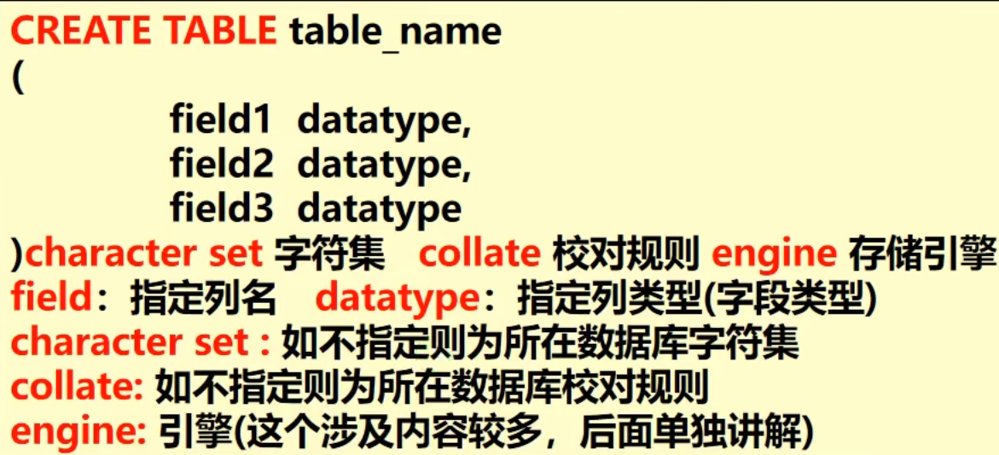

### 删除表

### 修改表

## MySQL数据类型

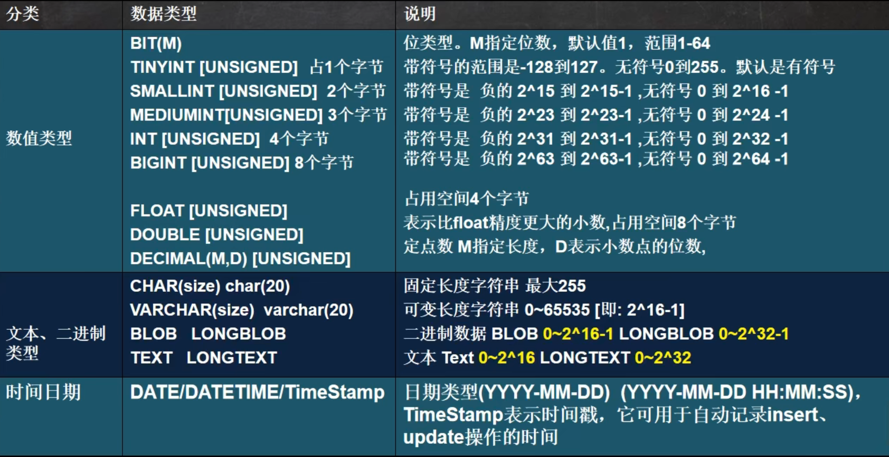

## CRUD

### Insert

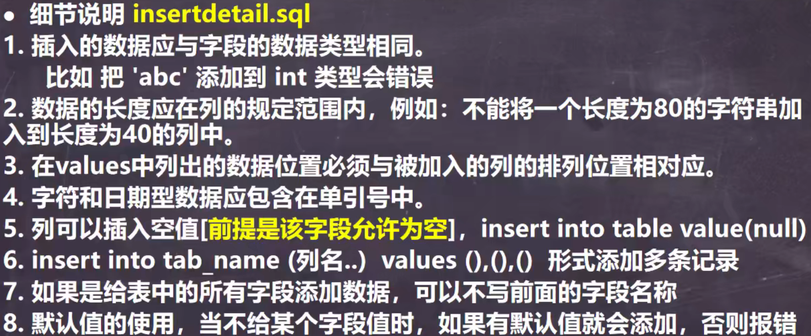

### Update

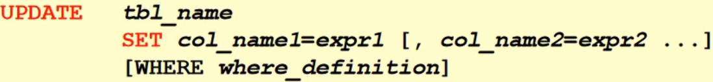

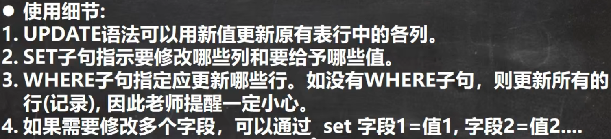

### Delete

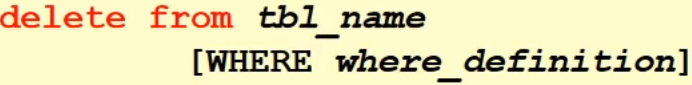

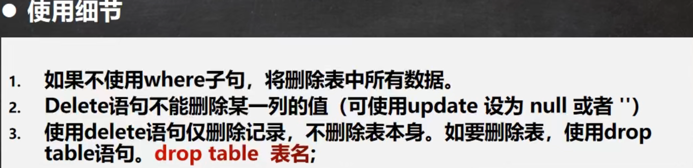

### Select

1. 单表查询

   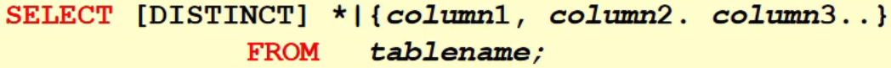

   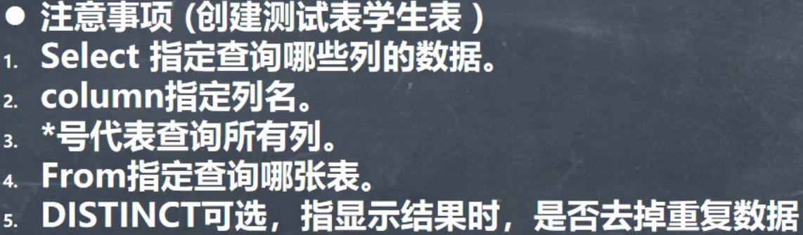

   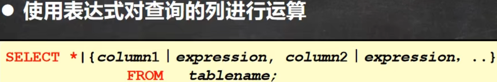

   

   ---

   1. 在 **where** 子句中经常使用的运算符

      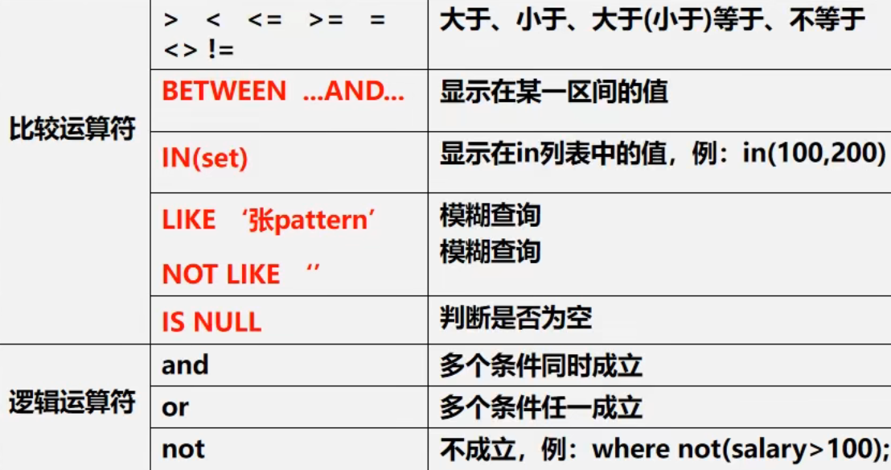

   2. 使用 **order by** 子句排序查询结果

      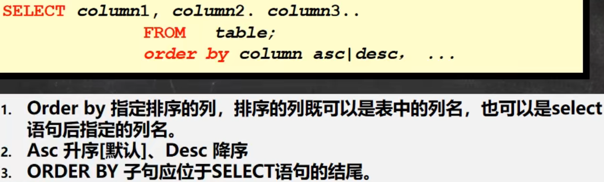

   3. **count函数** 返回行的总数

      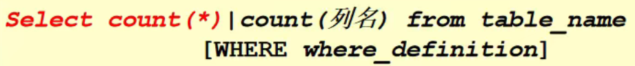

      > coutn(*) VS count(列)
      >
      > 1. count(*) 返回满足条件的记录的行数
      > 2. count(列) 返回满足条件的某列有多少个，但是会排除为null的情况

   4. **sum函数** 返回满足where条件的行的和（一般使用在数值列）

      

      > 注：sum仅对数值起作用，否则会报错。对多列求和，“，”不能少

   5. **avg函数** 返回满足where条件的一列的 平均值

      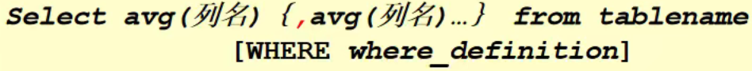

   6. **max/min函数** 返回满足where条件的一列的最大/最小值

      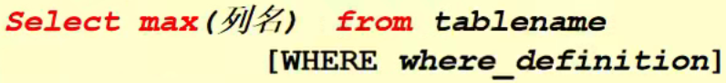

   7. 使用 **group by** 子句对列进行分组

      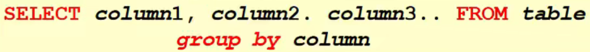

   8. 使用 **having** 子句对分组后的结果进行过滤

      

      

2. 多表查询

## 函数

### 统计函数

如 select 单表查询所列函数

### 时间函数

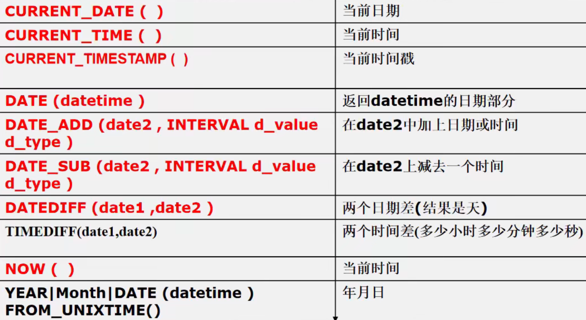


### 字符串函数

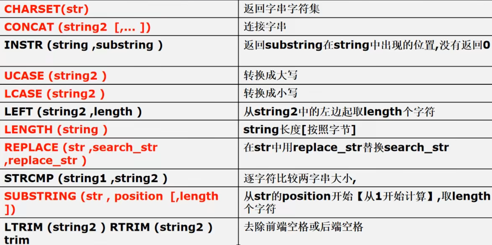

### 数学函数

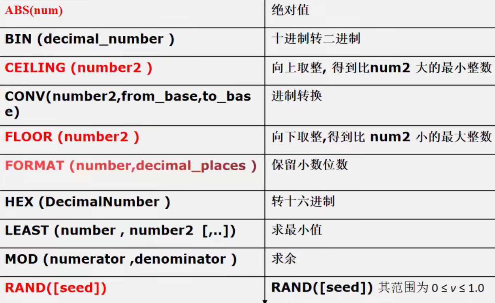

### 加密 & 系统 函数

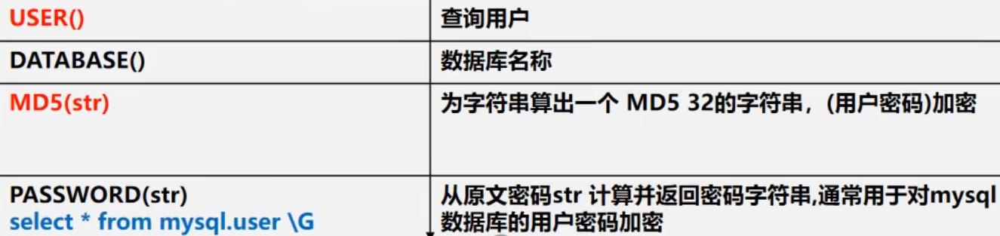

### 流程控制函数

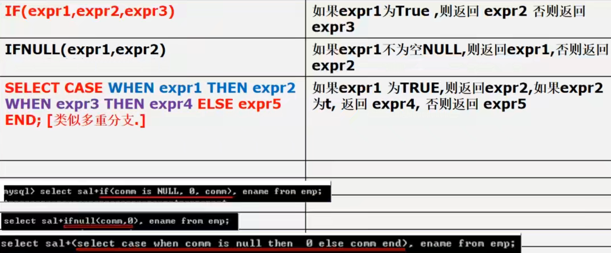

## MySQL 表查询

### 加强

1. where 子句中：

   1. 在MySQL中，日期类型可以直接比较（需要注意格式）

      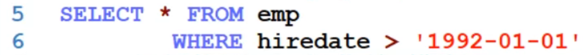

   2. like 操作符（模糊查询）

      - %：表示0到多个字符

        

      - _ ：表示单个字符

        

   3. 查询表结构

      

2. 分页查询

   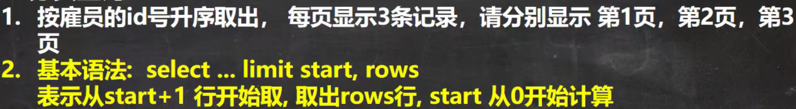

3. group by 分组子句 与 分组函数 的 使用

4. 数据分组总结

   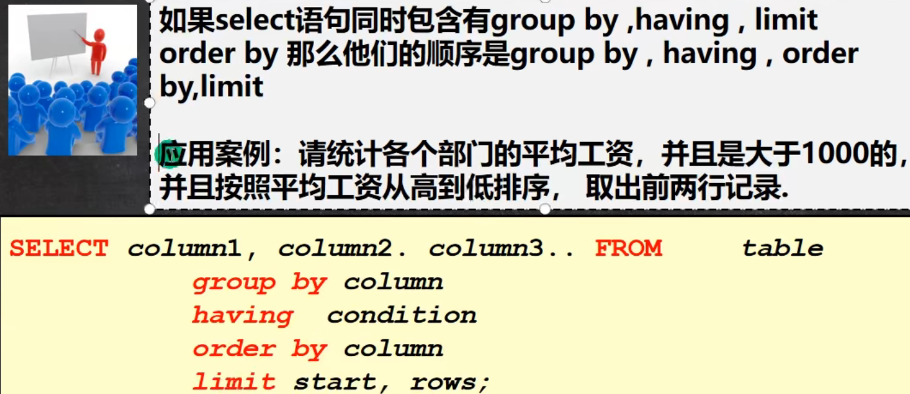

### 多表查询

1. 说明：

   多表查询是指基于 两个或两个以上的表 查询。在实际应用中，查询单个表可能不能满足需求

   > 注：多表查询的条件 不能少于 表的个数-1，否则会出现**笛卡尔积**（多表数据根据笛卡尔积的运算法则进行拼接）

### 自连接

- 自连接 -> *指在同一张表的连接查询（将同一张表看做两张表）*

### 子查询

1. 子查询 -> *指嵌入在其它 SQL语句中的 select语句，也叫嵌套查询*

   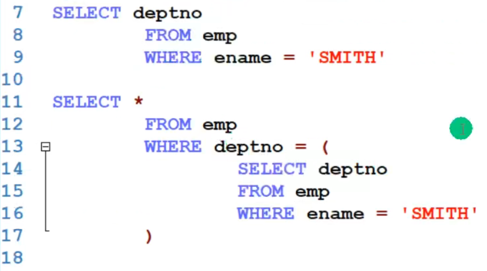

2. 单行子查询 -> *指只返回一行数据的子查询语句*

3. 多行子查询 -> *指返回多行数据的子查询，**使用关键字 in***

   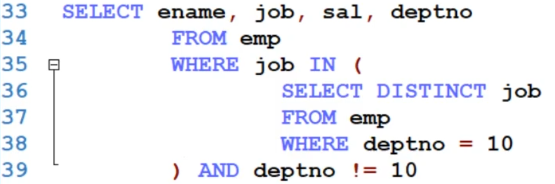

> 注：子查询可以当做临时表使用：
>
> 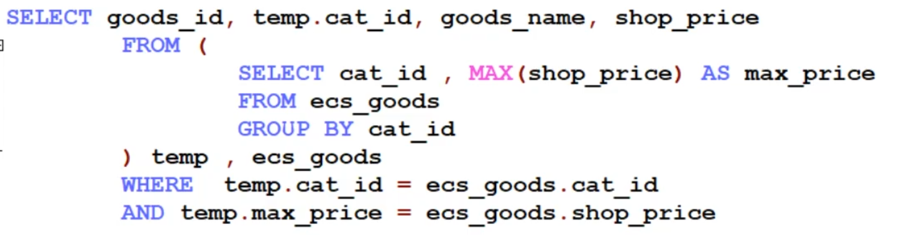

4. 多行子查询中使用 all & any 操作符

   1. all：

      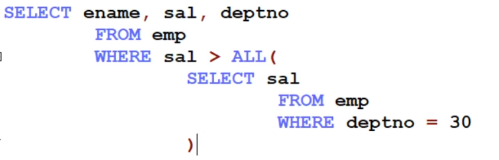

   2. any：

      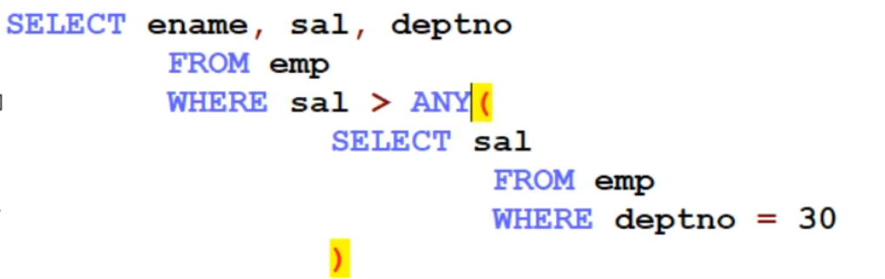

5. 多列子查询 -> *查询返回多个列数据的子查询语句*

   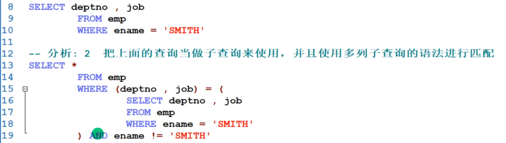

   > （要查询的多个列） = （子查询输出的多个列）

### 表复制 & 去重

1. 自我复制数据（蠕虫复制）-> *为了对某个SQL语句进行效率测试，可以此为表创建海量数据*

   

   （表复制）

   

2. 去重

   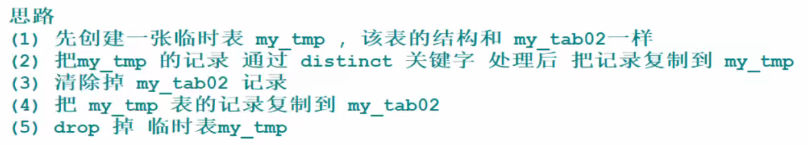

### 合并查询

- 有时在实际应用中，为了合并多个select语句的结果，可以使用集合操作符号union，union all

1. union all -> *该操作符用于取得两个结果集的并集。当使用该操作符时，**不会自动去掉重复行***

   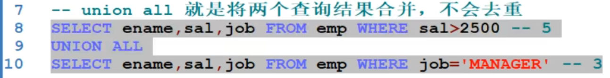

2. union -> *该操作符与 union all 相似，但是**会自动去掉结果中的重复行***

   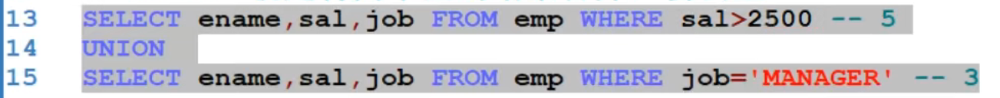

## MySQL 表外连接

### 外连接

1. 左外连接 -> *左侧的表完全显示*

   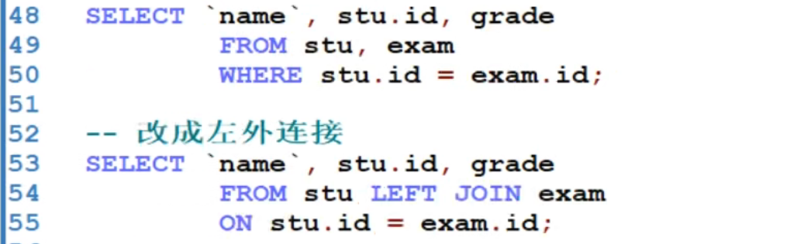

2. 右外连接 -> *右侧的表完全显示*

   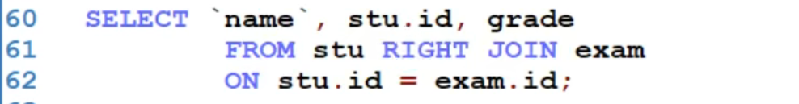

## MySQL 约束

### 基本介绍

- **约束** -> *用于确保数据库数据满足特定的商业规则*（包括：not null、unique、primary key、foreign key、check 五种）

1. primary key (主键)：不可重复且不能为null

   > primary key (id, \`name\`, ...) -> *复合主键：其中多个内容不可都相同*

   1. 主键的指定方式：
      1. 直接在字段名后指定：字段名 primary key
      2. 在表定义最后写 primary key (column1, ...);
   2. 一张表只能有一个主键，但可以是复合主键
   3. desc [table_name] 可以看到primary key的情况
   4. 实际开发中，每个表往往都会设计一个主键

2. not null (非空)：数据不可为空

   1. 指定方式：[field_name] [field_type] not null

3. unique (唯一)：值不能重复

   1. 指定方式：[field_name] [field_type] unique
   2. 细节（注）：
      1. 若没有指定 not null，则unique字段可以有多个null
      2. 一张表可以有**多个unique**字段

4. foreign key (外键)：用于定义 主表 和 从表 之间的关系

   - 外键约束要定义在从表上，主表则必须具有主键约束或是unique约束。当定义外键约束后，要求外键列数据必须在主表的主键列存在或是为null

     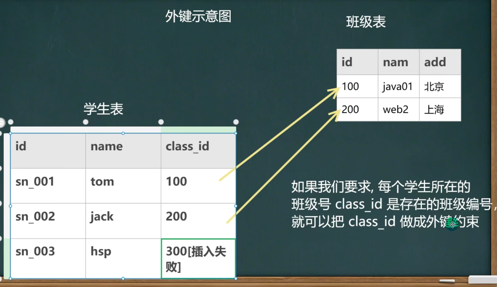

   1. 指定方式：foreign key [本表名] references [主表名(主键名或unique字段名)]
   2. 细节说明：
      1. 外键指向的表的字段，要求是 primary key 或者是 unique
      2. 表的类型是 **innodb** 才支持外键
      3. 外键字段的类型要和主键字段的类型一致（长度可以不同）
      4. 外键字段的值，必须 **在主键字段中出现过** 或者为 **null** （前提是外键字段允许为 null）
      5. 一旦建立主外键关系，数据就不能随意删除了

5. check (检查)：用于**强制 行数据 必须满足的条件**，假定在 col 列上定义了 check 约束，并要求 col 列值在1000 ~ 2000之间，若不在1000 ~ 2000之间就会提示 出错

   - Oracle 和 SQL server 均支持 check，但是 MySQL5.7 目前还不支持 check，只做语法校验，但不会生效。

     > 在 MySQL中实现 check 的功能，一般是在程序中控制，或者通过触发器完成

   1. 基本语法：

      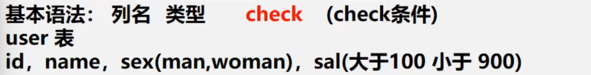

6. MySQL 自增

   1. 基本介绍：添加记录时实现从1开始 自动增长

   2. 基本语法：字段名 整型 primary key auto_increment

   3. 添加自增长的字段

      

   4. 使用细节

      1. 一般来说自增长是和 primary key 配合使用的
      2. 自增长也可以单独使用 [但是需要配合一个 unique]
      3. 自增长修饰的字段为 整数型 的（虽然小数也可以但是非常少见）
      4. 自增长默认从 1 开始，也可以通过命令修改：`alter table [表名] auto_increment = [新的开始值];`
      5. 如果在添加数据时为自增列指定值，则以指定值为准，之后从指定值起自增

## MySQL 索引

通过建立索引可 提高查询速度

### 原理

1. 无索引时：每次查询要遍历整张表
2. 有索引时：形成一个索引的数据结构，如二叉树

### 代价

1. 磁盘占用
2. 对 dml (update delete insert) 语句的效率有影响（维护索引开销）

### 索引类型

1. 主键索引（primary） -> *是主键，也是索引*

2. 唯一索引（unique） -> *是唯一，也是索引*

3. 普通索引（index）

4. 全文索引（fulltext）【适用于 MyISAM 引擎】

   开发中，不考虑 MySQL 自带的，而是考虑使用：全文搜索 Solr 和 ElasticSearch（ES）框架

### 索引使用

1. 添加索引

   

   

   > 如何选择：
   >
   > - 如果某列的值 是不会重复的，则优先考虑使用 unique 索引，否则使用普通索引

2. 添加主键（索引）

   建表时加 primary key 修饰

   若建表时未添加，可用如下指令添加 

3. 删除索引

   

   

4. 删除主键索引（比较特别）

   

5. 修改索引 -> *先删除再添加*

6. 查询索引（四种方式）

   1. show index from [table_name];
   2. show indexes from [table_name];
   3. show keys from [table_name];
   4. desc [table_name];

### 索引小结：哪些列上适合使用索引

1. 较频繁地作为查询条件字段 **适合** 创建索引（如：雇员编号）
2. 唯一性太差的字段 **不适合** 单独创建索引（如：性别）
3. 更新非常频繁的字段 **不适合** 创建索引（如：登录次数）
4. 不会出现在 where 子句中的字段 **不适合** 创建索引

## MySQL 事务

### 什么是事务

事务用于保证数据的一致性，由 **一组相关的 dml 语句组成**，该组的 dml 语句要么全部成功，要么全部失败。如：转账用事务来处理，以保证数据一致性

### 事务 & 锁

当执行事务操作时（dml 语句），MySQL 会在表上加锁，防止其它用户改表的数据（对用户来讲是非常重要的）

### MySQL 控制台事务操作


- 回退事务

  

- 提交事务

  

### 事务细节讨论


### 事务隔离级别

1. 介绍

   - 事务与事务之间的隔离程度

   

   1. **脏读**（dirty read）-> *当一个事务读取另一个事务时尚未提交时，产生脏读*
   2. **不可重复读**（nonrepeatable read）-> *同一查询在同一事务中多次进行，由于其它提交事务所做的修改或删除，每次返回不同的结果集，此时发生不可重复读*
   3. **幻读**（phantom read）-> *同一查询在同一事务中多次进行，由于其它提交事务所做的插入操作，每次返回不同的结果集，此时发生幻读*

2. MySQL 隔离级别

   

   > MySQL InnoDB 引擎可重复读级别 通过 MVCC 机制解决了幻读问题

3. MySQL 隔离级别的 设置 & 修改

   > 默认隔离级别为 Repeatable read，可满足大部分项目要求（一般不作修改）

### ACID 特性

1. **原子性**（Atomicity）

   事务是一个不可分割的工作单位，事务中的操作要么都发生，要么都不发生

2. **一致性**（Consistency）

   事务必须使数据库从一个一致性状态变换到另外一个一致性状态

3. **隔离性**（Isolation）

   多个用户并发访问数据库时，数据库为每一个用户开启的事务，不能被其它事务的操作数据所干扰，多个并发事务之间要相互隔离

4. **持久性**（Durability）

   一个事务一旦被提交，它对数据库中数据的改变就是永久性的，接下来即使数据库发生故障也不应该对其有任何影响

## MySQL 表类型 & 存储引擎

### 基本介绍

1. MySQL 的表类型由存储引擎（Storage Engines）决定，主要包括 MyISAM、innoDB、Memory 等
2. MySQL 数据表主要支持六种类型
   1. **事务安全型**（Transaction-safe）
      - InnoDB
   2. **非事务安全型**（non-transaction-safe）
      - CSV
      - MEMORY
      - ARCHIVE
      - MRG_MYISAM
      - MyISAM

### 主要的 存储引擎 / 表类型 特点


### 细节说明

1. MyISAM 不支持 事务 和 外键，但其访问速度快，对事务完整性没有要求
2. InnoDB 存储引擎提供了具有提交、回滚 和 崩溃恢复能力 的事务安全。但是比起 MyISAM 存储引擎，InnoDB 写的处理效率差一些，并且会占用更多的磁盘空间以保留 数据 和 索引
3. MEMORY 存储引擎使用存在内存中的内容来创建表。每个 MEMORY 表只实际对应一个磁盘文件。MEMORY 类型的表访问非常得快，因为它的数据是放在内存中的，并且默认使用 Hash 索引。但是一旦服务关闭，表中的数据就会丢失掉，表的结构还在

### 存储引擎的选择

1. 如果应用不需要事务处理，处理的只是基本的 CRUD 操作，那么 MyISAM 是不二选择，速度快
2. 如果需要支持事务，选择 InnoDB
3. MEMORY 存储引擎就是将数据存储在内存中，由于没有磁盘 IO 的等待，速度极快。但是由于是内存存储引擎，所做的任何修改在服务器重启后都将消失（经典用法：用户的在线状态）

## MySQL 视图

### 基本概念

1. 视图是一个虚拟表，其内容由查询定义。同真实的表一样，视图包含列，**其数据来自对应的真实表**（基表）

2. 视图和基表的关系

   

### 视图的基本使用


### 视图细节讨论


### 视图最佳实践


## MySQL 管理

### MySQL 用户管理

存储在系统数据库 mysql 中的 user 表中


1. 创建用户
2. 删除用户
3. 用户修改密码

### MySQL 权限管理

1. MySQL 中的权限

   

2. 用户授权操作

   1. 给用户授权

      

   2. 回收用户授权

      

   3. 权限生效指令

      

### 细节说明


# JDBC & 连接池

## JDBC 概述

### 基本介绍

1. JDBC 为访问不同的数据库提供了统一的接口，为使用者屏蔽了细节问题

2. JDBC 基本原理

   

3. JDBC 模拟

## JDBC API

JDBC API 是一系列接口，它统一和规范了应用程序与数据库的连接、执行 SQL 语句，并得到返回结果等各类操作（相关类与接口在 java.sql 与 javax.sql 包中）


### Statement

有注入风险

### PreparedStatement


### ResultSet（结果集）

1. 基本介绍

   

2. 应用实例

   

3. 底层结构

   

### 总结


## JDBCUtils


## JDBC 事务

### 基本介绍


## 批处理

### 基本介绍


## 数据库连接池

### 传统获取 Connection 问题分析


### 数据库连接池基本介绍


### 数据库连接池种类


## Apache-DBUtils


### 基本介绍


### DBUtils 类


## DAO 增删改查 - BasicDao

### 问题引出


### 基本说明


# 正则表达式

- [java正则表达式大全(参考).zip](./java正则表达式大全(参考).zip)

## 介绍


## 底层实现


## 基本语法

### 基本介绍

想要灵活运用正则表达式，须了解其中各种元字符的功能，按功能分为

1. 转义符（\\\）

   

2. 限定符

   用于指定其前面的字符和组合项连续出现多少次

   

   

   > 非贪婪匹配：限定符 后加 问号

3. 选择匹配符

   在匹配某个字符串的时候是选择性的（既可以匹配这个，又可以匹配那个）

   

4. 分组、捕获 与 反向引用符

   捕获分组

   

   非捕获分组（不存储于 groups 中）

   

   反向引用

   

5. 特殊字符

6. 字符匹配符

   

   

7. 定位符

   规定要匹配的字符串出现的位置（如在字符串的开始还是结束位置）

   

## 三个常用类

java.util.regex

### Pattern 类


> Pattern.matches(pattern, content) -> *返回是否匹配成功*

### Matcher 类


### PatternSyntaxException 类


# Java 8 - 11新特性

## Java 8

### Lambda


（函数式接口）


### 函数式接口

### 接口静态方法

### 接口默认方法

### 方法引用


### 构造器引用

### stream API

### 并行流

### 串行流

### Optional 类

```java	
public static void hello(String str){
    Optional
            .ofNullable(str)   //将str包装进Optional
            .ifPresent(System.out::println);  
  	//println也是接受一个String参数，返回void，所以这里使用我们前面提到的方法引用的写法
}
```

```jav
System.out.println(Optional.ofNullable(str).orElse("VVV"));   //orElse表示如果为空就返回里面的内容
```

## 新时间日期 API

---

# Java 9-17 新特性

代码层

1. JShell
2. **类型推断**
3. **集合增强API**
4. Stream 加强
5. 新增字符串处理方法
6. Optional 加强
7. InputStream 增强API
8. 标准Java异步HTTP客户端

其他

1. 简化编译运行
2. 支持Unicode10
3. Epsilon 垃圾收集器
4. ZGC
5. JFR
6. 支持Linux容器
7. 支持G1上的并行完全垃圾收集
8. 增加加密算法，代替RC4
9. 最新HTTPS安全协议TLS
10. 移除 & 废弃

## Java 9

1. 模块化开发

   类似于 js 导模块（模块之间的引用较为严格）

2. JShell 交互式命令行

3. 接口中方法可用 private 修饰，之后只可在内部进行调用

4. 集合类新增工厂方法

   

5. Stream API 改进

   

   

6. 其它新特性

## Java 10

1. var 局部变量类型推断

## Java 11 (LTS)

1. 用于 Lambda 的形参局部变量语法

   var 关键字在 Lambda 表达式中的使用

2. String 类的增强方法

3. 全新的 HttpClient

   新 API 支持最新 HTTP2 和 WebSocket 协议

## Java 12 - 16

1. switch 语法糖

   ```java
   public static String grade(int score){
       score /= 10;  //既然分数段都是整数，那就直接整除10
       return switch (score) {   //增强版switch语法
           case 10, 9 -> "优秀";   //语法那是相当的简洁，而且也不需要我们自己考虑break或是return来结束switch了（有时候就容易忘记，这样的话就算忘记也没事了）
           case 8, 7 -> "良好"; 
           case 6 -> "及格";
           default -> "不及格";
       };
   }
   ```

   > yield 关键字使从 switch 返回

2. 三引号文本块

   长段格式文本原样输出

3. 新 instanceof 语法糖

4. 空指针异常改进：提示出错原因

5. 记录类型

## Java 17 (LTS)

1. 密封类型：限制类的继承


