# 资源归档

- [JAVA_EE_api_中英文对照版.chm](./JAVA_EE_api_中英文对照版.chm)

# Servlet

## 配置开发

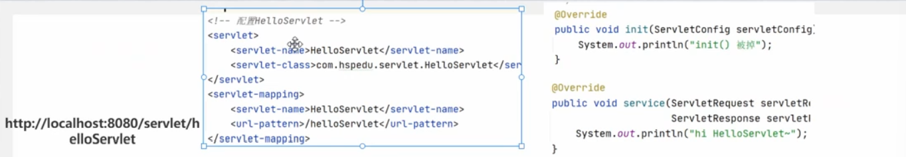

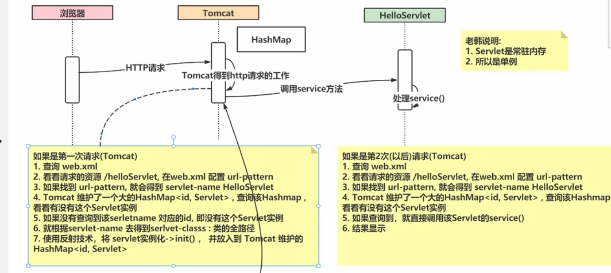


## 注解开发

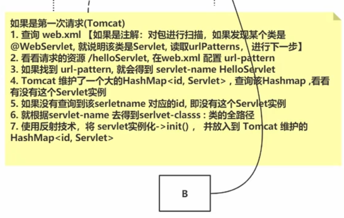

与 **配置开发** 的区别在于读取注解，后对所注解的类进行反射（而非用给定的类的全路径）

> Ctrl + Alt + 方向键 -> *切换历史标签页*

# HTTP协议

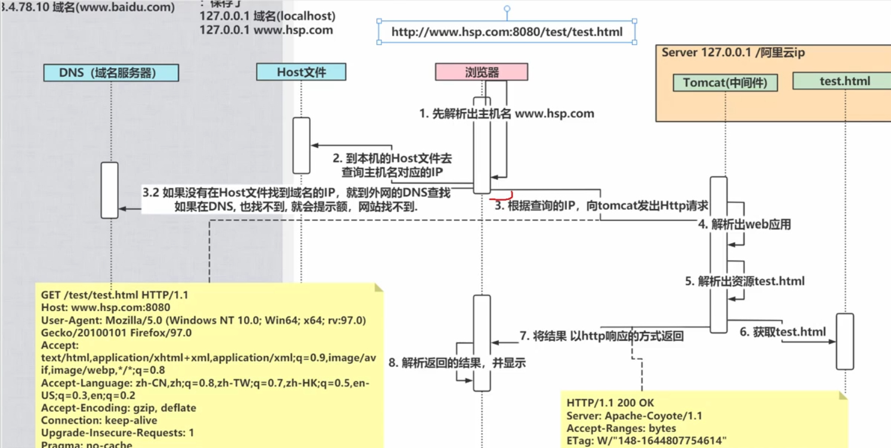

## 请求头

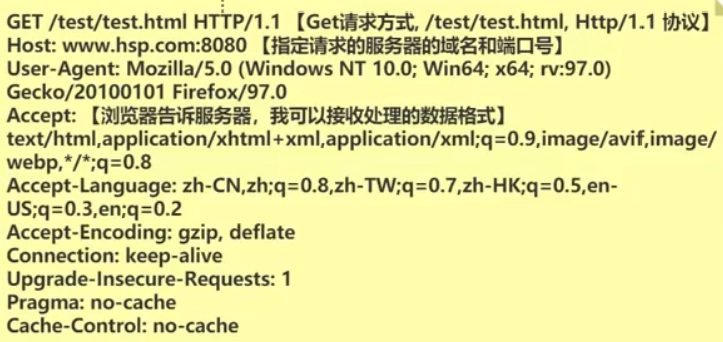

## 响应头

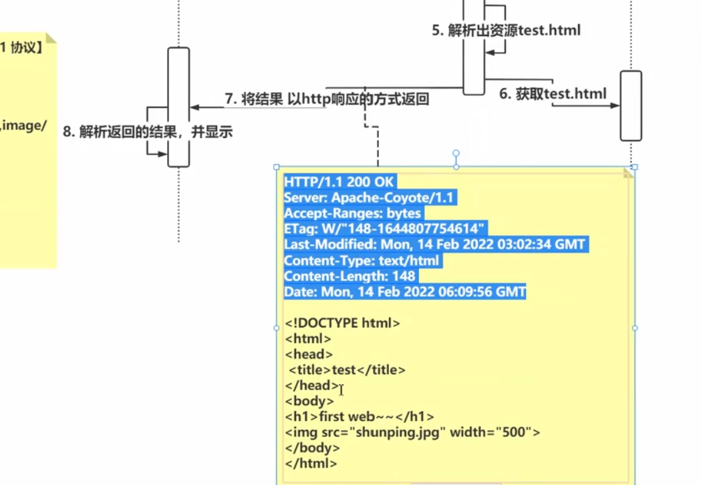

## 响应体

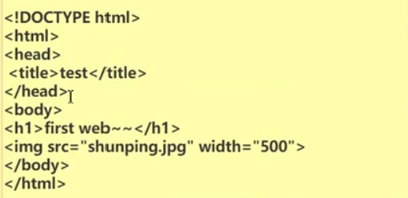

## HTTP请求包分析

### GET请求

### POST请求

## HTTP响应包分析

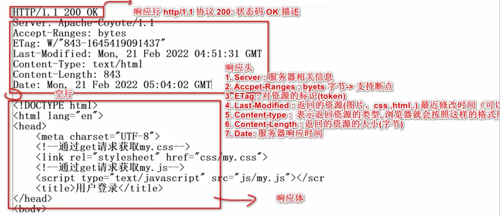

### 资源

- [HTTP常见请求和响应头-说明.pdf（ZIP压缩包）](./HTTP_common_reqHeader_resHeader.zip)

## HTTP状态码

当浏览者访问一个网页时，浏览者的浏览器会向网页所在服务器发出请求。当浏览器接收并显示网页前，此网页所在的服务器会返回一个包含HTTP状态码（HTTP Status Code）的信息头（Server Header）用以响应浏览器的请求

### 常见HTTP状态码

- 200 - 请求成功
- 301 - 资源（网页等）被永久转移到其它URL
- 404 - 请求的资源（网页等）不存在
- 500 - 内部服务器错误

### 状态码补充

- 302 - 临时移动（类似301），但资源只是临时被移动。客户端应继续使用原有URL
- 304 - 未修改，取缓存页面

### 资源

- [HTTP响应状态码说明.docx（ZIP压缩包）](./HTTP_resStatusCode.zip)

## MIME类型

### 介绍

- MIME (Multipurpose Internet Mail Extensions 多功能 Internet 邮件扩充服务) 是 HTTP 协议中数据类型（但不一定只能在浏览器中使用）。

### 格式

- 大类型 / 小类型 （并与某一种文件的扩展名相对应）e.g. text/html

### 常见类型

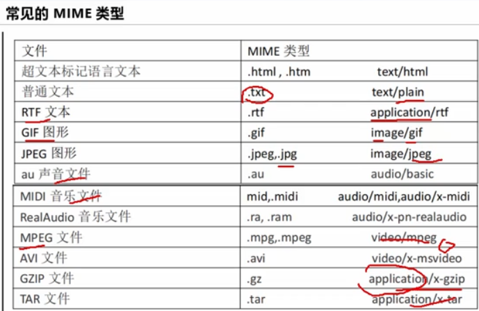

# ServletConfig

通过 getServletConfig() 来获得配置详情

# ServletContext

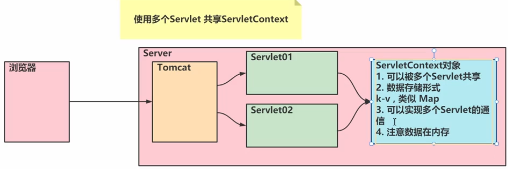

## 基本介绍

1. ServletContext 是一个接口，它表示 Servlet 上下文对象

2. 一个 web 工程，只有一个 ServletContext 对象实例

3. ServletContext 对象 是在 web 工程启动的时候创建的，在 web 工程停止的时候销毁

4. ServletContext 对象可以通过 ServletConfig.getServletContext() 方法获得对 ServletContext 对象的引用，也可以通过 this.getServletContext() 来获得其对象的引用

5. 由于一个 web 应用中的所有 Servlet 共享同一个 ServletContext 对象，因此 Servlet 对象之间可以通过 ServletContext 对象来实现多个 Servlet 间通讯。ServletContext 对象通常也被称之为 域对象

   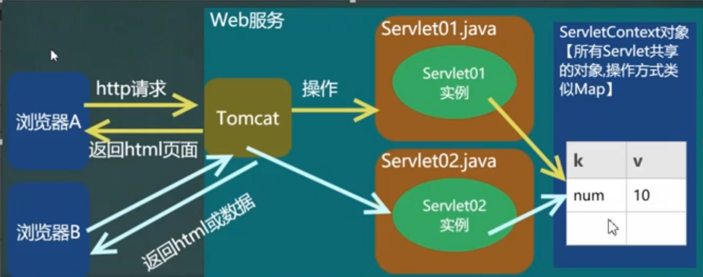

## 功能

1. 获取 web.xml 中配置的上下文参数 context-param [信息和整个 web 应用相关，而不是属于某个 Servlet]
2. 获取当前的工程路径，格式：/ 工程路径
3. 获取工程**部署后**在服务器硬盘上的**绝对路径**
4. 像 **Map** 一样存取数据，多个 Servlet 共享数据

# HttpServletRequest

## 介绍

1. HttpServletRequest 对象代表客户端的请求
2. 当 客户端 / 浏览器 通过 HTTP 协议访问服务器时，HTTP 请求头中的所有信息都封装在这个对象中
3. 通过这个对象的方法，可以获得客户这些信息

## 常用方法

1. getRequestURI() -> *获取请求的资源路径*
2. getRequestURL() -> *获取请求的统一资源定位符（绝对路径）*
3. getRemoteHost() -> *获取客户端的主机*
4. getHeader() -> *获取请求头*
5. getParameter() -> *获取请求的参数*
6. getParameterValues() -> *获取请求的参数（多个值的时候使用），如checkbox*
7. getMethod() -> *获取请求的方式 GET 或 POST*
8. setAttribute(key, value) -> *设置域数据*
9. getAttribute(key) -> *获取域数据*
10. getRequestDispatcher() -> *获取请求转发对象*

## 请求转发

### 说明

1. 实现请求转发：请求转发是指一个 web 资源收到客户端请求后，通知服务器去调用另一个 web 资源进行处理
2. HttpServletRequest 对象（也叫 Request 对象）提供了一个 getRequestDispatcher 方法，该方法返回一个 RequestDispatcher 对象，调用这个对象的 forward 方法可以实现 请求转发
3. request 对象 同时也是一个域对象，开发人员通过 request 对象在实现转发时，把数据通过 request 对象带给其它 web 资源处理
   - setAttribute()
   - getAttribute()
   - removeAttribute()
   - getAttributeNames()

### 示意图

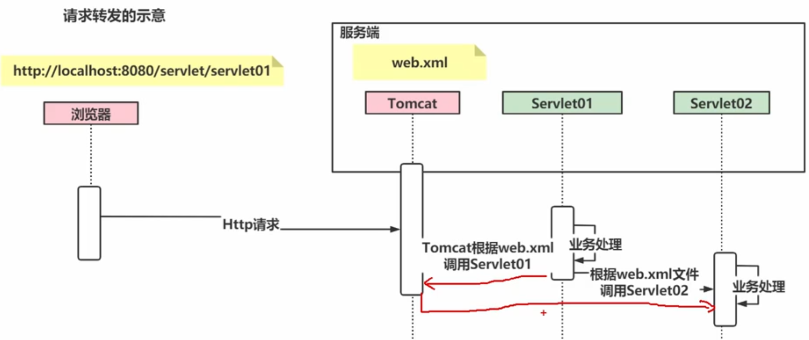

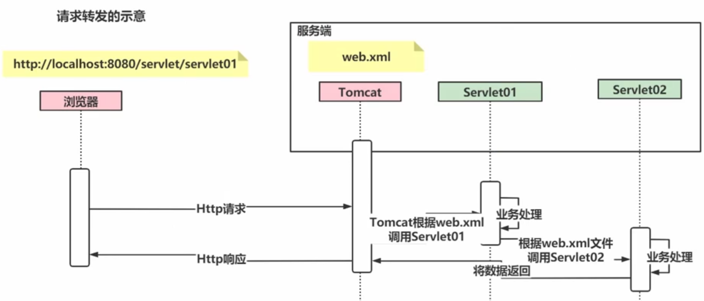

### 转发代码

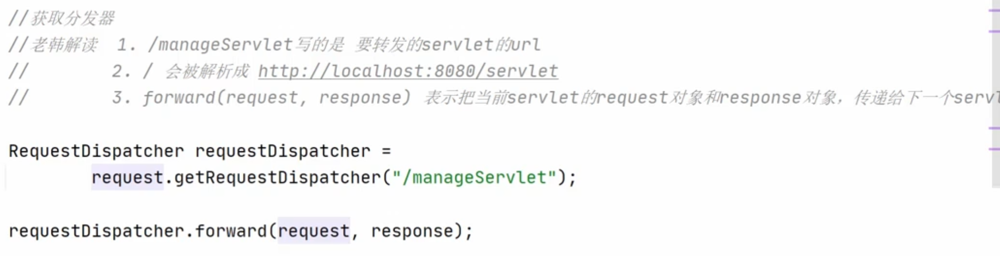

### 注意事项 & 细节

1. 浏览器地址不会变化（转发过程没有与浏览器交互）
2. 在同一次 HTTP 请求中，进行多次转发，仍然是一次 HTTP 请求
3. 在同一次 HTTP 请求中，进行多次转发，多个 Servlet 可以共享 request域 / 对象 的数据（因为始终是同一个对象）
4. 可以转发到 WEB-INF 目录下
5. 不能访问当前 web 工程外的资源
6. 因为浏览器地址栏会停止在第一个 Servlet ，如果刷新页面，会再次发出请求（并且会带数据），所以在支付页面情况下，不能使用请求转发，否则会造成重复支付

# HttpServletResponse

## 介绍

1. 每次 HTTP 请求，Tomcat 会创建一个 HttpServletResponse 对象传递给 Servlet 程序去使用

2. HttpServletRequest 表示请求过来的信息，HttpServletResponse 表示所有响应的信息，如果需要设置返回给客户端的信息，通过 HttpServletResponse 对象来进行设置即可

   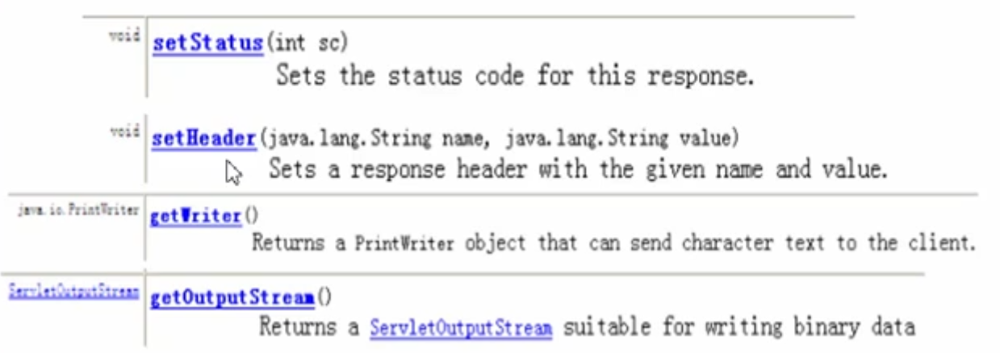

## 向客户端返回数据 注意事项 & 细节

1. 处理中文乱码问题（方案一）

   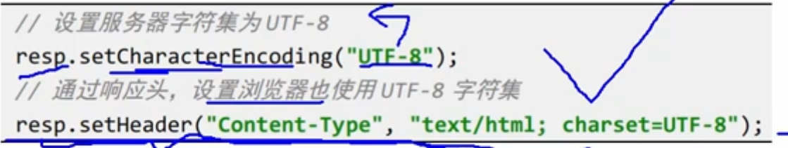

2. 处理中文乱码问题（方案二）

   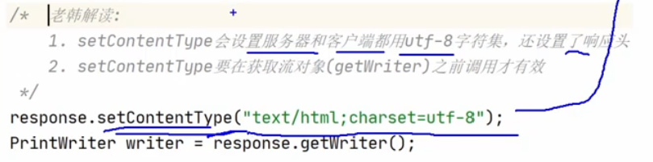

# Maven 简单引入

## 传统 Java 项目

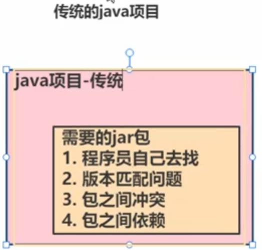

## Maven 的 Java 项目

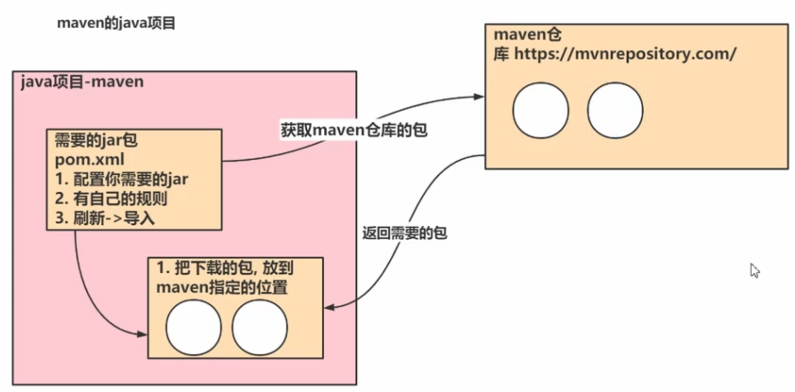

## 项目创建

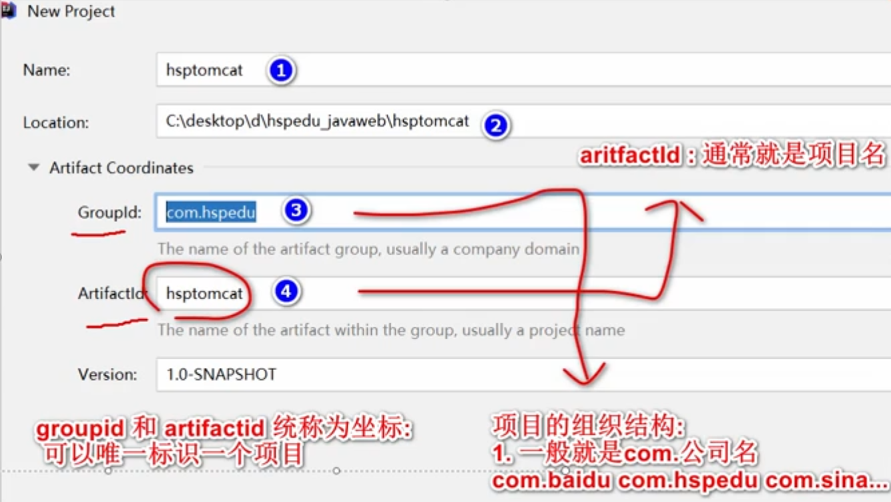

# JUL 日志框架

# MyBatis 简单引入

笔记引用：[柏码 - 让每一行代码都闪耀智慧的光芒！ (itbaima.cn)](https://www.itbaima.cn/document)

# Tomcat手动实现

Repo:	[KKTomcat (Github)](https://github.com/kkyesyes/KKTomcat)

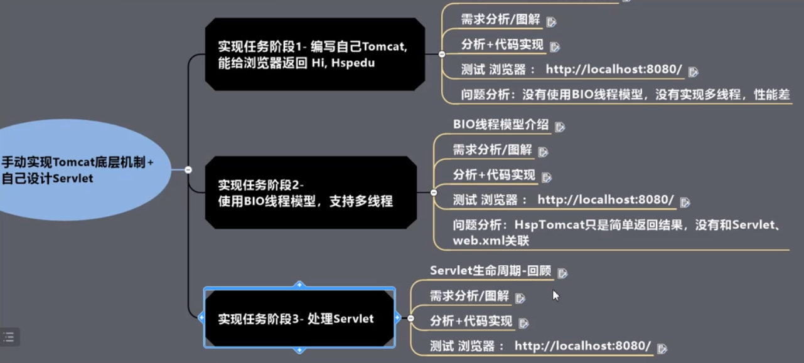

## 原理图解 (BIO 多线程模型)

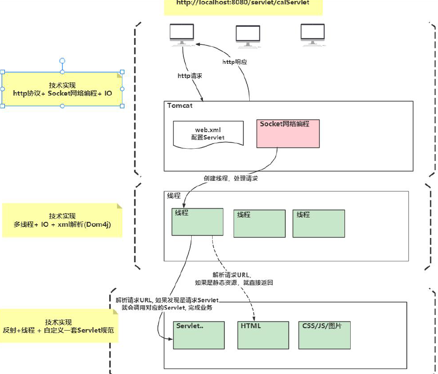

# Web 工程路径专题

## 表单跳转网址过长 解决方案

### 相对路径：

1. 相对路径下一个非常重要的规则：**页面所有的相对路径（默认）都会参考当前浏览器地址栏路径来跳转**

### base 标签

1. base 标签是 HTML 语言中的基准网址标记，它是一个单标签，位于网页头部的 head 标签内
2. 一个页面最多只能使用一个 base 元素，用来提供一个指定的默认目标，是一种表达路径和连接网址的标记
3. 常见的 url 路径形式分别有 相对路径 与 绝对路径，如果 base 标签指定了目标，浏览器将通过这个目标解析当前文档中的所有相对路径，包括（a、img、link、form）
4. 浏览器解析时会在路径前加上 base 给的目标，而页面中的相对路径也都转换成了绝对路径。使用了 base 标签就应带上 href 属性和 target 属性

> 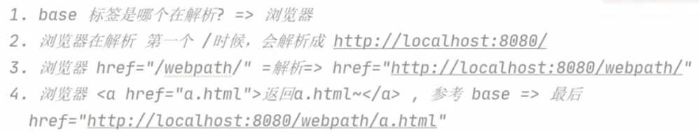

# Web 开发会话技术（Cookie & Session）

## 会话

### 基本介绍

1. 什么是会话

   会话 可简单理解为 **用户开一个浏览器，点击多个超链接，访问服务器多个 web 资源，然后关闭浏览器** 这样一整个过程

2. 会话要解决的问题

   每个用户在使用浏览器与服务器进行会话的过程中，不可避免各自会产生一些数据，服务器要想办法为每个用户保存这些数据

### 两种技术

1. Session
2. Cookie

## Cookie

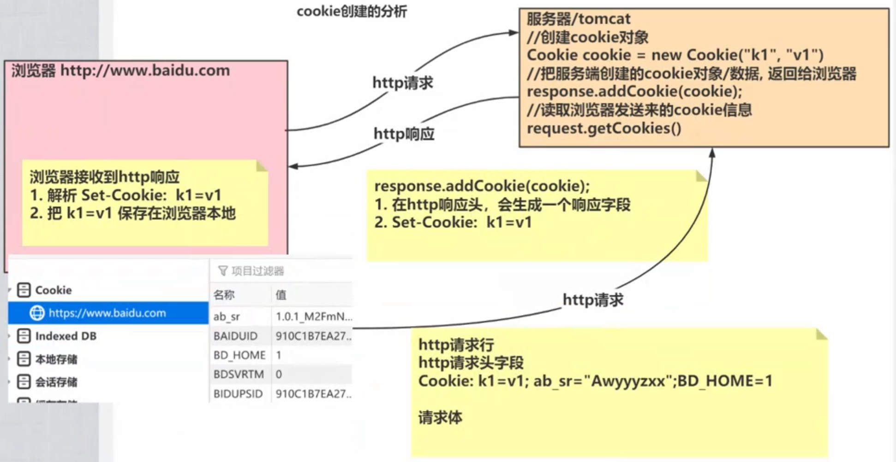

### 二说 Cookie

1. Cookie 是服务器在客户端保存的用户的信息，如登录名，浏览历史 等就可以以 Cookie 方式保存
2. Cookie 信息就像是曲奇，数据量并不大，服务端需要的时候可以从客户端读取
3. 保存在浏览器中

### Cookie 应用

1. 保存登录时间
2. 保存登录信息，一定时间内不用重复登录
3. 网站个性化，定制内容

### Cookie 常用方法

[JAVA_EE_api_中英文对照版.chm](./JAVA_EE_api_中英文对照版.chm)

1. Cookie 像一张表 (K-V)，一个是名字，一个是值，数据类型都是 String

2. 如何创建一个 Cookie （在服务端创建）

   ```java
   Cookie c = new Cookie(String name, String val);
   c.setMaxAge(); // 保存时间
   ```

3. 如何将一个 Cookie 添加到客户端

   ```java
   resp.addCookie(c);
   ```

4. 如何读取一个 Cookie （在服务端读取）

   ```java
   req.getCookies();
   ```

### 底层（Cookie 创建 & 读取）

注：

1. 服务端创建与客户端同名 Cookie 相当于覆盖原 Cookie

### JSESSIONID

- 作为在同一服务器上区分不同会话的唯一标识

### Cookie 生命周期

1. Cookie 生命周期指的是如何管理 Cookie 什么时候销毁（删除、不再携带）
2. setMaxAge(int expiry)：（以秒为单位）
   1. 正数：表示在指定的秒数后过期
   2. 负数：表示浏览器关闭，Cookie 就会被删除（默认值为 -1）
   3. 0，表示马上删除 Cookie

### Cookie 有效路径

1. Cookie 的 path 属性可以有效过滤哪些 Cookie 可以发送给服务器，哪些不发，path 属性是通过 **请求的地址** 来进行有效过滤的（长路径包含短路径则有效）
2. 默认为 **上下文工程路径**

### 注意事项 & 细节

1. 一个 Cookie 只能标识一种信息，它至少含有一个标识该信息的名称（name）和设置值（value）
2. 一个 web 站点可以给一个浏览器发送多个 Cookie，一个浏览器也可以存储多个 web 站点提供的 Cookie
3. Cookie 的总数量没有限制，但是每个域名的 Cookie 数量 和 每个 Cookie 的大小是有限制的，Cookie 不适合存放数据量大的信息
4. 删除 Cookie 时，path 必须一致，否则不会删除
5. Java Servlet 中 Cookie 中文乱码解决（存放中文默认报错，可通过 URL 编码（工具类）来解决）

## Session

### 介绍

1. Session 是服务端技术，服务器在运行时为每一个用户的浏览器创建一个其独享的 Session 对象
2. 由于 Session 为各个用户浏览器独享，所以用户在访问服务器的不同页面时，可以从各自的 Session 中 读取 / 添加 数据，从而完成相应任务

### Session 基本原理

1. 当用户打开浏览器，访问某个网站，**操作 Session 时**，服务器就会在内存中为该浏览品名**分配**一个 Session 对象，该 Session 对象被这个浏览器独占（JSESSIONID）
2. 这个 Session 对象也可看做是一个容器， Session 对象默认存在时间为 30 min，也可修改（tomcat / conf / web.xml）

### Session 存储结构

1. Session 可看作是类似 HashMap 的容器，每一行（K-V）就是其一个属性
2. 每个属性包含两个部分，名（String） 与 值（Object）

### Session 常用方法

1. 创建 和 获取 Session

   ```java
   HttpSession hs = req.getSession();
   ```

   **第一次调用** 是 **创建** Session 会话，之后调用是获取创建好的 Session 对象

2. 向 Session 添加属性

   ```java
   hs.setAttribute(String name, Object val);
   ```

3. 从 Session 得到某个属性

   ```java
   Object obj = hs.getAttribute(String name);
   ```

4. 从 Session 删除调某个属性

   ```java
   hs.removeAttribute(String name);
   ```

5. 判断是不是刚创建出来的 Session

   ```java
   hs.isNew();
   ```

6. 每个 Session 都有一个唯一标识 Id 值，通过 getId() 得到 Session 会话的 Id 值

### Session 底层分析

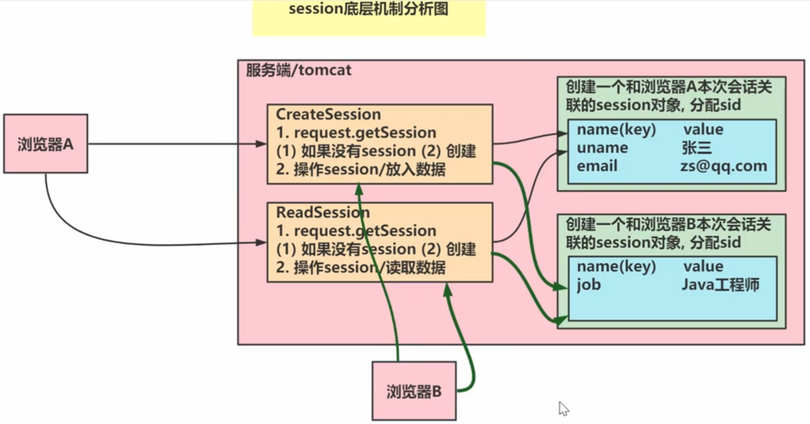

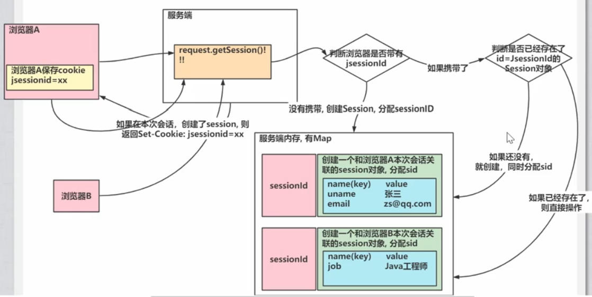

### Session 生命周期

1. setMaxInactiveInterval(int interval) -> *设置 Session 超时时间（以秒为单位），超过指定的时长，Session 就会被销毁*
2. 值为正数的时候，设定 Session 的超时时长
3. **负数表示永不超时**
4. getMaxInactiveInterval() -> **获取 Session 的超时时间**
5. invalidate() -> **让当前 Session 会话立即无效**
6. 如果没有调用 setMaxInactiveInterval() 来指定 Session 的生命周期，Tomcat 会以 Session 默认时长为准，Session 默认超时为 30 min，可以在 Tomcat 的 web.xml 中设置
7. Session 的生命周期指的是：客户端 **同一会话两次请求** 最大间隔时长，而不是累积时长。即当客户端访问了自己的 Session，Session 的生命周期将从 0 开始重新计算
8. 底层：Tomcat 用一个线程来轮询会话状态，如果某个会话的空闲时间超过设定的最大值，则将该会话销毁

# 服务器端渲染技术

## JSP

### 基本介绍

1. JSP 全称 Java Server Pages，即服务器渲染技术
2. JSP 技术基于 Servlet，可以理解成是对 Servlet 的包装（或就是 Servlet）
3. 在 <% %> 标签中可以写 Java 代码

### JSP 运行原理

1. JSP 页面本质是一个 Servlet 程序，其性能是和 Java 关联的
2. 第一次访问 JSP 页面的时候，Tomcat 服务器会把 JSP 页面解析成为一个 Java 源文件，并且对它进行编译为 .class 字节码程序

## Thymeleaf

# 监听器 & 过滤器

## 监听器 Listener

### 介绍

1. Listener 监听器是 JavaWeb 三大组件之一（Servlet | Listener | Filter）
2. Listener 是 JavaEE 的规范（即接口）
3. 监听器作用：监听某种变化，触发对应方法完成相应的任务
4. JavaWeb 中的监听器（共八个），目前最常用的是 ServletContextListener

### **ServletContextListener**

1. 作用：监听 ServletContext 创建或销毁（当 web 应用启动时，就会创建 ServletContext ），即 **生命周期监听** (使用前要在 web.xml 中注册)
2. 相关方法：
   1. void contextInitialized(ServletContextEvent sce)
   2. void contextDestroyed(ServletContextEvent sce)
3. 应用场景：
   1. 加载初始化的配置文件（如 Spring 的配置文件）
   2. 任务调度（配合定时器 Timer / TimerTask）

### **ServletContextAttributeListener**

1. 作用：监听 ServletContext 属性变化
2. 相关方法：
   1. void attributeAdded(ServletContextAttributeEvent event) -> *添加属性时调用*
   2. void attributeReplaced(ServletContextAttributeEvent event) -> *替换属性时调用*
   3. void attributeRemoved(ServletContextAttributeEvent event) -> *移除属性时调用*

### **HttpSessionListener**

1. 作用：监听 Session 创建或销毁，即 **生命周期监听**
2. 相关方法：
   1. void sessionCreated(HttpSessionEvent se) -> *创建 session 时调用*
   2. void sessionDestroyed(HttpSessionEvent se) -> *销毁 session 时调用*
3. 应用场景：
   1. 监控用户上线、离线等

### HttpSessionAttributeListener

1. 作用：监听 Session 属性的变化
2. 相关方法：
   1. void attributeAdded(ServletRequestAttributeEvent srae) -> *添加*
   2. void attributeReplaced(ServletRequestAttributeEvent srae) -> *替换*
   3. void attributeRemoved(ServletRequestAttributeEvent srae) -> *移除*
3. 应用场景：较少

### **ServletRequestListener**

1. 作用：监听 Request 创建或销毁，即 **Request 生命周期监听**，可得到 Request 中内容（若无法得到某一属性可能需要强转一下类型）
2. 相关方法：
   1. void requestInitialized(ServletRequestEvent sre) -> *创建 request 时*
   2. void requestDestroyed(ServletRequestEvent sre) -> *销毁 request 时*
3. 应用场景：
   1. 可用于监控 IP 访问网站的频率、日志记录、访问资源等的情况

### ServletRequestAttributeListener

1. 作用：监听 Request 属性变化
2. 相关方法：
   1. void attributeAdded(ServletRequestAttributeEvent srae) -> *添加*
   2. void attributeReplaced(ServletRequestAttributeEvent srae) -> *替换*
   3. void attributeRemoved(ServletRequestAttributeEvent srae) -> *移除*
3. 应用场景：同上

### 其它 Listener

1. HttpSessionBindingListener -> *将对象绑定至 Session 中感知监听（无需配置）*
2. HttpSessionActivationListener -> *感知监听非钝化（未持久化）对象*

## 过滤器 Filter

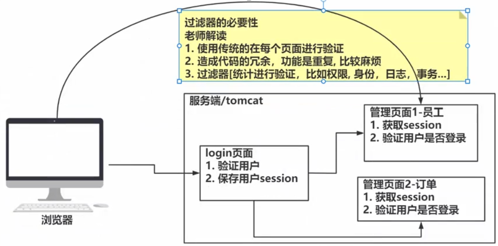

### 介绍

1. Filter 过滤器 是 JavaWeb 三大组件之一（Servlet 程序、Listener 监听器、Filter 过滤器）

2. Filter 过滤器是 JavaEE 的规范（即接口）

   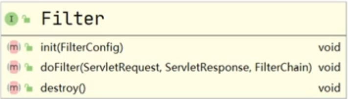

3. Filter 过滤器作用：拦截请求，过滤响应（**转发不经过滤器**）

4. 应用场景：

   1. 权限检查
   2. 日志操作
   3. 事务管理

### Filter 基本原理

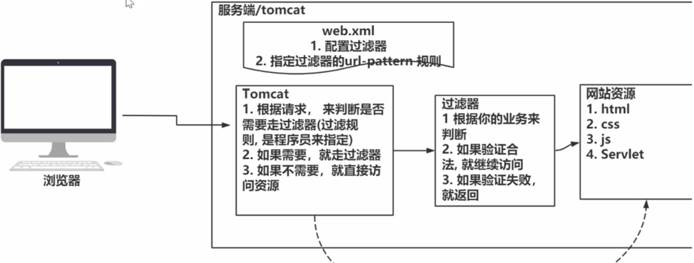

### url-pattern

1. url-pattern：Filter 的拦截路径，即浏览器在请求什么位置的资源时，过滤器会进行拦截过滤
2. 精确匹配：`<url-pattern>/a.jsp</url-pattern>` 对应的请求地址为 http://[ip]:port/工程路径/a.jsp 会拦截
3. 目录匹配：`<url-pattern>/manage/*</url-pattern>` 对应的请求地址为 http://[ip]:port/工程路径/manage/xxx，即 web 工程 manage 目录下所有资源都会拦截
4. 后缀名匹配：`<url-pattern>*.jsp</url-pattern>` 对应的请求地址为 http://[ip]:port/工程路径/xxx.jsp （后缀为 .jsp 的请求都会拦截）
5. **Filter 过滤器只关心请求的地址是否匹配，不关心请求的资源是否存在**

### Filter 生命周期（单例）

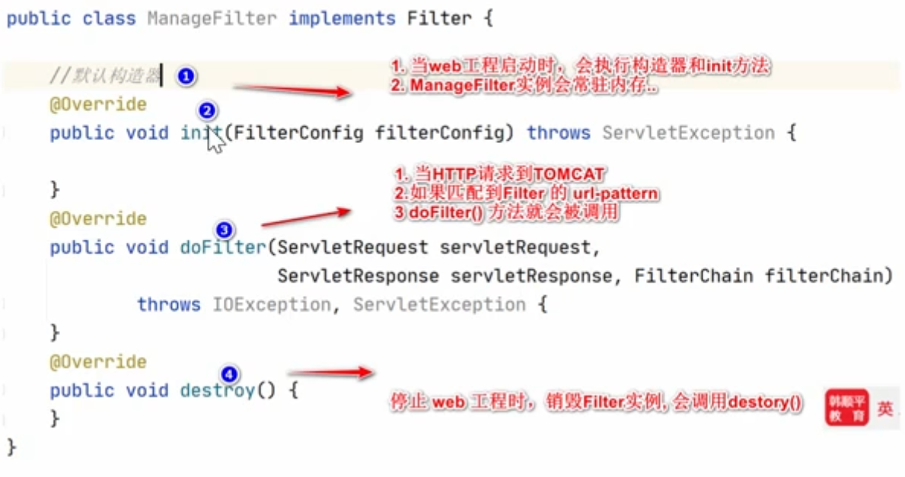

### FilterConfig

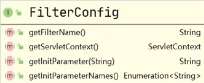

1. FilterConfig 是 Filter 过滤器的配置类，其作用是 **获取 Filter 过滤器的配置内容**

2. Tomcat 在创建 Filter 实例时，同时会创建一个 FilterConfig 对象（包含 Filter 配置文件的配置信息），并通过 init() 方法传入

3. 配置图解

   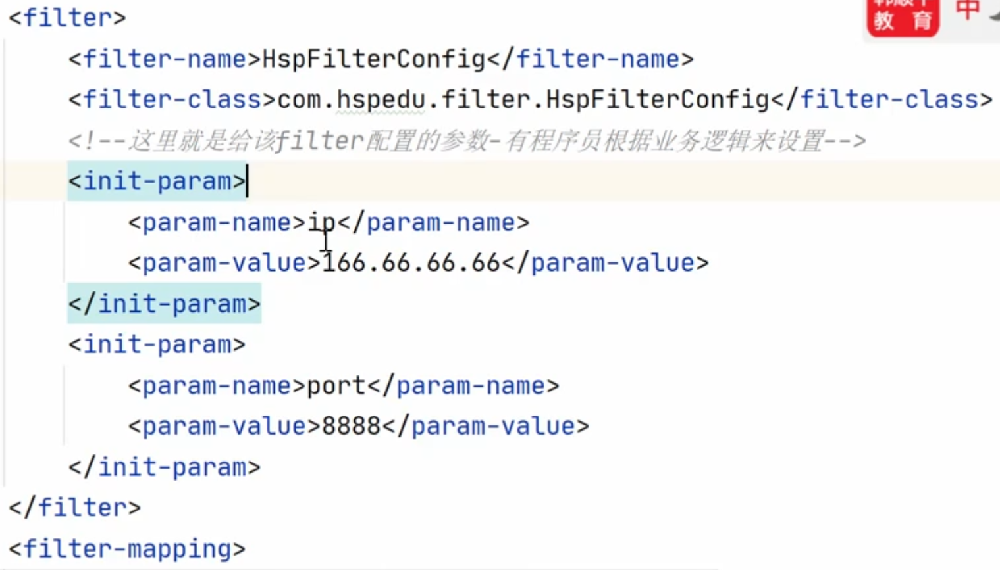

### FilterChain

1. 在处理复杂业务时，可设计多个过滤器共同完成过滤任务，形成 **过滤器链**

2. 基本原理分析

   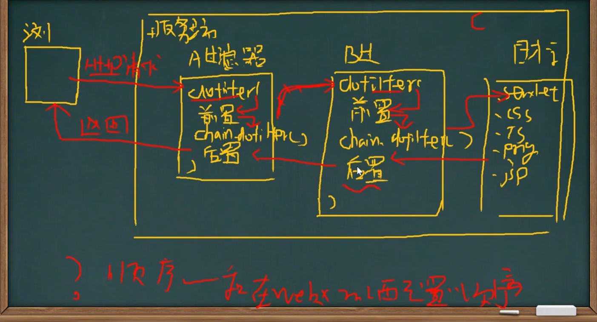

3. 注意事项 & 细节

   1. 多个 Filter 和目标资源在一次 http 请求中生效，在同一个线程中
   2. 当一个请求 url 和 Filter 的 url-pattern 匹配时，才会被执行。如果有多个匹配上，就会依 web.xml 中的配置顺序执行，形成一个 FilterChain
   3. 多个 Filter 共同执行，使用同一个 request 对象（同一次请求）
   4. filterChain.doFilter(req, resp) -> *执行下一个过滤器的 doFilter() 方法，若之后无过滤器，则执行目标资源*

# jQuery

 文档速查：

- https://www.w3school.com.cn/jquery/index.asp
- https://jquery.cuishifeng.cn

## 介绍

1. jQuery 是一个快速的、简结的 JavaScript 库，使用户能更方便地处理 HTML
2. 提供方法、events、选择器，并且方便地为网站提供 AJAX 交互
3. 其宗旨是 <q>WRITE LESS, DO MORE</q>
4. 实现了浏览器兼容问题

## jQuery 原理图解

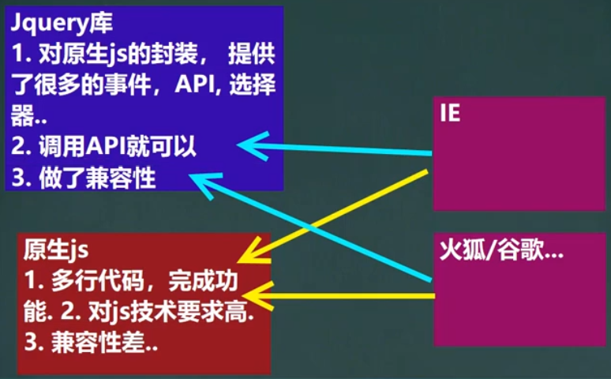

## jQuery 对象（数组对象）

1. jQuery 对象就是对 DOM 对象进行包装后产生的对象

   ```javascript
   $("#test").html() // 获取 id 为 test 的元素内的 HTML 代码
   ```

2. jQuery 对象是 jQuery 独有的。如果一个对象是 jQuery 对象，那么它就可以使用 jQuery 里的

3. 变量名约定：如果获取的是 jQuery 对象，那么变量名前要加上 $

4. 对象互转：

   1. jQuery -> DOM：
      1. <u> jQuery 对象</u> =  $( <u>DOM 对象</u> ) 
   2. DOM -> jQuery：
      1. <u>DOM 对象</u> = <u> jQuery 对象</u>.get(0)
      2. <u>DOM 对象</u> = <u> jQuery 对象</u>[0]

## jQuery 选择器

### 介绍

1. 选择器是 jQuery 的核心，在 jQuery 中，对事件处理，遍历 DOM 和 Ajax 操作都依赖于选择器
2. jQuery 选择器优点：
   1. 简洁的写法
   2. 完善的事件处理机制

### 基本选择器

1. id 选择器：$("#xxx");
2. 类选择器：$(".xxx");
3. 元素选择器：$("div");
4. *选择器：匹配所有元素，多用于结合上下文搜索
5. 组合选择器：以逗号分割

### 层级选择器

如果想通过 DOM 元素之间的层次关系来获取特定元素，如 后代元素、子元素、相邻元素、兄弟元素等，则需要使用层次选择器

1. ancestor descendant

   1. 用法：$("form input"); -> *返回 集合元素*
   2. 说明：在 <u>给定的祖先元素下</u> 匹配 <u>所有后代元素</u>

2. parent > child

   1. 用法：$(form > input); -> *返回 集合元素*

   2. 说明：在给定的父元素下匹配所有子元素

      > 注：要区分好 后代元素 与 子元素

3. prev + next

   1. 用法：$(label _ input); -> *返回 集合元素*
   2. 说明：匹配所有紧接在 prev 元素后的 next 元素

4. prev ~ siblings

   1. 用法：$(form ~ input); -> *返回 集合元素*

   2. 说明：匹配 prev 元素之后的所有 siblings 元素

      > 注：是匹配之后的元素，不包含该元素在内，并且 siblings 匹配的是和 prev 同辈的元素，其后辈元素不被匹配

### 基础过滤选择器

- 过滤内容为相对 **前** 或 **后** 等

### 内容过滤选择器

- 过滤规则主要体现在它所包含的 **子元素** 和 **文本内容** 上

### 可见度过滤选择器

- 根据元素的 **可见** 和 **不可见** 状态来选择相应的元素

### 属性过滤选择器

- 过滤规则是通过 **元素的属性** 来获取相应的元素

### 子元素过滤选择器

- 对子元素进行选择过滤

### 表单属性过滤选择器

- 主要对 **表单元素** 进行过滤

### 表单选择器

## jQuery の DOM 操作

### 查找节点，修改属性

1. 查找到属性节点后，可以调用 jQuery 对象的 attr() 方法来获取它的各种属性值

### 创建节点

1. 介绍：

   1. 创建：使用 jQuery 的工厂函数 `$():$(HTML标签);` 会根据传入的 HTML 标记字符串创建一个 jQuery 对象 并返回

   2. 动态创建的新元素节点不会被自动添加至文档中，而是需要使用其它方法将其插入至文档中
   3. 当创建单个元素时，需注意闭合标签和使用标准的 XHTML 格式
   4. 创建文本节点 就是在创建元素节点时直接把文本内容写出来；属性节点同上

2. 插入方法：

   1. 内部插入法：在元素内插入内容（该内容变成该元素的子元素或节点）

   2. 外部插入法：在元素外插入内容（该内容变成该元素的兄弟节点）

      > 注：外部插入法 不但能将新 DOM 元素插入到文档中，也能对原有的 DOM 元素进行移动

### 删除节点

1. remove() -> *从 DOM 中删除所有匹配元素，传入的参数用于根据 jQuery 表达式来筛选元素。当某个节点被删除后，该节点所包含的所有后代节点将被同时删除，返回一个指向已被删除的节点的引用*
2. empty() -> *清空元素中所有的后代节点（不包含属性节点）*

### 复制节点

1. clone() -> *克隆匹配的 DOM 元素，返回克隆后的副本（但此时复制的新节点不具有任何事件行为）*
2. clone(true) -> *复制元素的同时也复制元素中的事件*

### 替换节点

1. replaceWith() -> *将所有匹配到的元素都替换为指定的 HTML 或 DOM 元素*

   > 注：或在替换之前，已经在元素上绑定了事件，替换后原先绑定的事件会与原先的元素一起消失

### 属性操作

### 样式操作

### 获取 HTML 文本 和 值

### 常用遍历节点方法

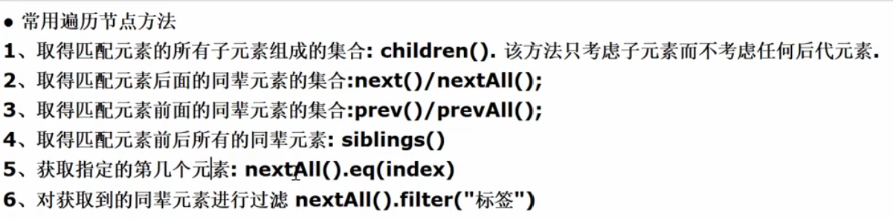

### CSS-DOM 操作

# 数据交换 & 异步请求

## JSON

## AJAX (Asynchronous JavaScript And XML)

### 原理图解

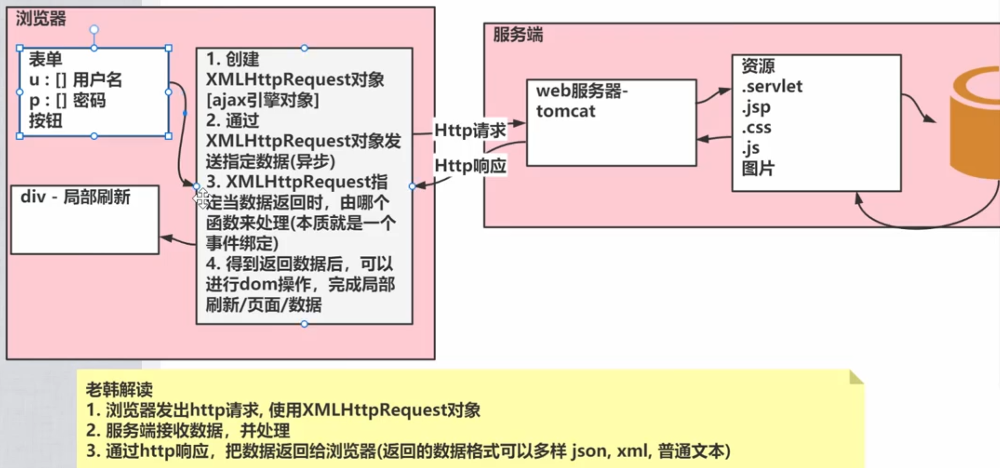

### jQuery 封装

### 应用场景

1. 搜索引擎自动提示检索关键字
2. 动态加载数据

# 线程数据共享 & 安全 - ThreadLocal

## 什么是 ThreadLocal

1. ThreadLocal 可以实现 **在同一个线程数据共享**，从而解决多线程数据安全问题
2. ThreadLocal 可以给 当前线程 关联 **一个** 数据（普通变量、对象、数组）set 方法
3. ThreadLocal 可以像 Map 一样存取数据，key 为当前线程，get 方法
4. 每一个 ThreadLocal 对象，只能为当前线程关联一个数据，如果要为当前线程关联多个数据，就需要使用多个 ThreadLoal 对象实例
5. 每个 ThreadLocal 对象实例定义的时候，一般为 static 类型
6. ThreadLocal 中保存数据，在线程销毁后，会自动释放

## 源码解读

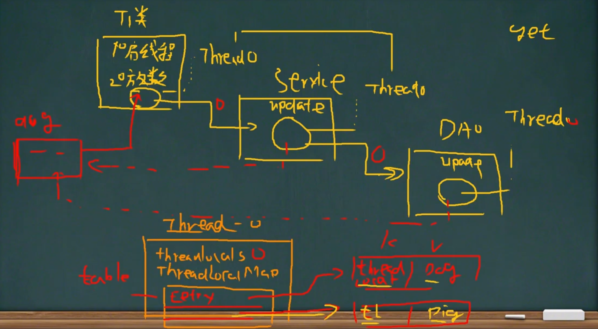

```java
public void set (T value) {
    // 1. 获取当前线程，关联到当前线程
    Thread t = Thread.currentThread();
    // 2. 通过线程对象，获取到 ThreadLocalMap （其静态内部类）
    ThreadLocalMap map = getMap(t);
    // 3. 如果 map 不为 null，将数据（dog、pig...）放入 map
    //    key = threadLocal, value:(存放的数据)
    // 4. 如果 map 为 null，就创建一个和当前线程关联的 ThreadLocalMap，并且将该数据放入
    if (map != null) {
        map.set(this, value);
    } else {
        createMap(t, value);
    }
}
```

# 文件上传下载

## 基本介绍

1. 文件的上传和下载是 web 常见功能

2. 传输大文件一般用专门的工具或插件

3. 需要两个包

   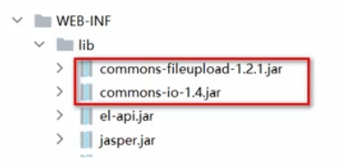

## 文件上传

### 基本原理

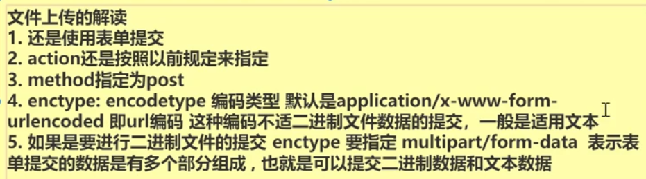

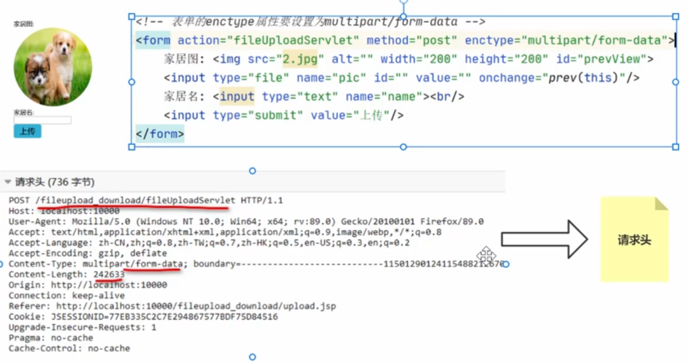

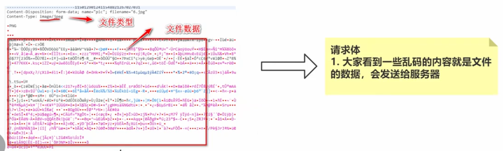

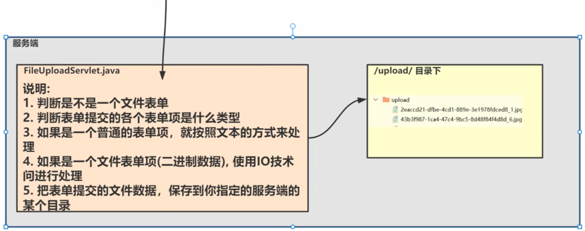

### 注意事项 & 细节

1. 如果将文件都上传到一个目录下，当上传文件很多时，会造成访问文件速度变慢，因此可以将文件上传到不同目录（如微信存储目录结构）
2. 一个完美的文件上传，要考虑因素如 断点续传，控制图片大小、尺寸，分片上传，防止恶意上传等。在项目中，可考虑使用 WebUploader 组件（by 百度）
3. 文件上传功能在项目中建议有限制使用，一般用于 头像、证明、合同、产品展示等，如果不加限制，磁盘空间将被大量占用（如 b站评论不能传图、微信一次朋友圈最多9张图）
4. 文件覆盖问题：采用系统生成 UUID 用 _ 与文件名相连解决

## 文件下载

### 原理分析图

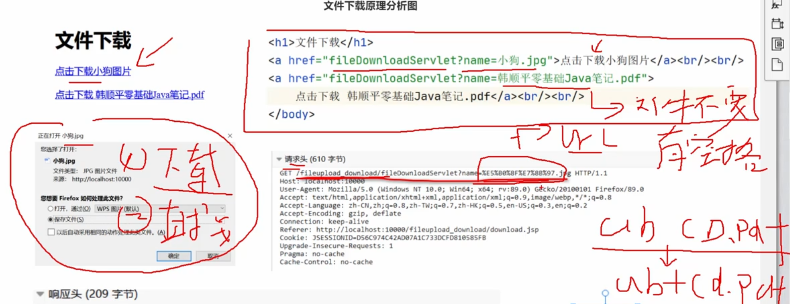

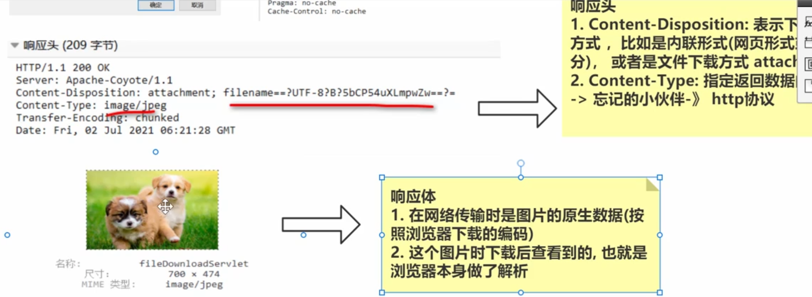

### 注意事项 & 细节

1. 文件中文名处理

# [项目] 家居网购

Repo:

- [家居网购 (Github)](https://github.com/kkyesyes/JavaWebQuiz)

Note:（笔记部分在项目总帖中）

前置基础

- 正则表达式 (P877)
- MySQL (P730)
- JDBC (P820)
- 数据库连接池 (P841)
- 满汉楼 (P858)


