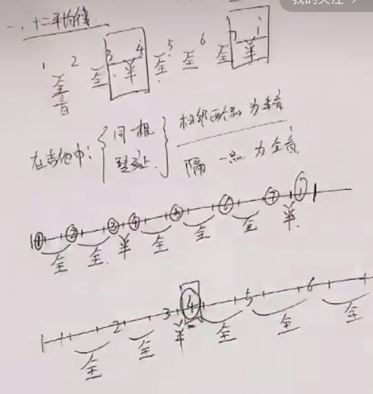
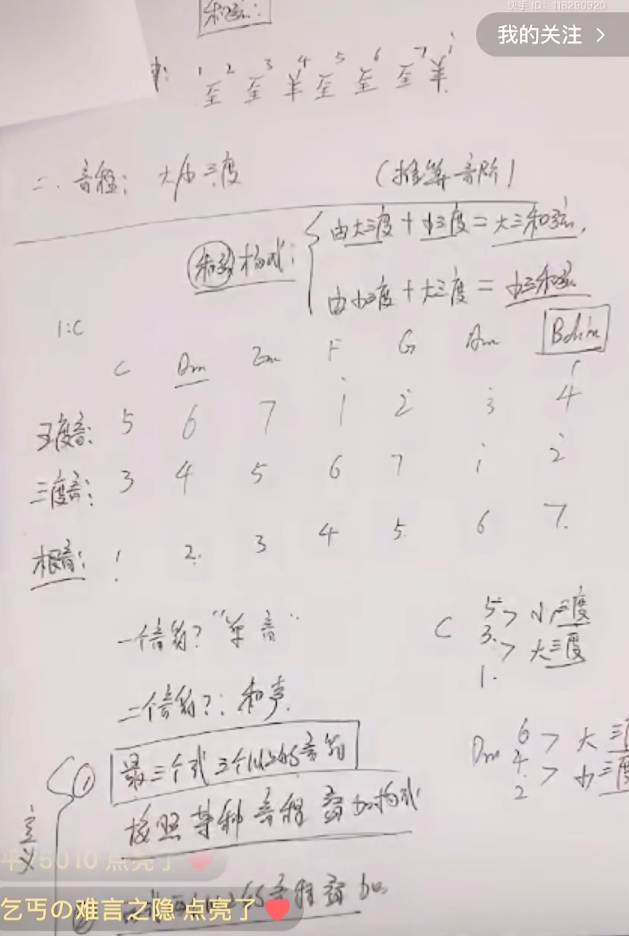
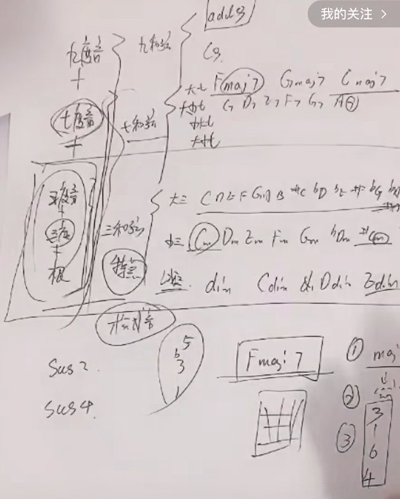
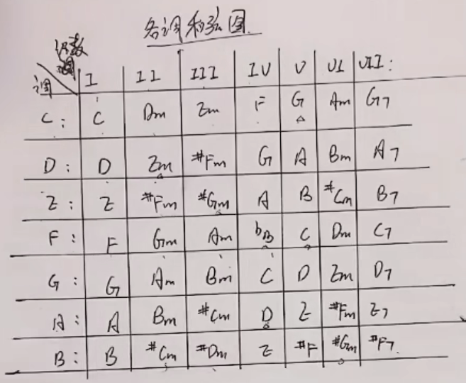

# 音阶推算

## 十二平均律

# 音程

- 音与音之间的距离，单位/度

## 大三度

三度之间皆为全音关系

## 小三度

三度之间为全半音关系

## 纯四度

四度之间含半音

## 增四度

纯四度之外（四度之间无半音）

# 音名 & 唱名

## 音名

A B C D E F G

## 唱名

Do ...

# 和弦

## 和弦构成

### 大三和弦

大三度 + 小三度

### 小三和弦（音名后加m，如 Dm）

小三度 + 大三度

## 和弦级数

