# 8086基础阶段总结

## 通用寄存器


## 内存访问&字节序


## 段地址&偏移地址


## 虚拟硬盘の写入&虚拟机(Bochs)

### 虚拟硬盘

1. 写入数据工具：WinHex
2. 一切从**主引导扇区**开始

### Bochs虚拟机

可调试操作系统の虚拟机

## 显卡&显存

### 屏幕显示文本

1. 一字节字符编码信息 + 一字节显示属性信息

   

2. **MOV**

   mov 目的操作数，源操作数

   

3. 汇编程序の**标号**

   代表距离最近的汇编指令の汇编地址

4. **JMP** -> *段间绝对跳转指令*

   jmp 段地址:偏移地址

   

5. 虚拟机添加硬盘运行写屏程序

   

6. **主引导扇区**布局

   0x07C00 - 0x07E00

   

7. 使用标号计算偏移地址

   直接 对标号做加减操作 进行跳转

   

8. 寄存器 绝对 间接 近跳转 -> *jmp bx*

   1. 近跳转：段内跳转

   2. 间接    ：跳转地址由寄存器间接给出

   3. 绝对    ：给出的地址是实际地址

      

9. 使用相对偏移量の短跳转&近跳转(可省参数)

   1. 短跳转：jmp (short) 标号  -编译->  EB **8位の相对偏移量**
   2. 近跳转：jmp (near) 标号   -编译->  E9 **16位の相对偏移量**

### 屏幕显示数字

1. 无符号数除法 指令
2. **XOR** -> *异或指令*
3. **ADD** -> *加法指令*
4. 段超越前缀 -> *跨段访问内存时，使用另一个段地址寄存器作前缀用：连接*


## 循环、批量传送 和 条件转移

1. NASM 的 $ 和 $$ 指令

   **$** -> *当前代码的汇编地址*

   **$$** -> *代码首部的起始汇编地址*

2. 跳过 非指令の数据区

   1. 指令：db、dw等定义数据区
   2. 在起始处用jmp跳至指令区

3. 串传送

   1. 使用前准备工作：

      DS:SI		原始数据串地址：偏移地址

      ES:DI		目标位置段地址：偏移地址

   2. 指令(REP指令依cx计数)：

      1. **(REP) MOVSB** -> *（重复） 按字节传送(一次)*
      2. **(REP) MOVSW** -> *（重复）按字传送(一次)*
      3. **CLD** -> *方向标志清零，使之指示正方向(低地址->高地址)*
      4. **STD** -> *置方向标志为1，指示反方向*

   3. 标志寄存器FLAGS中：

      1. 方向标志(DF)：指示串传送流方向
      2. 零	标志(ZF)：指示最近一次计算所得是(1)否(0)为零

4. **LOOP**指令

   1. 用法：loop 标号(地址)

   2. 循环次数：cx寄存器中所存数值
   3. 机器码：E2 8位相对偏移量
   4. 执行过程：
      1. 将cx内容减一
      2. 若cx内容 不为零，转移执行，否则顺序往后执行

5. 基址寻址& INC指令

   **INC** -> *自增(可用于 基址偏移地址寻址 使基地址循环自增)*

   ​	inc r/m(m需指定占用字节大小)

   8086中，只能使用BX、SI、DI、BP寄存器来提供偏移地址(如mov [bx], dl)

   

   > 寄存器BX在设计之初的作用之一就是用来提供数据访问的基地址，所以又叫**基址寄存器(Base Address Register)***

   > 在设计8086处理器时，每个寄存器都有自己的特殊用途，比如**AX**是**累加器(Accumulator)**，与它有关的指令还会做指令长度上的优化(较短)；**CX**是**计数器(Counter)**；**DX**是**数据寄存器(Data)**，除了作为通用寄存器外，还专门用于和外设之间进行数据传送；**SI**是**源索引寄存器(Source Index)**；**DI**是**目标索引寄存器(Destination Index)**，用于数据传送操作，我们已经在movsb和movsw指令用法中领略过了

6. DEC指令

   **DEC** -> *自减*

   ​	dec (r/m)

7. 基址变址寻扯&条件转移指令

   1. 8086中基址变址允许的组合：

      bx + si

      bx + di

      bp + si

      bp + di

   2. 条件转移指令：

      1. **JNS** -> *符号标志(SF)为0时跳转*

   3. 标志寄存器FLAGS中：

      1. 符号标志(SF)：计算结果最高位为0则为0，反之为1

## 计算机中的负数

1. 减法指令&求补指令(SUB&NEG)

   1. **SUB** -> *减法指令*

      ​	sub r/m, r/m/imm(立即数)

      ​	注意：两操作数宽度需一致，且不能同为内存地址(m)

   2. **NEG** -> *求负or求补*

      ​	neg r/m -> 执行 **0-操作数** 操作 得到补码(负数)，执行后替换操作数中的内容

      

2. 对于 有(无)符号数 の区分

   > 可以说，大多数指令既适用于无符号整数，也适用于有符号整数。指令执行的结果不管是用无符号整数来解释，还是用有符号整数来解释，都是正确的

   > 但是，也有一些指令不能同时应付无符号数和有符号数，需要根据你的实际情况选择它们的无符号版本和有符号版本。比如，无符号数乘法指令mul和有符号数乘法指令imul，以及无符号数除法指令div和有符号数除法指令idiv

   > 简单总结，有些指令皆适用，有些指令要区分使用

   

3. 有符号数の除法指令IDIV

   ​	idiv r/m

   1. 商和余数的符号性

      如果 被除数 和 除数 的**符号不同**，**商**为负数

      **余数**的符号 始终 和被除数相同

4. 有符号数の符号扩展指令


## 栈&逻辑指令

1. 栈

   1. cs -> *指定代码段识别区*

   2. ds/es -> *指定数据段识别区*

   3. ss:sp -> *指定**栈段识别区***

      

   4. **栈の使用**：(必须保持栈平衡，有压必有出)

      1. **PUSH** -> *入栈*

         ​	push r/m

         > push dx
         >
         > push word [0x2002]

         ​	push 执行过程：

         1. sp = sp - 操作数大小(字节);
         2. 利用ss:sp生成物理地址;
         3. 将操作数写入上述地址处

      2. **POP** -> *出栈*

         ​	pop r/m

         > pop ax
         >
         > pop word [0x08]

         ​	pop 执行过程：

         1. 利用ss:sp生成物理地址;
         2. 从上述地址处取得数据，存入由操作数提供的目标位置处;
         3. sp = sp + 2;

      3. 注意：

         1. 必须保持栈平衡，有压必有出
         2. 充分估计需要的栈空间，开辟安全的空间

2. 逻辑指令

   1. **OR** -> *逻辑或*

      ​	or r/m, r/m/imm(左右操作数长度需一致)

   2. **AND** -> *逻辑与*

      ​	and r/m, r/m/imm(长度需一致)


## Intel8086处理器の寻址方式

1. 寄存器/立即数寻址/直接寻址
2. 基址寻址
3. 变址寻址
4. 基址变址寻址

## 硬盘&显卡の访问与控制

1. **align** -> *设置段对齐长度*

   > section s	align=16

2. **vstart** -> *设置段内相对起始汇编地址*

   > section s	align=16	vstart=0x100

3. 加载器 & 用户程序

   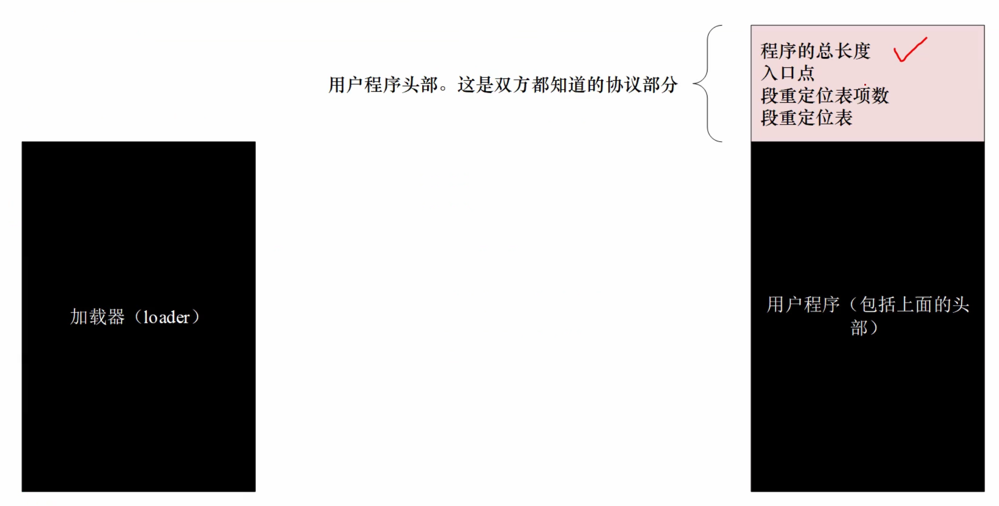

   ```assembly
   ;=================================================
   section header vstart=0
   	; 程序总长度
   	program_lenth	dd	program_end
   	; 用户程序入口点
   	code_entry		dw	start
   					dd	section.code.start
   	; 段重定位表项个数		
   	realloc_tbl_len	dw	(segtbl_end-segtbl_begin)/4
   	; 段重定位表
   	segtbl_begin:
   	code_segment	dd	section.code.start
   	data_segment	dd	section.data.start
   	stack_segment	dd	section.stack.start
   	segtbl_end:
   ;=================================================
   section code align=16 vstart=0
   	start:
   ```

   **section.段名字.start** -> *计算段汇编地址*

   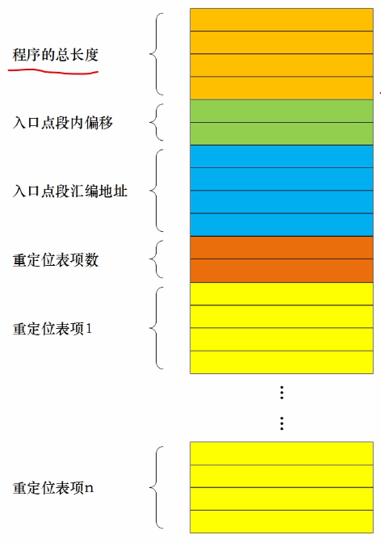

4. 加载器的工作流程 & 常数的声明方法

   1. 加载器工作流程
   
      1. 读取用户程序的起始扇区
      2. 把整个用户程序都读入内存
      3. 计算段的物理地址和逻辑段地址（段的重定位）
      4. 转移到用户程序执行（将处理器的控制权交给用户程序）
   
   2. **声明常量**:
   
      ```assembly
      app_lba_start equ(als) 100	; 相当于#define，常数的声明不占用汇编地址
      ```
   
5. 外围设备及其接口

## 中断&动态时钟显示

### 中断

1. 外部硬件中断

   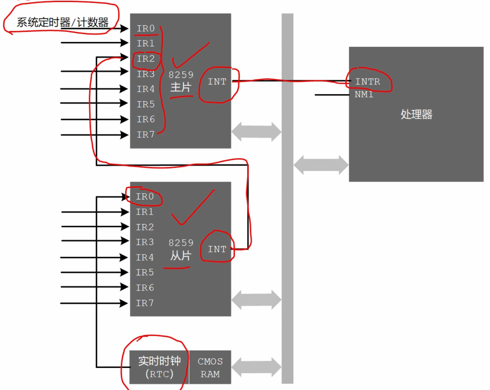

   后经中断屏蔽寄存器

   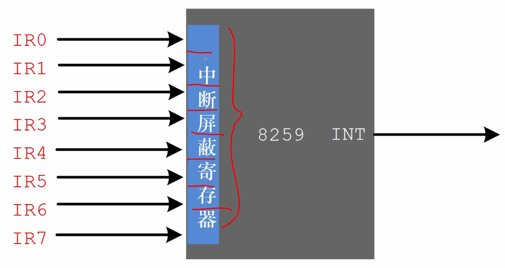

   标志寄存器可选是否忽略中断

   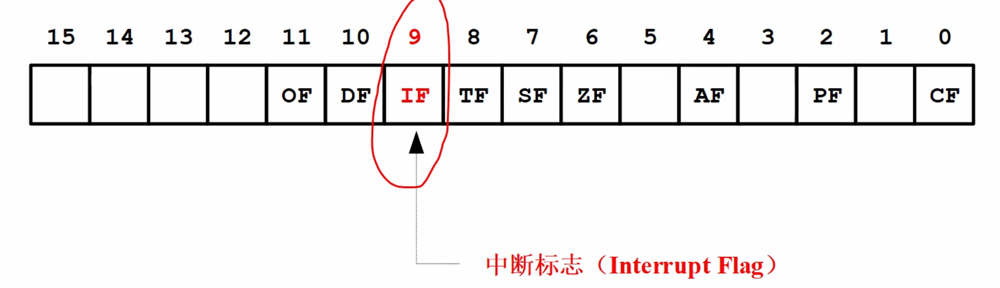

   1 -> 接受&响应中断，0 -> 屏蔽信号

   

2. 实模式下的中断向量表（由 BIOS 在开机时创建供 CPU 使用）

   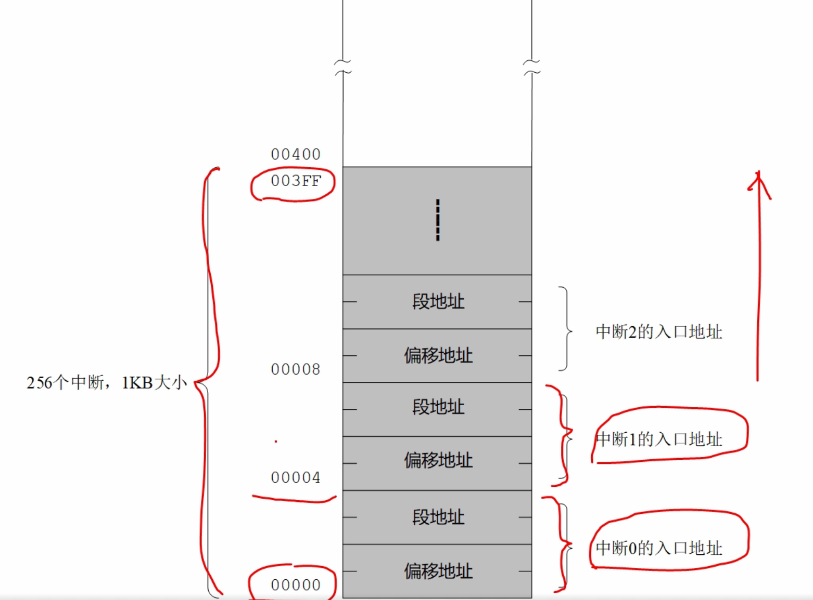

   > 中断号 x 4 = 物理地址（段地址 + 偏移地址）

3. 遇到中断时操作

   1. 保护断点现场（将标志寄存器、指令指针寄存器等压栈）
   2. 执行中断处理程序（取得地址、执行）
   3. 遇到 iret（中断返回）指令，返回断点，将前状态出栈，继续执行

### 时钟（RTC 电路 + CMOS RAM）

1. RTC：单独供电，CMOS RAM 中一小部分存储时钟信息，其它空间存储硬件配置等信息

   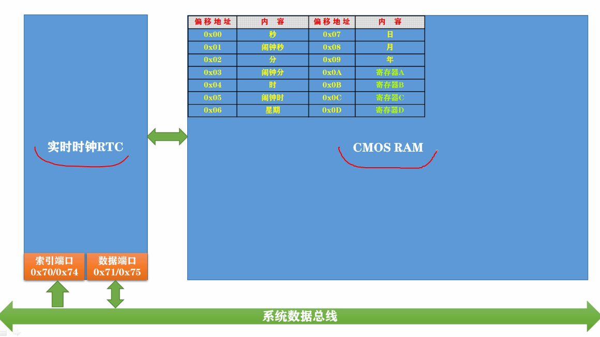

2. RTC 电路可以发出的中断信号

   1. 周期性中断信号（Periodic Interrupt: PI）

      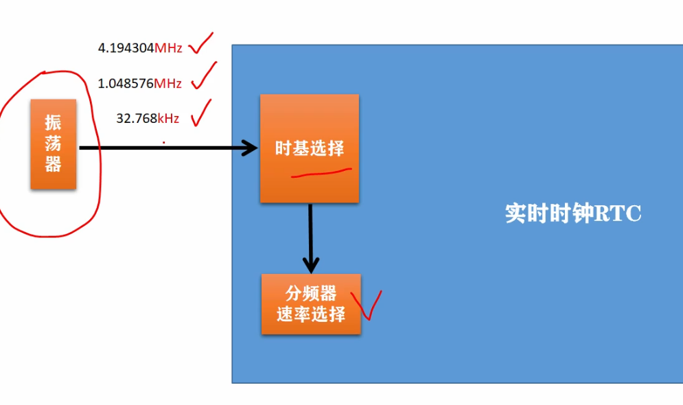

      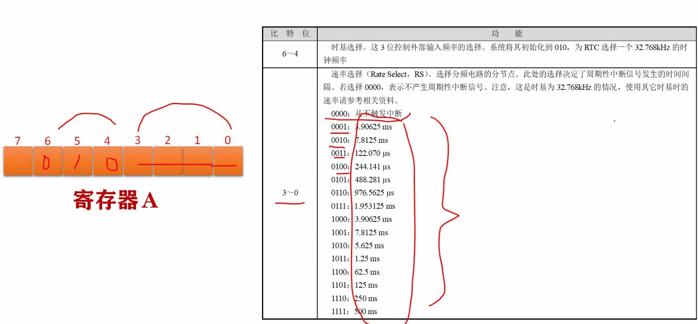

      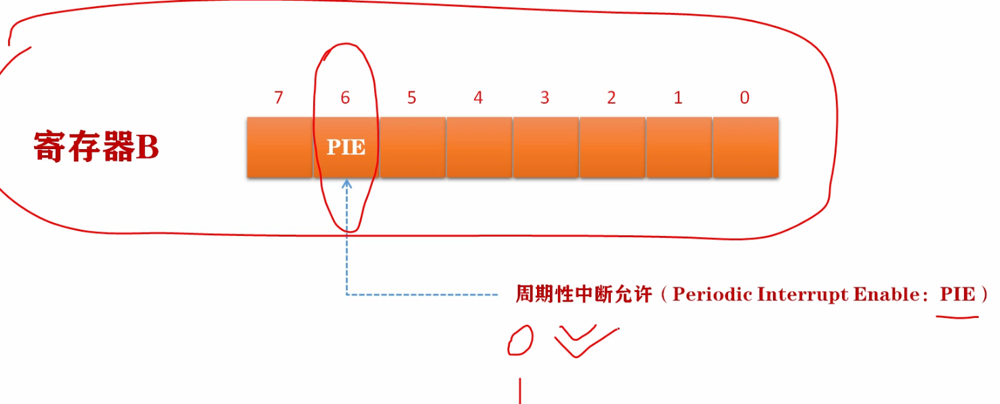

      > PIE 置 1 时需将 0 ~ 3 位置数选择速率（0 ~ 3 全部置 0 则 PIE 自动置 0）

   2. 更新周期结束中断（Update-ended Interrupt: UI）

      进行时钟更新的周期

      1. 更新周期的开关

         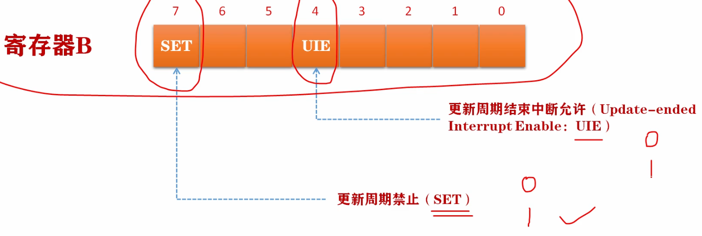

      2. 更新周期的过程监视

         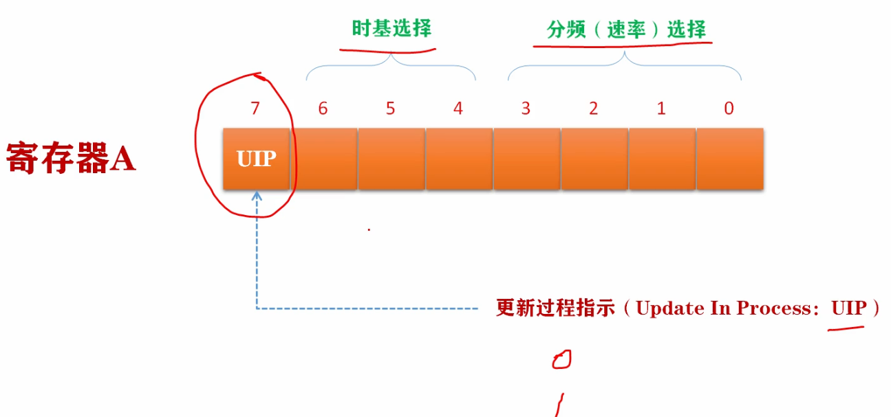

         > 时钟更新过程中会暂时与总线断开以防误访问

   3. 闹钟中断（Alarm Interrupt: AI）

      

3. 中断类型的判别

   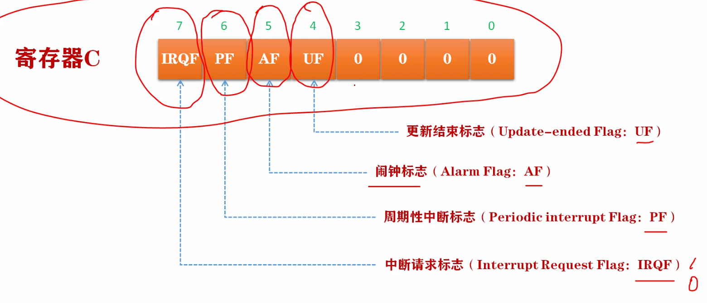

   > 对 寄存器 C（只读寄存器） 的读操作会使所有位清零，低 4 位为保留位（始终为 0）

# 32位x86处理器架构

## 32位处理器特殊寻址

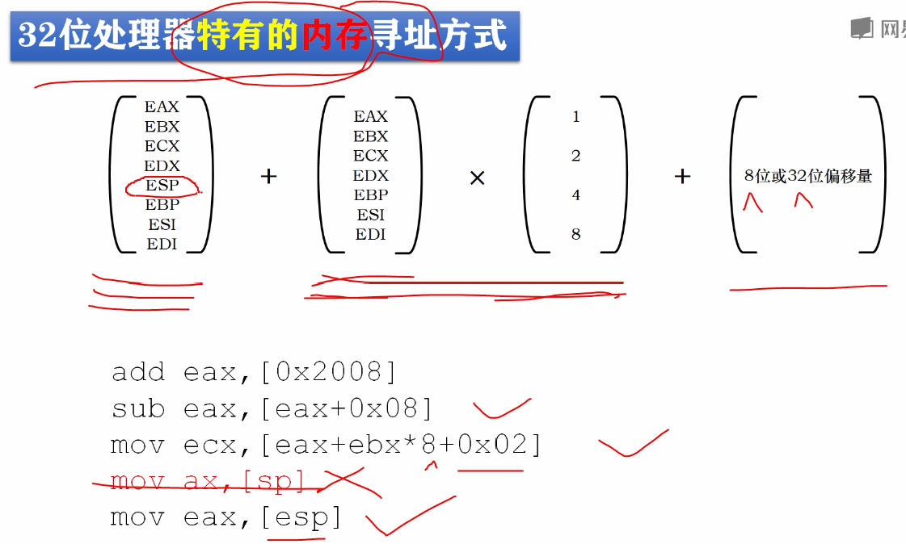

## 进入保护模式

### 全局描述符表 GDT


