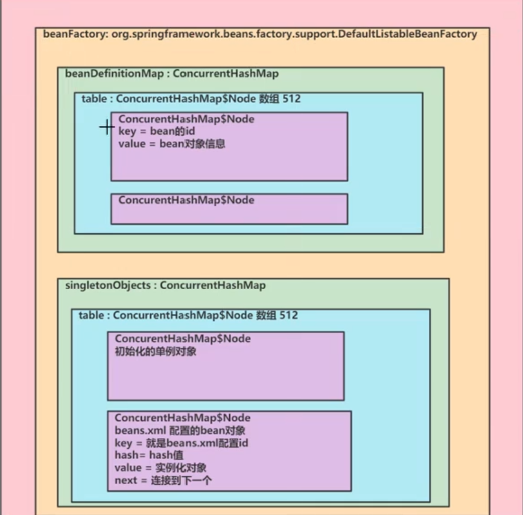

# 课程链接

[Spring 核心教程 已完结（IDEA 2023最新版）4K蓝光画质 基于Spring6的全新重制版本 起立到起飞](https://www.bilibili.com/video/BV1Kv4y1x7is)

# 笔记引用

[柏码 - 让每一行代码都闪耀智慧的光芒！ (itbaima.cn)](https://www.itbaima.cn/document)

# Spring IoC 容器

## 重要结构图

# Spring Bean 管理

## Bean 管理

### 创建 Bean 对象

### 向 Bean 注入属性

## Bean 配置

### xml

### 注解

# Spring AOP

## 动态代理

