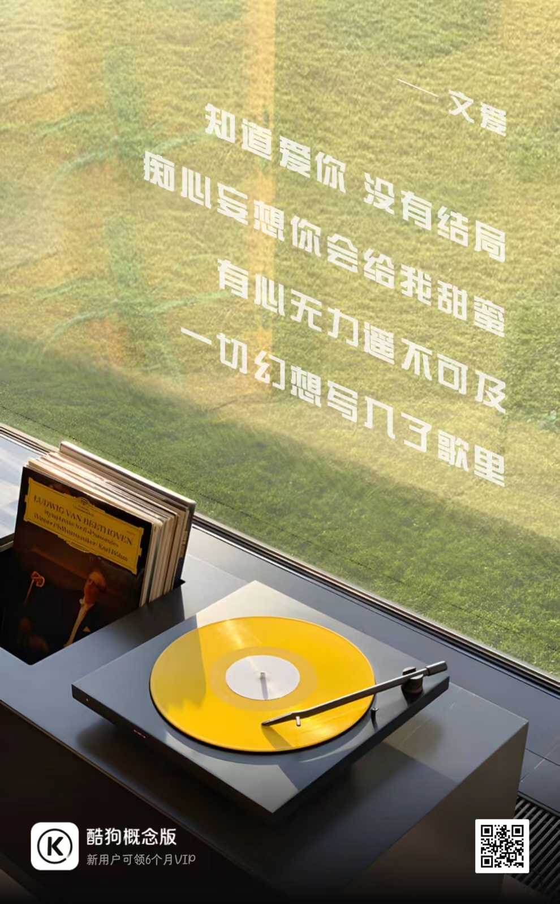
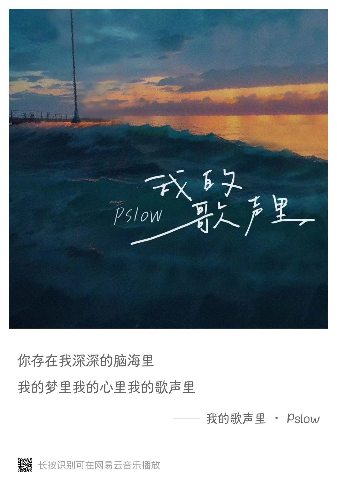
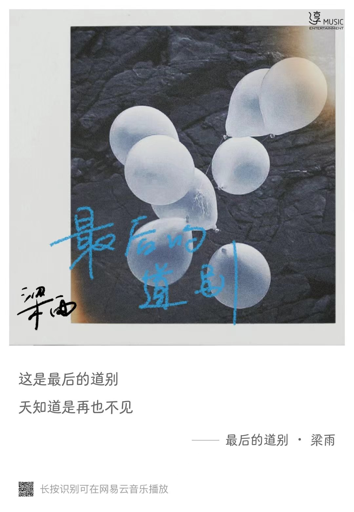
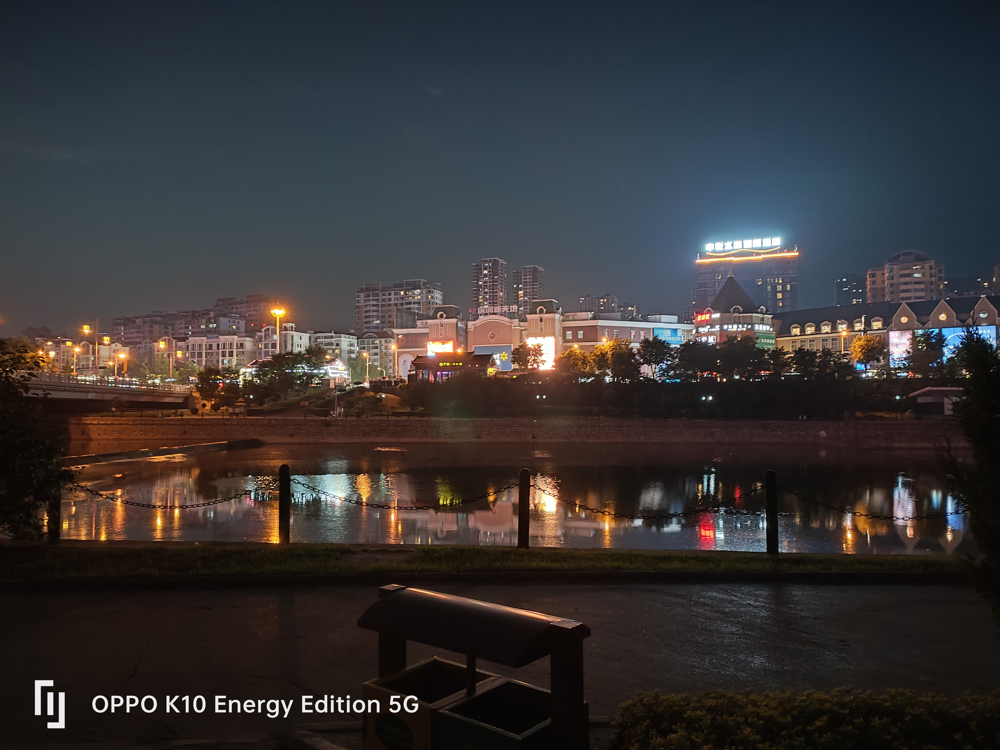
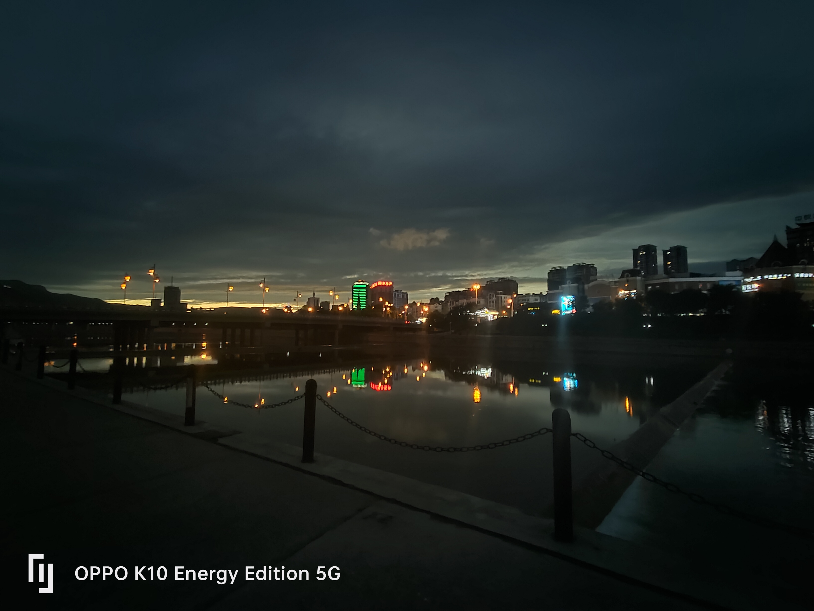
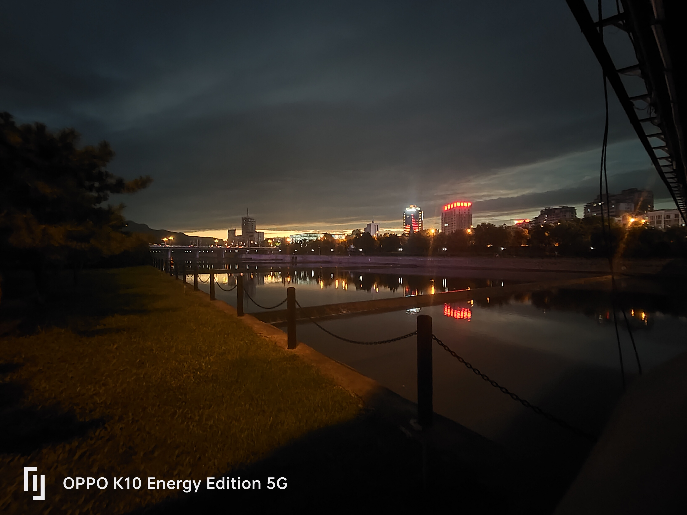
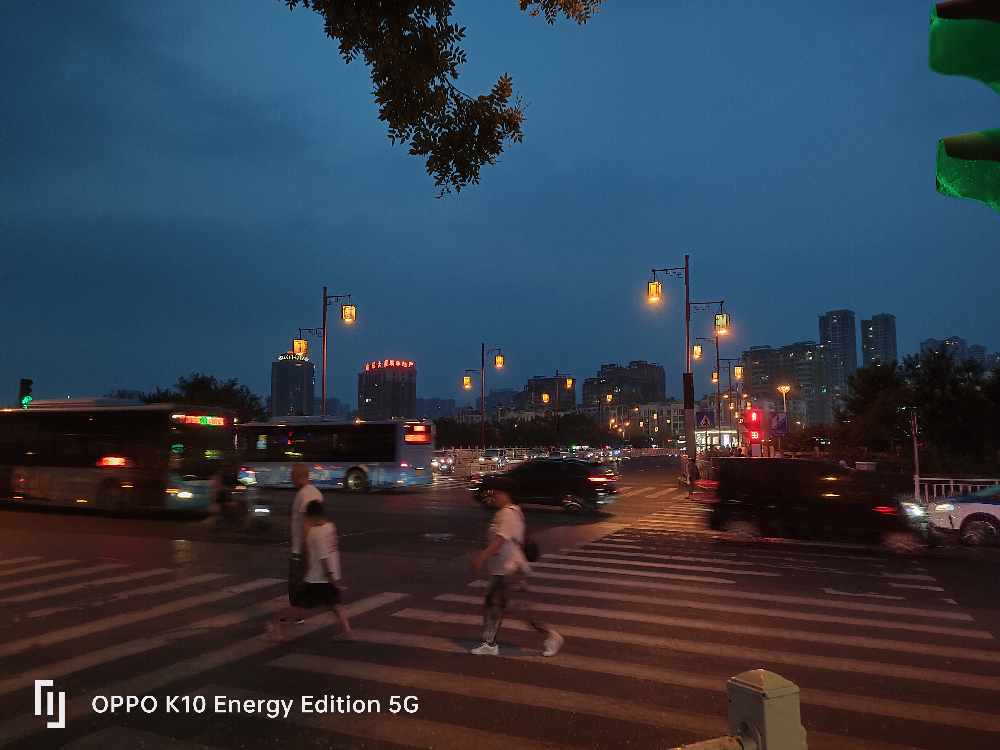
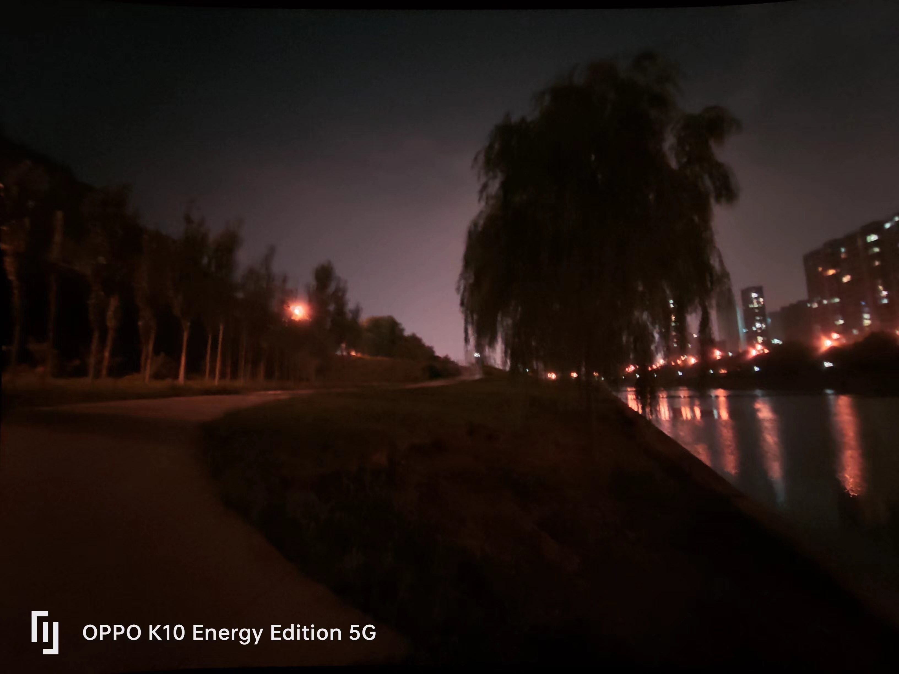
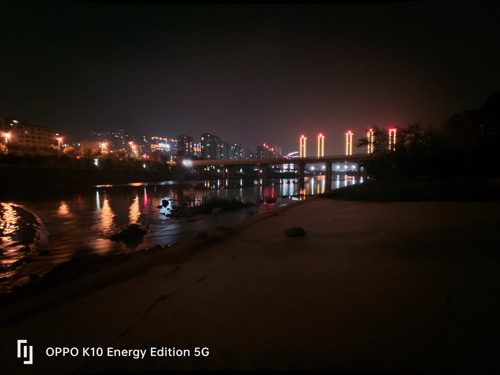

# 1.16 - 摘录

“时间过得真快啊。”
“有多快？”
“像烟花一样，一瞬间。”
“烟花易逝，人情长存。”

---

- 2023

# 12.12 - 今日歌曲推荐

# 11.30 - 今日歌曲推荐

# 11.25 - 今日歌曲推荐

# 11.24 - 今日歌曲推荐

# 11.22 - 随想

看遍人海潮落潮起

尝尽世间人聚人离

**希望下一次，不再是不辞而别**

# 11.11 - 关于热爱

最初
我喜欢音乐，喜欢计算机
不是为做好音乐，玩转计算机
而是音乐和计算机让我知道
什么是真正的
念念不忘，必有回响

# 11.9 - 今日歌曲推荐

Oh they say people come
看遍人海潮落潮起
Say people go
尝尽世间人聚人离
......
来自Coldplay的单曲《[Everglow](https://t1.kugou.com/3knbbf0BhV2)》（@酷狗概念版）

# 11.7 - 桃河

怀念那个桃河边弹吉他的晚上
