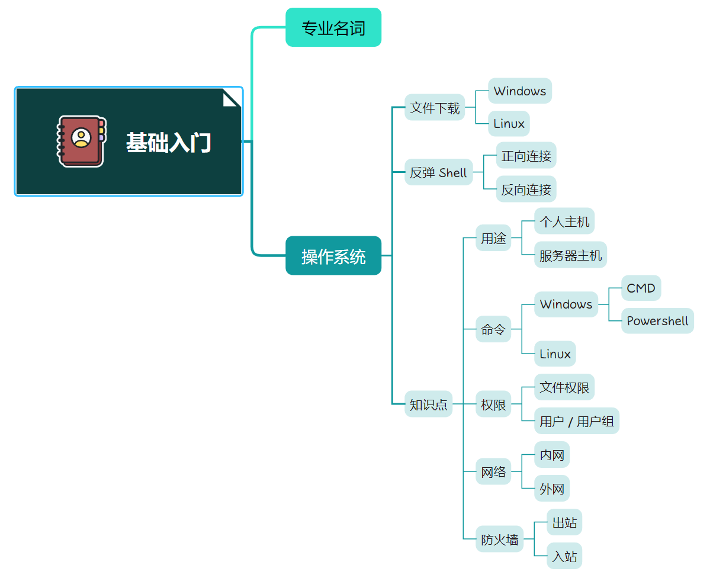
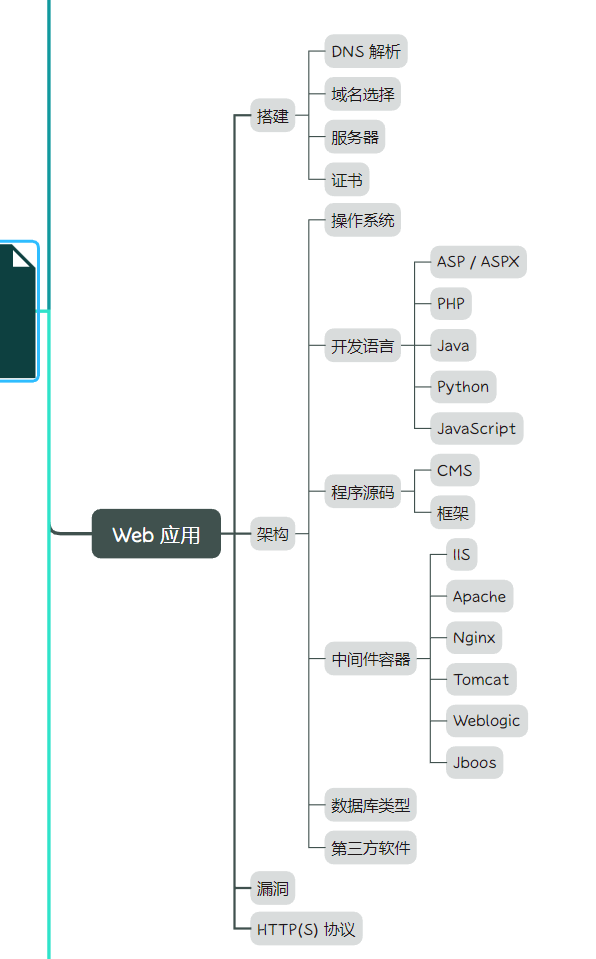
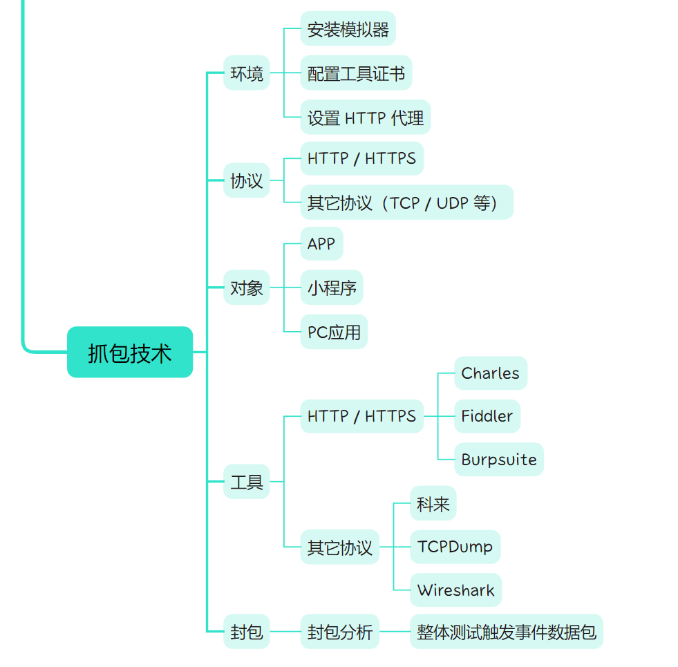
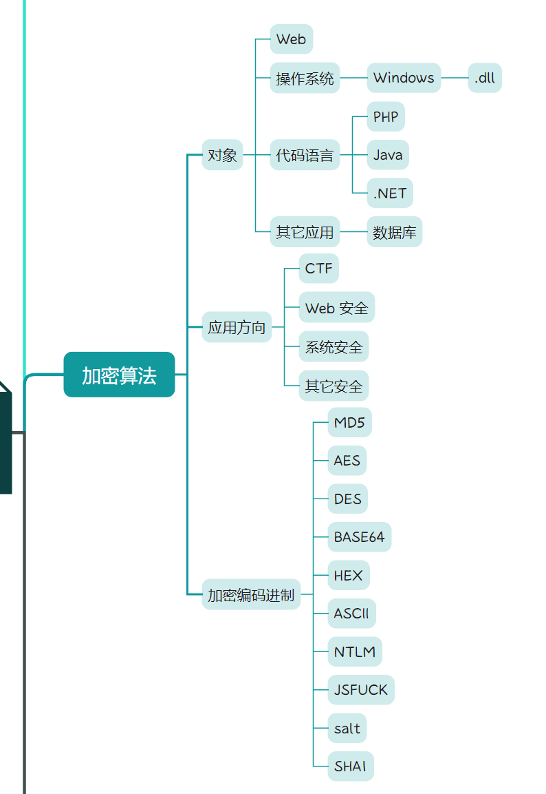
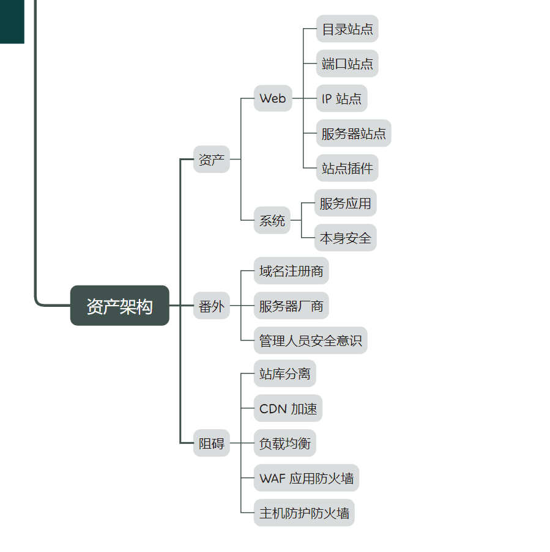
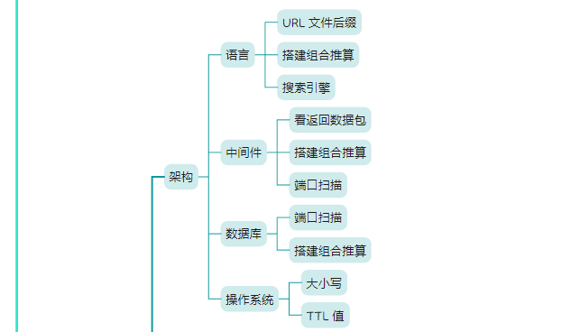
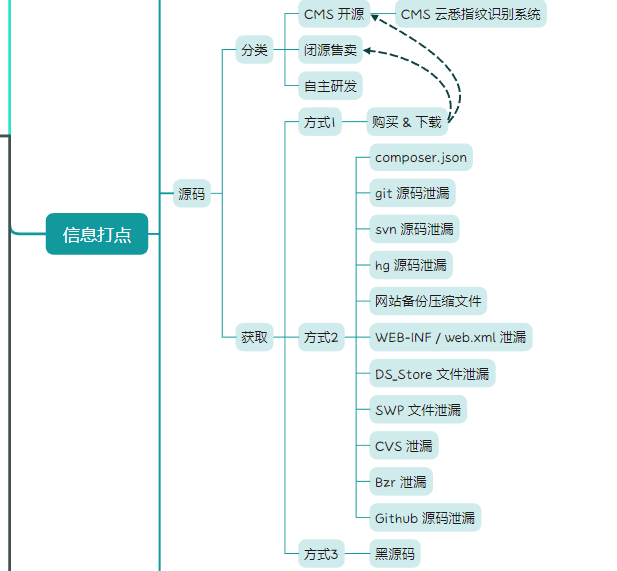
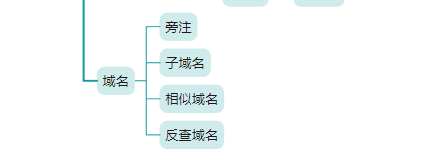
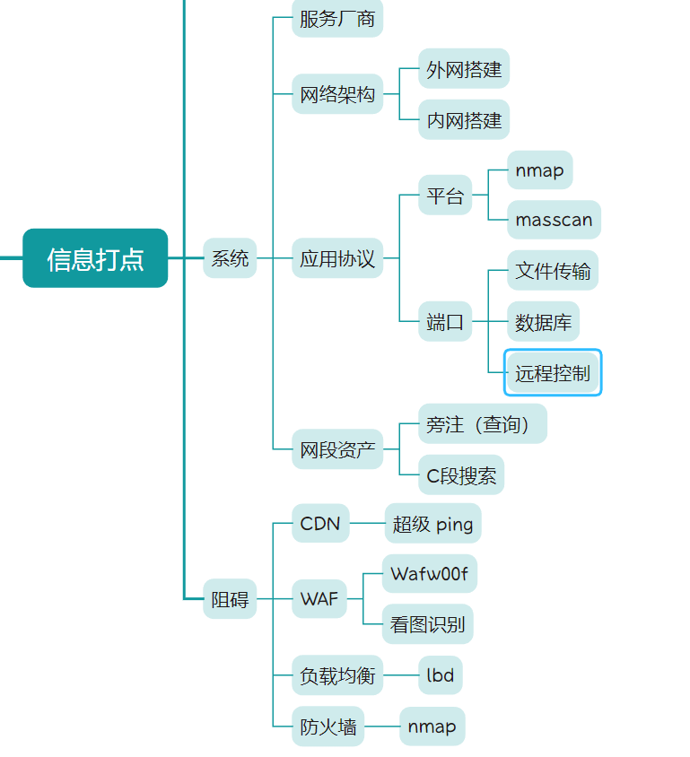
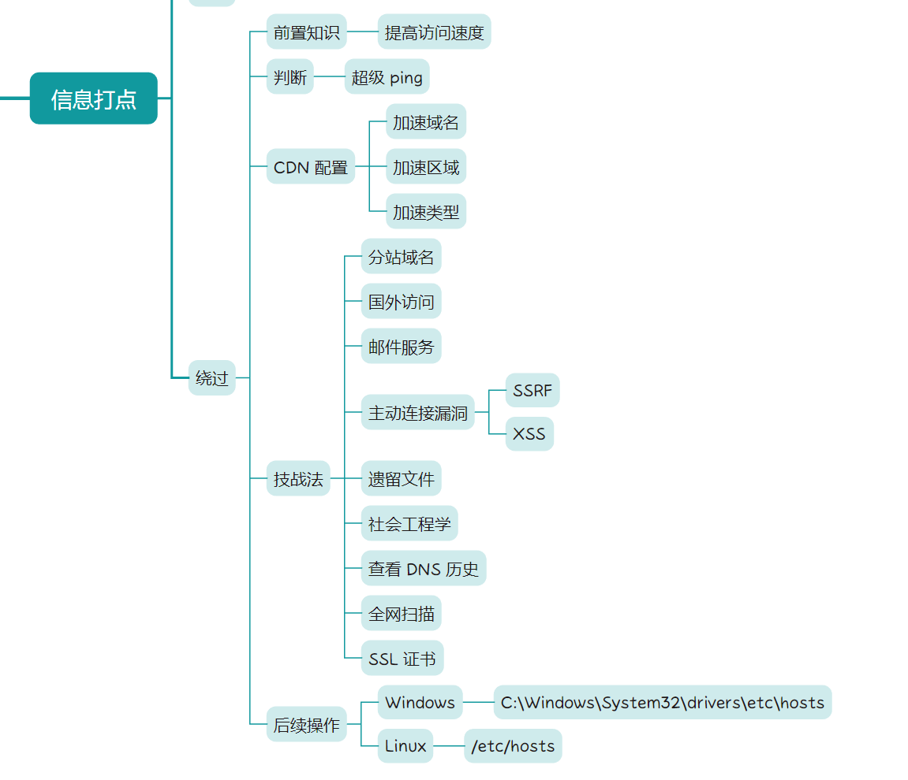

# 必备网站

- [ATT&CK（安全术语知识库）](https://attack.mitre.org/)
- [棱角社区（网安工具汇总）](https://forum.ywhack.com/bountytips.php)
- [CMD5（加密解密站）](https://www.cmd5.org/)
- [CTF 常用编码工具站](http://www.hiencode.com/)
- [SeeBug（Paper - 安全技术精粹）](https://paper.seebug.org)
- [Web 渗透测试学习成长路线图](https://www.freebuf.com/articles/web/290855.html)
- [Get Site IP（非 100% CDN 绕过根据域名查找真实 IP）](https://get-site-ip.com/)

# 课程资源

- [课程 Xmind 文件下载](./网络安全.xmind)

# 基础入门

# 信息打点

# PHP 开发

